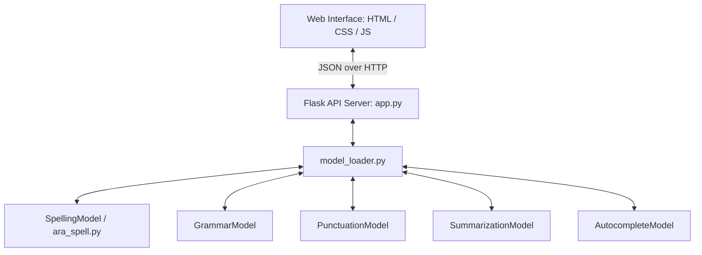

# Bayan (بيان) - Arabic Writing Assistant & Text Summarization System

Bayan is a state-of-the-art Arabic text editing and summarization application. Similar to assistants like Grammarly, Bayan provides real-time correction of spelling, grammar, and punctuation, combined with autocomplete suggestions and an advanced summarization pipeline. It features a modern, responsive web interface that communicates with a Flask backend powered by deep learning models.

---

## 📁 Repository Layout & File Descriptions

```
Bayan/
├── data/                       # Directory for raw and processed datasets (empty by default)
├── models/                     # Deep learning models directory (organized by task)
│   ├── Autocomplete/           # GPT-2 autocomplete model
│   ├── Grammrar/               # Gemma-based grammar correction model
│   ├── Punctuation/            # Seq2Seq punctuation correction model
│   ├── Spelling/               # BERT-based spelling corrector checkpoint
│   └── Summarization/          # mBART summarization model checkpoint
├── src/                        # Core backend source code and frontend
│   ├── app.py                  # Flask server containing API endpoints
│   ├── ara_spell.py            # Custom spell-checking algorithms and post-processing
│   ├── index.html              # TailwindCSS & Vanilla JS responsive web interface
│   ├── model_loader.py         # Loader classes for all deep learning models
│   └── README.md               # Source code instructions and API output contracts
├── check_dependencies.py       # Helper script to check required Python libraries
├── inspect_decoder.py          # Weight inspection helper for the spelling model
├── inspect_model.py            # Basic PyTorch checkpoint architecture identifier
├── inspect_model_details.py    # Detailed tensor shape explorer for spelling checkpoint
├── inspect_model_weights.py    # Checkpoint structure explorer
├── LICENSE                     # MIT License
├── QUICKSTART.md               # Quickstart guide for setting up and running Bayan
├── README.md                   # Main project overview and directory layout
├── README_SETUP.md             # Detailed step-by-step setup and troubleshooting guide
├── reproduce_issue.py          # Simple local script to test Spelling, Grammar, and Punctuation models
├── requirements.txt            # Python dependencies (PyTorch, Transformers, Flask, etc.)
├── run_app.py                  # Standard launcher script for the application
├── summarization_test.py       # Local tests and configuration options for Summarization
├── test_analyze_api.py         # Request test script for the /api/analyze endpoint
├── test_analyze_methods.py     # Request test script for GET/POST validations of analyze endpoint
├── test_model_load.py          # Verification script for local summarization model loading
├── upload_model.py             # Script to upload models to the Hugging Face hub
└── verify_api_live.py          # Test script to send sample text to a live API server
```

---

## 🛠️ Core Features

1. **Smart Spelling Correction (`SpellingModel`)**:
   - Cleans the text (removes harakat and tatweel), collapses repeated characters, and resolves common keyboard substitution errors.
   - Generates candidates using seq2seq model inference (beams), smart rules-based heuristics, and edit-distance suggestions (Norvig's spelling corrector adapted for Arabic).
   - Reranks candidates using a combined formula of **fluency** (evaluated using a BERT Masked Language Model), **similarity** (Damerau-Levenshtein distance), and **vocabulary-aware acceptance** (checks In-Vocabulary/Out-of-Vocabulary words from the tokenizer dictionary).

2. **Grammar Correction (`GrammarModel`)**:
   - Loads a Gemma causal language model configured to run on CPU.
   - Evaluates grammar through a standard chat template prompt.
   - Extracts the first valid non-empty corrected sentence and rejects generic instruction text generated by the model.

3. **Punctuation Insertion (`PunctuationModel`)**:
   - Uses a Seq2Seq architecture to automatically place Arabic commas (`،`), semicolons (`؛`), question marks (`؟`), periods (`.`), and quotation marks (`« »`) into continuous text.

4. **Text Summarization (`SummarizationModel`)**:
   - Leverages an mBART conditional generation model.
   - Supports variable length thresholds (short: ~30%, medium: ~50%, long: ~70% of the input text length).
   - Features a **safe extractive fallback** mechanism: if the generated abstractive summary deviates too far from the original text (monitored by word overlap and similarity ratios), it falls back to a readable extractive summary composed of the opening sentences of the source text.

5. **Autocomplete Suggestions (`AutocompleteModel`)**:
   - Powered by a local GPT-2 model (CPU-only mode) configured to predict the next word given a text prefix.
   - Integrates with the web interface to display ghost text prompts that users can accept by pressing the `Tab` key.

---

## 🖥️ Architecture & Web Interface

The project uses a unified **Client-Server Architecture**:



### 1. Backend: Flask API (`src/app.py`)
- Manages model state instances and startup loading triggers (loads the summarization model on startup and lazily loads autocomplete as needed).
- Provides API endpoints validating text length requirements (between 10 and 5,000 characters).
- Implements `/api/analyze` which coordinates a sequential processing pipeline:
  $$\text{Input Text} \rightarrow \text{Spelling Correction} \rightarrow \text{Grammar Correction} \rightarrow \text{Punctuation Insertion} \rightarrow \text{Diff Calculation}$$

### 2. Frontend: Modern Web Application (`src/index.html`)
- Built using **TailwindCSS** for styling, **Google Fonts** (Tajawal, Noto Kufi Arabic) for premium typography, and glassmorphism cards.
- Includes a live, rich editing canvas (`contenteditable`) with instant wavy underlines representing errors:
  - <span style="border-bottom: 2px wavy #ef4444; background: rgba(239, 68, 68, 0.1); padding: 0 4px;">Red underlines</span> indicate **Spelling Errors**.
  - <span style="border-bottom: 2px wavy #fbbf24; background: rgba(251, 191, 36, 0.1); padding: 0 4px;">Yellow underlines</span> indicate **Grammar / Punctuation Suggestions**.
- Features an interactive **suggestion tooltip** allowing users to click on highlighted words to view explanations and apply replacements directly.
- Displays a real-time **document score metric** (0–100 circular gauge) based on error density, along with word counters and feedback lists.
- Hosts a **Summarization Panel** where users can control the length and generation configuration of the text summarizer.

---

## 🔌 API Endpoints Reference

### 1. Health Check
* **Endpoint**: `GET /api/health`
* **Response**:
  ```json
  {
    "status": "healthy",
    "models": {
      "summarization": true,
      "spelling": false,
      "autocomplete": false,
      "grammar": false,
      "punctuation": false
    }
  }
  ```

### 2. Summarize Text
* **Endpoint**: `POST /api/summarize`
* **Payload**:
  ```json
  {
    "text": "النص العربي الطويل المراد تلخيصه...",
    "length": 2, // 1 = short, 2 = medium, 3 = long
    "full_text": true
  }
  ```
* **Response**:
  ```json
  {
    "status": "success",
    "summary": "الملخص المولد من النموذج...",
    "original_length": 1420,
    "summary_length": 620
  }
  ```

### 3. Spelling Correction
* **Endpoint**: `POST /api/spelling`
* **Payload**: `{"text": "الكتبة الصحيحه"}`
* **Response**: `{"corrected": "الكتابة الصحيحة", "status": "success", ...}`

### 4. Autocomplete
* **Endpoint**: `POST /api/autocomplete`
* **Payload**: `{"text": "ذهب الطالب إلى", "n": 3}`
* **Response**: `{"suggestions": ["المدرسة", "الجامعة", "الفصل"], "status": "success"}`

### 5. Unified Analyze Text
* **Endpoint**: `POST /api/analyze`
* **Payload**: `{"text": "الطلاب ذهبو الى المدرسة"}`
* **Response**:
  ```json
  {
    "original": "الطلاب ذهبو الى المدرسة",
    "corrected": "ذهب الطلاب إلى المدرسة.",
    "suggestions": [
      {
        "original": "ذهبو",
        "correction": "ذهبوا",
        "type": "spelling"
      },
      {
        "original": "ذهبوا",
        "correction": "ذهب",
        "type": "grammar"
      },
      {
        "original": "الطلاب ذهب",
        "correction": "ذهب الطلاب",
        "type": "grammar"
      },
      {
        "original": "المدرسة",
        "correction": "المدرسة.",
        "type": "punctuation"
      }
    ],
    "status": "success"
  }
  ```

---

## 🚀 How to Run the Project

### 1. Install Dependencies
Make sure you have Python 3.8+ installed, and then run:
```bash
pip install -r requirements.txt
```
*Note: If you are running on a CPU-only environment or want to configure PyTorch for CUDA (GPU), visit [PyTorch Local Setup](https://pytorch.org/get-started/locally/) to install the appropriate distribution.*

### 2. Prepare Model Files
Verify that you have placed the model files under the `models/` directory:
- Summarization: `models/Summarization/Model/`
- Spelling: `models/Spelling/Model/`
- Autocomplete: `models/Autocomplete/Model/`
- Grammar: `models/Grammrar/Model/`
- Punctuation: `models/Punctuation/Model/`

### 3. Run the Server
Use the standard run script:
```bash
python run_app.py
```
This runs the server locally on port `5000` by default. Open your web browser and navigate to:
```
http://localhost:5000
```
