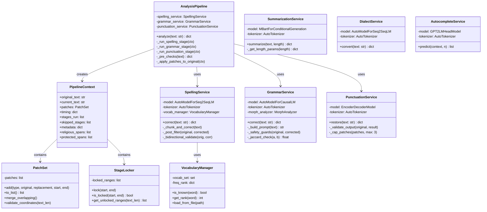
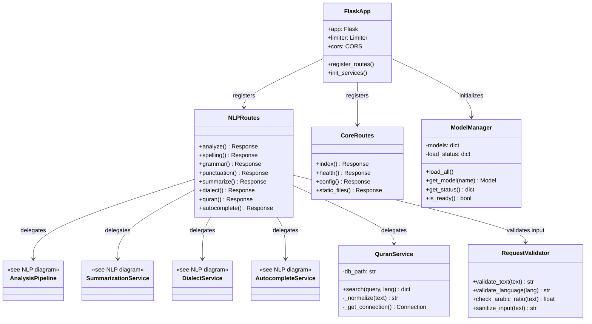

# Class Diagram — Bayan

> Key classes and their relationships across the NLP backend and Flask application.

## 1. NLP Models and Services

```mermaid
classDiagram
    class AnalysisPipeline {
        -spelling_service: SpellingService
        -grammar_service: GrammarService
        -punctuation_service: PunctuationService
        +analyze(text: str) dict
        -_run_spelling_stage(ctx)
        -_run_grammar_stage(ctx)
        -_run_punctuation_stage(ctx)
        -_pre_checks(text) dict
        -_apply_patches_to_original(ctx)
    }

    class PipelineContext {
        +original_text: str
        +current_text: str
        +patches: PatchSet
        +timing: dict
        +stages_run: list
        +skipped_stages: list
        +metadata: dict
        +religious_spans: list
        +protected_spans: list
    }

    class PatchSet {
        -patches: list
        +add(type, original, replacement, start, end)
        +to_list() list
        +merge_overlapping()
        +validate_coordinates(text_len)
    }

    class StageLocker {
        -locked_ranges: list
        +lock(start, end)
        +is_locked(start, end) bool
        +get_unlocked_ranges(text_len) list
    }

    class SpellingService {
        -model: AutoModelForSeq2SeqLM
        -tokenizer: AutoTokenizer
        -vocab_manager: VocabularyManager
        +correct(text: str) dict
        -_chunk_and_correct(text)
        -_post_filter(original, corrected)
        -_bidirectional_validate(orig, corr)
    }

    class GrammarService {
        -model: AutoModelForCausalLM
        -tokenizer: AutoTokenizer
        -morph_analyzer: MorphAnalyzer
        +correct(text: str) dict
        -_build_prompt(text) str
        -_safety_guards(original, corrected)
        -_jaccard_check(a, b) float
    }

    class PunctuationService {
        -model: EncoderDecoderModel
        -tokenizer: AutoTokenizer
        +restore(text: str) dict
        -_validate_output(original, result)
        -_cap_patches(patches, max: 3)
    }

    class SummarizationService {
        -model: MBartForConditionalGeneration
        -tokenizer: AutoTokenizer
        +summarize(text, length) dict
        -_get_length_params(length) dict
    }

    class DialectService {
        -model: AutoModelForSeq2SeqLM
        -tokenizer: AutoTokenizer
        +convert(text: str) dict
    }

    class AutocompleteService {
        -model: GPT2LMHeadModel
        -tokenizer: AutoTokenizer
        +predict(context, n) list
    }

    class VocabularyManager {
        -vocab_set: set
        -freq_rank: dict
        +is_known(word) bool
        +get_rank(word) int
        +load_from_file(path)
    }

    AnalysisPipeline --> PipelineContext : creates
    AnalysisPipeline --> SpellingService : uses
    AnalysisPipeline --> GrammarService : uses
    AnalysisPipeline --> PunctuationService : uses
    PipelineContext --> PatchSet : contains
    PipelineContext --> StageLocker : contains
    SpellingService --> VocabularyManager : uses
```

## 2. Flask Application Structure

```mermaid
classDiagram
    class FlaskApp {
        +app: Flask
        +limiter: Limiter
        +cors: CORS
        +register_routes()
        +init_services()
    }

    class NLPRoutes {
        +analyze() Response
        +spelling() Response
        +grammar() Response
        +punctuation() Response
        +summarize() Response
        +dialect() Response
        +quran() Response
        +autocomplete() Response
    }

    class CoreRoutes {
        +index() Response
        +health() Response
        +config() Response
        +static_files() Response
    }

    class QuranService {
        -db_path: str
        +search(query, lang) dict
        -_normalize(text) str
        -_get_connection() Connection
    }

    class ModelManager {
        -models: dict
        -load_status: dict
        +load_all()
        +get_model(name) Model
        +get_status() dict
        +is_ready() bool
    }

    class RequestValidator {
        +validate_text(text) str
        +validate_language(lang) str
        +check_arabic_ratio(text) float
        +sanitize_input(text) str
    }

    FlaskApp --> NLPRoutes : registers
    FlaskApp --> CoreRoutes : registers
    FlaskApp --> ModelManager : initializes
    NLPRoutes --> AnalysisPipeline : delegates
    NLPRoutes --> SummarizationService : delegates
    NLPRoutes --> DialectService : delegates
    NLPRoutes --> AutocompleteService : delegates
    NLPRoutes --> QuranService : delegates
    NLPRoutes --> RequestValidator : validates input

    class AnalysisPipeline {
        <<see NLP diagram>>
    }
    class SummarizationService {
        <<see NLP diagram>>
    }
    class DialectService {
        <<see NLP diagram>>
    }
    class AutocompleteService {
        <<see NLP diagram>>
    }
```
