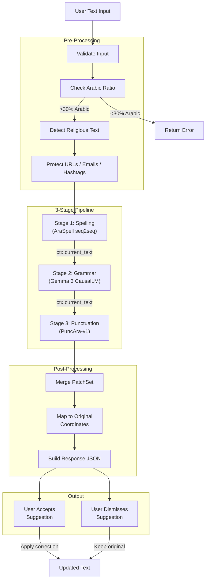

# Data Flow Diagram — Bayan

> How data moves through the system from user input to processed output.

## Full Analysis Data Flow

## Data Flow Legend

| Stage | Input | Processing | Output |
|-------|-------|-----------|--------|
| Pre-Processing | Raw text string | Validation, Arabic detection, religious text spans, URL/email protection | Clean text + protected spans |
| Spelling | Clean text (max 1000 chars) | AraSpell inference, post-filters, OOV cleanup, bidirectional validation | Patches + updated text |
| Grammar | Text from Stage 1 | Gemma 3 prompt, inference (30s timeout), safety guards (Jaccard, tanween, entity, digit) | Patches + updated text |
| Punctuation | Text from Stage 2 | PuncAra-v1 inference, validation, 3-patch cap | Patches + updated text |
| Post-Processing | All patches | Merge overlapping, map to original-text coordinates | JSON response |
