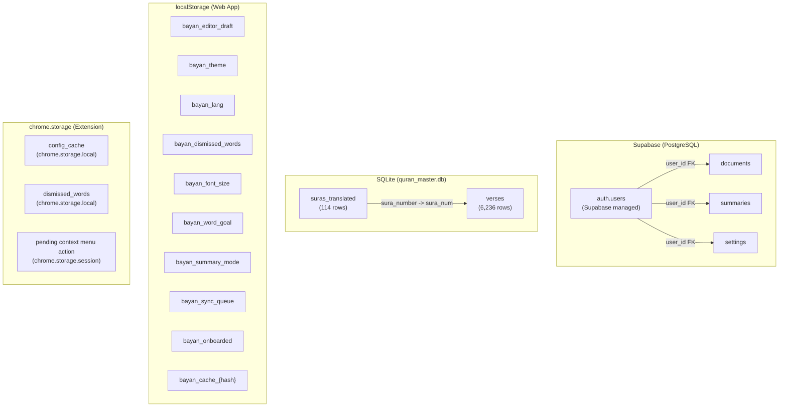
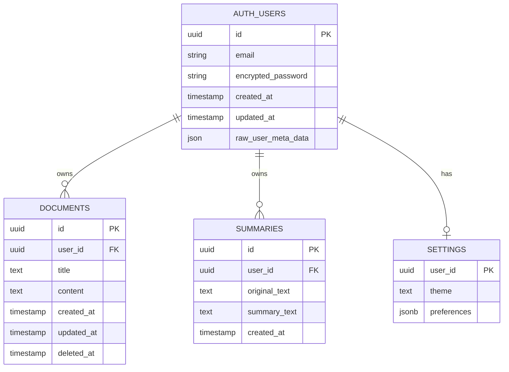
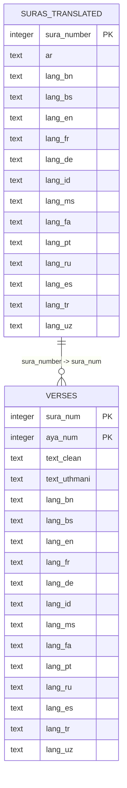
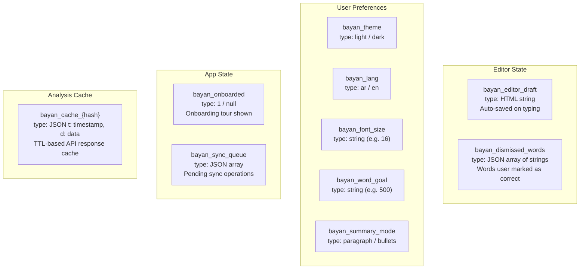

# Database Schema — Bayan

> All data storage layers: Supabase (PostgreSQL), SQLite (Quran), localStorage, and Chrome extension storage.

## Database Overview



## Supabase Schema (PostgreSQL)

### Entity Relationship Diagram



### Table Details

#### `documents`
| Column | Type | Constraints | Description |
|--------|------|-------------|-------------|
| `id` | uuid | PK, auto | Document identifier |
| `user_id` | uuid | FK -> auth.users | Document owner |
| `title` | text | NOT NULL | Document title (default: "مستند جديد") |
| `content` | text | | HTML content from the editor |
| `created_at` | timestamptz | auto | Creation timestamp |
| `updated_at` | timestamptz | auto | Last modification |
| `deleted_at` | timestamptz | nullable | Soft-delete timestamp (null = active) |

**Operations:** `insert`, `select`, `update` (content, title, deleted_at). No hard deletes.
**Access pattern:** Always filtered by `user_id` and `deleted_at IS NULL`. Ordered by `updated_at DESC`.

#### `summaries`
| Column | Type | Constraints | Description |
|--------|------|-------------|-------------|
| `id` | uuid | PK, auto | Summary identifier |
| `user_id` | uuid | FK -> auth.users | Summary owner |
| `original_text` | text | NOT NULL | Source text that was summarized |
| `summary_text` | text | NOT NULL | Generated summary |
| `created_at` | timestamptz | auto | Creation timestamp |

**Operations:** `insert`, `select`, `delete`. Max 50 per user query.
**Access pattern:** Filtered by `user_id`. Ordered by `created_at DESC`. Limited to 50.

#### `settings`
| Column | Type | Constraints | Description |
|--------|------|-------------|-------------|
| `user_id` | uuid | PK, unique | Settings owner (one row per user) |
| `theme` | text | | UI theme: `"light"` or `"dark"` |
| `preferences` | jsonb | | User preferences object |

**Preferences JSON structure:**
```json
{
  "font_size": "16",
  "word_goal": "0",
  "summary_mode": "paragraph"
}
```

**Operations:** `select`, `upsert` (on conflict: `user_id`). Single row per user.

---

## SQLite Schema (quran_master.db)

### Entity Relationship Diagram



### Table Details

#### `verses` (6,236 rows)
| Column | Type | Description |
|--------|------|-------------|
| `sura_num` | INTEGER | Sura number (1-114), composite PK |
| `aya_num` | INTEGER | Verse number within sura, composite PK |
| `text_clean` | TEXT | Normalized text (no diacritics) -- used for search |
| `text_uthmani` | TEXT | Uthmani script with full diacritics -- used for display |
| `lang_bn` | TEXT | Bengali translation |
| `lang_bs` | TEXT | Bosnian translation |
| `lang_en` | TEXT | English translation |
| `lang_fr` | TEXT | French translation |
| `lang_de` | TEXT | German translation |
| `lang_id` | TEXT | Indonesian translation |
| `lang_ms` | TEXT | Malay translation |
| `lang_fa` | TEXT | Persian translation |
| `lang_pt` | TEXT | Portuguese translation |
| `lang_ru` | TEXT | Russian translation |
| `lang_es` | TEXT | Spanish translation |
| `lang_tr` | TEXT | Turkish translation |
| `lang_uz` | TEXT | Uzbek translation |

**Query patterns:**
- `LIKE '%anchor%'` search on `text_clean` for fuzzy verse matching
- `JOIN suras_translated` for sura names in target language
- Dynamic column selection: `v.lang_{code}` and `s.lang_{code}` based on requested language

#### `suras_translated` (114 rows)
| Column | Type | Description |
|--------|------|-------------|
| `sura_number` | INT | Sura number (1-114) |
| `ar` | TEXT | Arabic sura name (e.g., "الفاتحة") |
| `lang_*` | TEXT | Translated sura names (14 languages) |

---

## localStorage Schema (Web App)



| Key | Type | Description |
|-----|------|-------------|
| `bayan_editor_draft` | HTML string | Auto-saved editor content |
| `bayan_dismissed_words` | JSON array | Words dismissed from spell check |
| `bayan_theme` | `"light"` \| `"dark"` | UI theme preference |
| `bayan_lang` | `"ar"` \| `"en"` | Interface language |
| `bayan_font_size` | string number | Editor font size |
| `bayan_word_goal` | string number | Daily word count goal |
| `bayan_summary_mode` | `"paragraph"` \| `"bullets"` | Summary display format |
| `bayan_onboarded` | `"1"` \| null | Whether onboarding tour was shown |
| `bayan_sync_queue` | JSON array | Queued sync operations for offline support |
| `bayan_cache_{hash}` | JSON `{t, d}` | Cached analysis results with TTL |

---

## Chrome Extension Storage

| Store | Key | Type | Description |
|-------|-----|------|-------------|
| `chrome.storage.local` | `config_cache` | object | Cached server config (Supabase URL, etc.) |
| `chrome.storage.local` | `dismissed_words` | string[] | Words user marked as correct |
| `chrome.storage.session` | pending action data | object | Context menu selection pending side panel open |

---

## Data Flow Between Storage Layers

```mermaid
flowchart LR
    subgraph WritePath["Write Path"]
        EditorTyping["Editor typing"]
        LS["localStorage\n(bayan_editor_draft)"]
        SQS["localStorage\n(bayan_sync_queue)"]
    end

    SupaDocs["Supabase\n(documents table)"]

    subgraph ReadPath["Read Path"]
        WebApp["Web App"]
    end

    Supa2["Supabase\n(documents)"]
    QuranDBRead["SQLite\n(quran_master.db)"]
    FlaskAPI["Flask API"]
    LS2["localStorage\n(draft)"]

    subgraph SettingsSync["Settings Sync"]
        LSTheme["localStorage\n(theme, font, etc.)"]
    end

    SupaSettings["Supabase\n(settings table)"]

    EditorTyping -->|"auto-save"| LS
    EditorTyping -->|"save button"| SQS
    SQS -->|"SyncManager"| SupaDocs

    Supa2 -->|"loadDocuments()"| WebApp
    LS2 -->|"on page load"| WebApp
    QuranDBRead -->|"search_bayan()"| FlaskAPI

    LSTheme <-->|"SettingsSync"| SupaSettings
```


