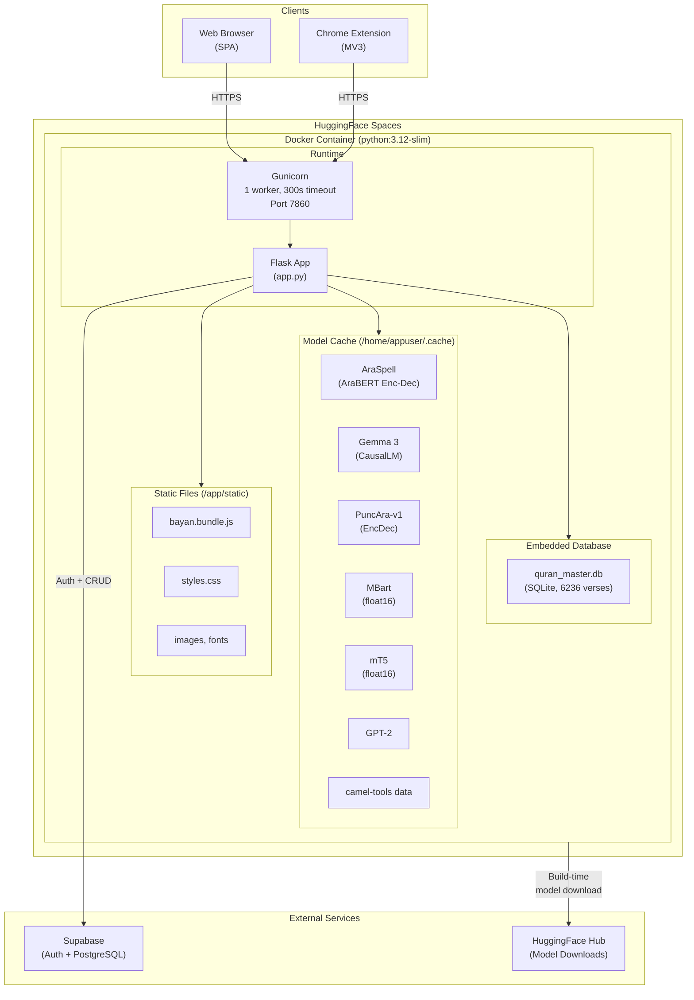
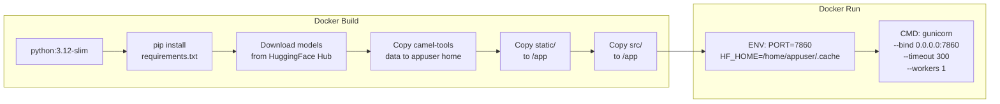

# Deployment Diagram — Bayan

> Infrastructure and deployment architecture on HuggingFace Spaces.

## Deployment Architecture

## Build Process

## Environment Configuration

| Variable | Value | Description |
|----------|-------|-------------|
| `PORT` | `7860` | HuggingFace Spaces required port |
| `HF_HOME` | `/home/appuser/.cache` | Model cache directory |
| `SUPABASE_URL` | (secret) | Supabase project URL |
| `SUPABASE_KEY` | (secret) | Supabase anon key |
| `GUNICORN_WORKERS` | `1` | Single worker (memory constraint) |
| `GUNICORN_TIMEOUT` | `300` | 5-minute timeout for large texts |

## Resource Requirements

| Resource | Specification |
|----------|--------------|
| RAM | ~8 GB (6 models loaded) |
| Disk | ~4 GB (models + dependencies) |
| CPU | Multi-core recommended |
| GPU | Not required (CPU inference) |
| Network | Outbound HTTPS to Supabase |
