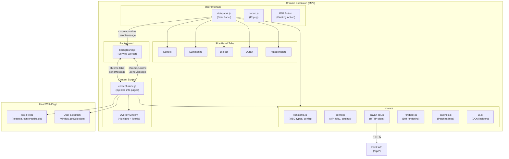
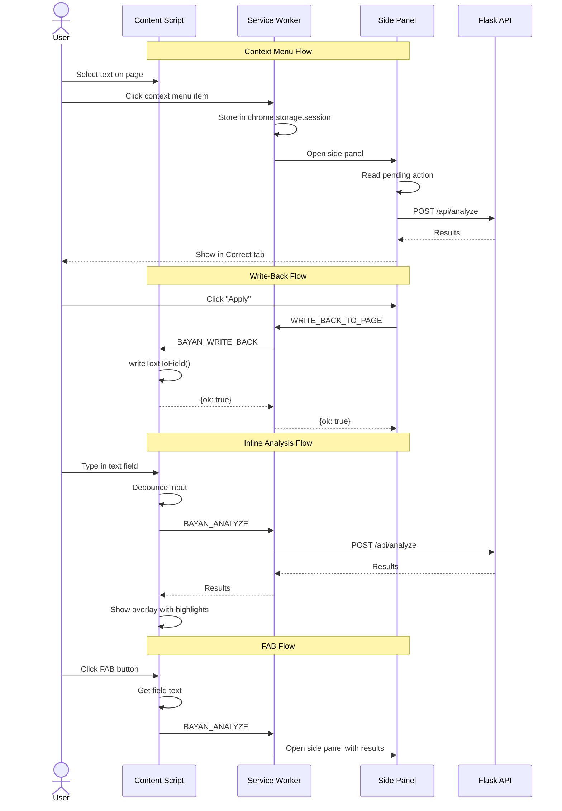
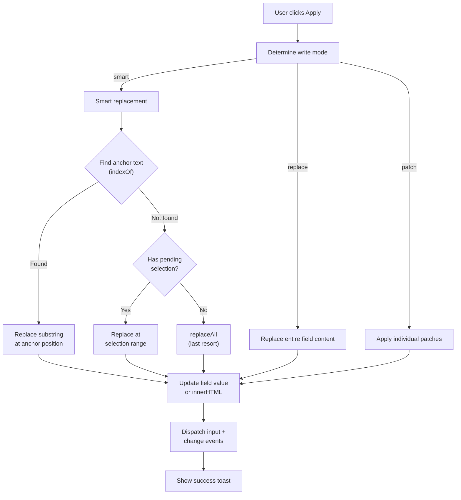
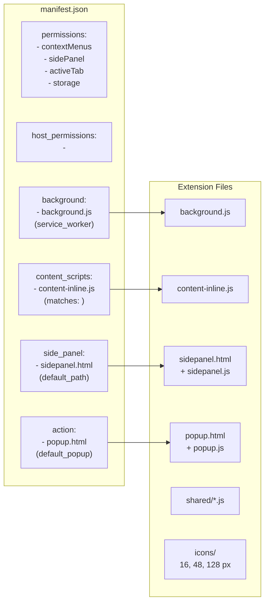

# Chrome Extension Architecture — Bayan

> Manifest V3 extension with service worker, content script, side panel, and shared modules.

## Component Overview

## Message Flow

## Write-Back Logic

## Manifest V3 Configuration

