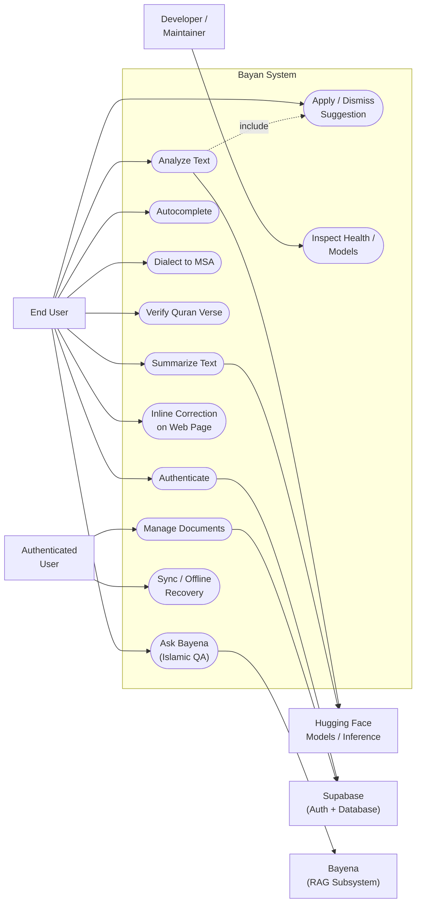
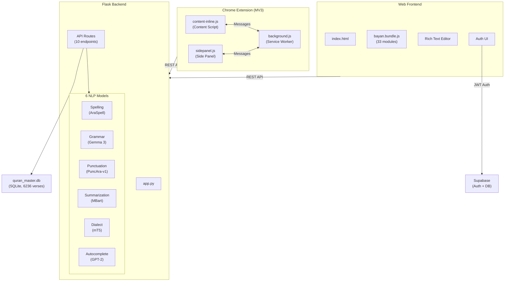
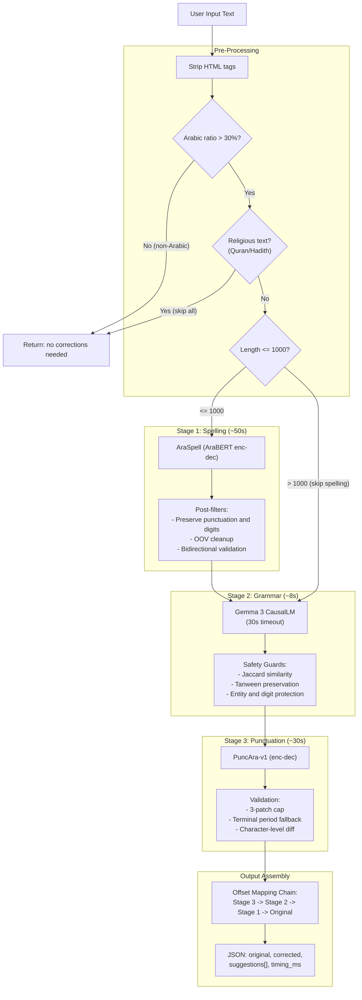
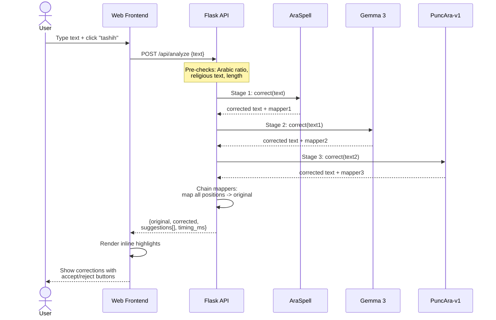
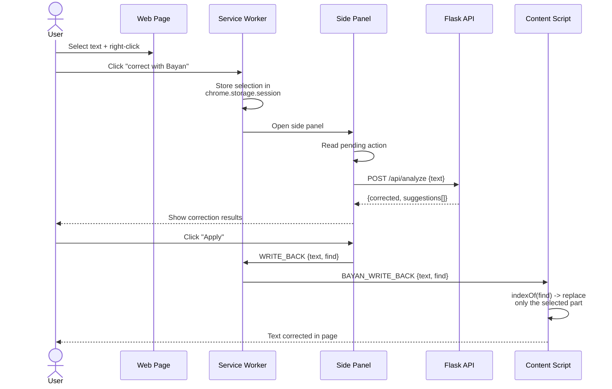
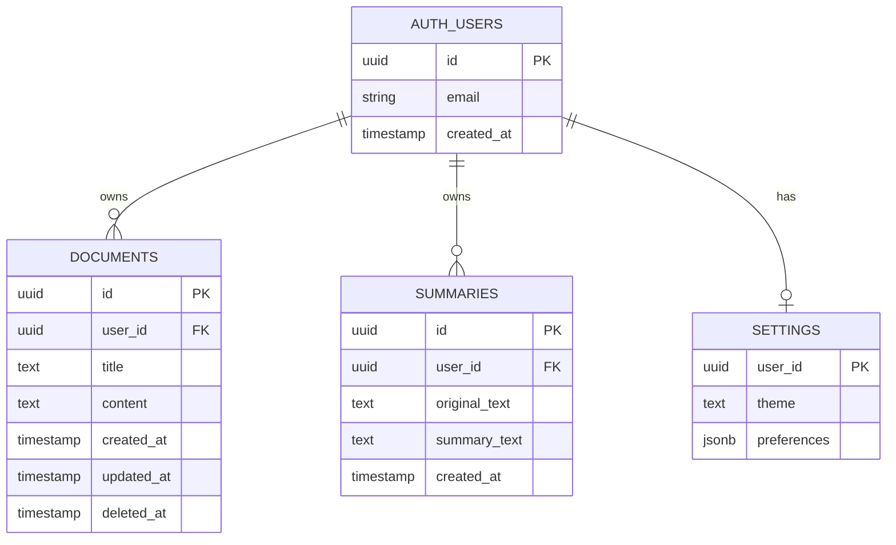
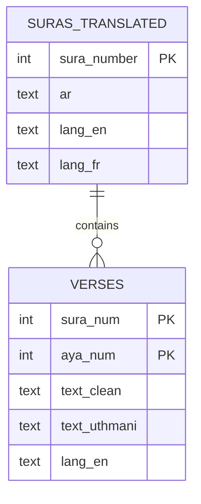
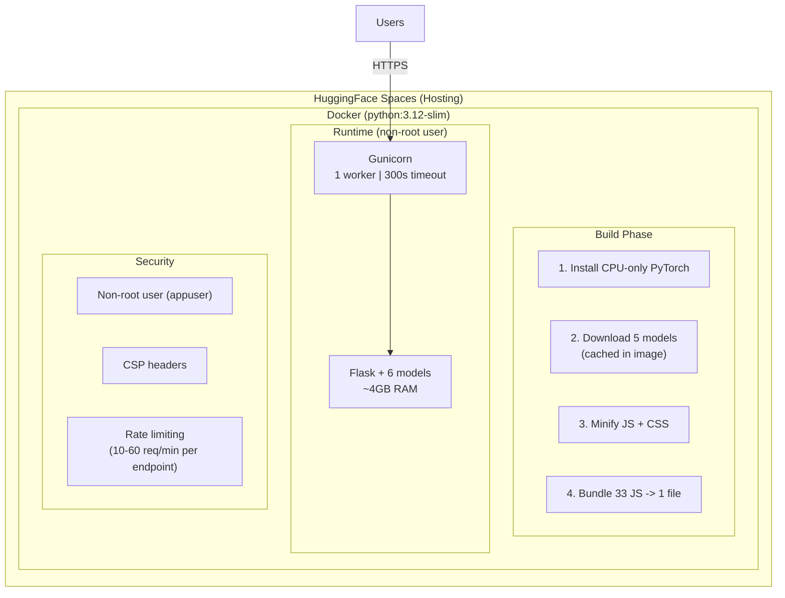

# Bayan (بيان) — Graduation Presentation Preparation Guide

> This file contains all diagrams in presentation order, with detailed speaking notes, technical depth points, and anticipated questions for each section.

---

## Slide 0: Title & Introduction

**What to say:**

> "Bayan is an AI-powered Arabic writing assistant that combines six machine learning models into a unified platform. It works both as a web application and a Chrome browser extension. The name 'بيان' means clarity in Arabic — our goal is to make Arabic text clear, correct, and well-structured."

**Key points to mention:**
- The problem: Arabic NLP tools are fragmented — spelling in one tool, grammar in another, no unified solution
- Our solution: a single platform that handles spelling, grammar, punctuation, summarization, dialect conversion, and Quran verification
- Two delivery channels: web app (for writing) and Chrome extension (for correcting text anywhere on the web)

---

## Slide 1: Use Case Diagram — "Here's what Bayan does"

### What to say:

> "Let me start with what the system does from the user's perspective. We have two types of users — web app users and Chrome extension users."

> "The core NLP features are shared between both: **text correction** which runs a 3-stage pipeline of spelling, grammar, and punctuation, **text summarization** using an MBart model, **dialect-to-MSA conversion** for converting colloquial Arabic to Modern Standard Arabic, **Quran verse verification** with fuzzy matching across 6,236 verses, and **autocomplete** with ghost text predictions."

> "The web app adds a full writing environment — a rich text editor, document management with cloud sync via Supabase, and export to PDF, DOCX, and TXT formats."

> "The Chrome extension lets users correct text anywhere on the web. You can select text on any page, right-click to analyze it, view results in a side panel, and apply corrections directly back to the page — even inside Gmail, Google Docs, or any textarea."

### Technical depth to add:

- Mention that the unified correction (`/api/analyze`) runs three models sequentially, not independently — each stage benefits from the previous stage's corrections
- The Quran feature uses **fuzzy matching with Levenshtein distance** — users can search even with spelling mistakes and still find the correct verse
- The dialect feature specifically targets Egyptian, Gulf, and Levantine Arabic dialects
- Cloud sync uses an **offline-first architecture** — changes queue in localStorage and sync when online

### Anticipated questions:

| Question | Answer |
|----------|--------|
| "Why combine spelling + grammar + punctuation into one pipeline?" | "Because corrections are interdependent. A spelling correction might change the sentence structure, affecting grammar. And grammar changes affect where punctuation should go. Running them sequentially with offset mapping ensures each stage works on the most current version of the text." |
| "How is this different from existing Arabic tools?" | "Existing tools like Yamli or Google's Arabic keyboard focus on input. Grammar tools like Ginger don't support Arabic well. We're the first to combine 6 Arabic-specific models in a single platform with both web and extension delivery." |
| "Why both a web app and an extension?" | "Different use cases. The web app is for writing from scratch — essays, reports. The extension is for correcting text wherever you already are — emails, social media, forms. They share the same backend API." |

---

## Slide 2: System Architecture — "Here's how it's built"

### What to say:

> "The system has three main components communicating over REST APIs."

> "**The backend** is a Flask application that loads six machine learning models into memory at startup. These are the heavy lifters — AraBERT-based encoder-decoder for spelling, Gemma 3 with 4 billion parameters for grammar, PuncAra-v1 for punctuation, MBart for summarization, mT5 for dialect conversion, and GPT-2 for autocomplete. All models run on CPU using PyTorch."

> "**The web frontend** is a single-page application — vanilla JavaScript with no framework, 33 modules bundled into one file for production. It communicates with the backend through 10 REST API endpoints."

> "**The Chrome extension** follows the Manifest V3 architecture. It has a service worker for message routing and caching, a content script that injects into every webpage for inline analysis, and a side panel for the full correction workspace."

> "**External services**: Supabase handles authentication with JWT tokens and stores user documents in PostgreSQL. The Quran search uses a local SQLite database with 6,236 verses in 14 languages."

### Technical depth to add:

- **Why Flask, not FastAPI?** Flask's synchronous model is simpler for CPU-bound ML inference. Async wouldn't help since the models block the CPU anyway. Single worker because the models consume ~4GB RAM.
- **Why vanilla JS, no React?** The frontend is content-heavy, not interaction-heavy. No virtual DOM overhead. The 33-module bundle is built during Docker build with a custom concatenation script — no webpack/vite needed.
- **Why 6 separate models instead of one LLM?** Each model is specialized and fine-tuned for its task. A general-purpose LLM (like GPT-4) would be slower, more expensive, and less accurate for Arabic-specific tasks like diacritics handling and Uthmani script.
- **float16 precision** for MBart and mT5 halves their memory footprint from ~2GB to ~1GB each, with negligible accuracy loss for text generation.

### Anticipated questions:

| Question | Answer |
|----------|--------|
| "Why not use a single large language model for everything?" | "Specialized models outperform general ones for Arabic NLP. Our AraSpell was fine-tuned specifically on Arabic spelling errors. Gemma 3 was prompted specifically for Arabic grammar rules. A general LLM would need expensive fine-tuning and would still struggle with Arabic-specific phenomena like tanween, Hamza rules, and diacritics." |
| "How much memory does the system need?" | "About 4GB total for all 6 models. MBart and mT5 use float16 to halve their size. We use a single Gunicorn worker to avoid duplicating models in memory." |
| "Why Supabase instead of building your own auth?" | "Supabase provides production-grade authentication (email/password, JWT, session management) out of the box. Building auth from scratch introduces security risks and takes weeks of development time. We focused our effort on the NLP pipeline instead." |

---

## Slide 3: Data Flow Diagram — "Here's the NLP pipeline, our core contribution"

### What to say:

> "This is the heart of Bayan — the 3-stage NLP pipeline. Let me walk you through how text flows from input to corrected output."

> "**Pre-processing** first: we strip any HTML, check that the text is at least 30% Arabic characters, and detect religious text like Quran verses or Hadith. Religious text is sacred — we skip it entirely to avoid 'correcting' divinely revealed text. We also skip spelling for texts longer than 1,000 characters because the AraBERT model is computationally expensive on long inputs."

> "**Stage 1 — Spelling:** We use AraSpell, an encoder-decoder model based on AraBERT. It processes the text through the seq2seq model, then we apply several post-filters. We preserve punctuation marks and digits that the model might accidentally remove. We clean up out-of-vocabulary tokens. And critically, we run **bidirectional validation** — we check that the correction actually improves the text. If the model makes the text worse, we revert."

> "**Stage 2 — Grammar:** We use Gemma 3, a 4-billion parameter causal language model. We prompt it specifically for Arabic grammar correction. But large language models can be unpredictable, so we built extensive **safety guards**. We check Jaccard similarity to reject outputs that are too different from the input. We verify that tanween diacritics weren't removed — these are grammatically significant in Arabic. We protect named entities and numbers from being altered. And we run a 30-second timeout thread — if the model takes too long, we skip it rather than hang."

> "**Stage 3 — Punctuation:** PuncAra-v1, an encoder-decoder model trained specifically for Arabic punctuation restoration. We cap it at 3 punctuation changes per run to avoid over-punctuating, and we add a terminal period if the text doesn't end with one."

> "**The key innovation is the offset mapping chain.** Each stage modifies the text, so character positions shift. If spelling changes 'كتب' to 'كتاب', every position after that word shifts by one character. We record these shifts in an OffsetMapper at each stage. When we generate the final suggestions, we chain all three mappers backward — Stage 3 positions map through Stage 2 to Stage 1 to the original text coordinates. This means our suggestions have accurate start/end positions relative to the user's original input, so the frontend can highlight exactly the right characters."

### Technical depth to add:

- **Why sequential, not parallel?** Each stage's output is the next stage's input. Grammar correction is more accurate on correctly-spelled text. Punctuation is more accurate on grammatically-correct text.
- **Bidirectional validation in spelling:** We check both directions — is the corrected word a real Arabic word? Is the original word already correct? This prevents over-correction.
- **Jaccard similarity guard:** If the grammar model outputs text where fewer than 70% of the words match the input, we reject the entire output. This catches hallucination.
- **Tanween preservation:** Tanween marks are grammatically meaningful in Arabic (they indicate indefinite nouns, adverbs). Some models strip them — we detect and revert this.
- **3-patch cap on punctuation:** Prevents the model from adding commas everywhere. Arabic text is naturally less punctuated than English — over-punctuation reads as unnatural.

### Anticipated questions:

| Question | Answer |
|----------|--------|
| "What is offset mapping and why is it needed?" | "When Stage 1 changes a word — inserting one character — every character position after that point shifts by +1. Without mapping, Stage 3 might say 'insert comma at position 50' but position 50 in the Stage 3 text is position 47 in the original. The offset mapper tracks all these shifts so we can translate coordinates back to the original text. It's like a coordinate transform chain." |
| "Why does spelling have a 1000-character limit?" | "The AraBERT encoder-decoder model has O(n squared) attention complexity. At 1000+ characters, inference takes over 2 minutes on CPU, which exceeds our timeout. Grammar (Gemma 3) and punctuation (PuncAra-v1) are more efficient architectures that handle longer texts." |
| "What happens if one stage fails?" | "We use try-catch around each stage. If spelling fails, we skip it and pass the original text to grammar. If grammar times out (30s limit), we skip it. The pipeline returns a 'partial' status with warnings about which stages failed. The user still gets results from the stages that succeeded." |
| "How do you handle the safety guards — aren't they too aggressive?" | "We tuned them through extensive testing. The Jaccard threshold was set at 0.7 after testing on 500+ sentences. Below that, the grammar model is likely hallucinating. We also have specific guards for Arabic phenomena — tanween, entities, digits, directional characters — based on real failure cases we observed during development." |

---

## Slide 4: Sequence Diagram — "A real request, end to end"

### Flow A: Text Analysis (Web App)

### Flow B: Chrome Extension Context Menu

### What to say:

> "Let me show you two real flows end to end."

> "**Flow A — Web App:** The user types Arabic text and clicks the correct button. The frontend sends a POST request to `/api/analyze`. The backend runs pre-checks, then passes the text through all three stages sequentially. Each stage returns corrected text and an offset mapper. After all three stages, we chain the mappers to translate all suggestion coordinates back to the original text. The response includes the original text, corrected text, and an array of suggestions — each with start position, end position, the original word, and the correction. The frontend renders these as inline highlights with accept/reject buttons."

> "**Flow B — Chrome Extension:** This is more complex because it crosses four execution contexts. The user selects text on any webpage and right-clicks. The service worker stores the selection in session storage and opens the side panel. The side panel reads the pending action, calls the same `/api/analyze` API, and shows results. When the user clicks 'Apply', the side panel sends the corrected text to the service worker, which relays it to the content script. The content script uses a **find anchor** — it searches for the original text using `indexOf` and replaces only that substring. This is critical: we replace only the selected portion, not the entire page content."

### Technical depth to add:

- **Why the find anchor?** The content script can't rely on the browser's selection object because the user may have clicked elsewhere by the time they press 'Apply'. Instead, we pass the original selected text as a `find` parameter through the entire message chain. The content script uses `indexOf(find)` to locate exactly where to replace.
- **Message routing:** Chrome MV3 doesn't allow direct communication between the side panel and content scripts. Everything goes through the service worker as a relay. This is a Chrome platform constraint, not a design choice.
- **The write-back has three fallback strategies:** (1) find anchor via `indexOf`, (2) pending selection from the original right-click, (3) full text replacement as a last resort.

### Anticipated questions:

| Question | Answer |
|----------|--------|
| "Why is the extension flow so indirect?" | "Chrome's Manifest V3 security model. Content scripts run in the page's context, the side panel runs in the extension's context. They can't communicate directly — the service worker acts as a message broker. This is a security feature to prevent malicious extensions from directly manipulating page content without user consent." |
| "What if the user edits the page between selecting and applying?" | "The find anchor handles this. We search for the original text at apply-time. If the text was modified and indexOf fails, we fall back to the pending selection range. If that also fails, we default to replacing the entire field — but we show a warning to the user." |
| "What's the typical response time?" | "About 90 seconds for the full pipeline on CPU (spelling ~50s, grammar ~8s, punctuation ~30s). Standalone endpoints like /api/grammar return in ~8 seconds. Autocomplete returns in under 500ms because GPT-2 is small." |

---

## Slide 5: Database Schema — "Here's our data model"

### Supabase (PostgreSQL) — User Data

### SQLite (quran_master.db) — Quran Data

### What to say:

> "We use two databases. **Supabase PostgreSQL** for user data and **SQLite** for the Quran."

> "On the Supabase side, we have three tables linked to Supabase's built-in auth system. The **documents** table stores the user's writing with a soft-delete pattern — we set `deleted_at` instead of actually deleting, so users can restore documents. The **summaries** table stores generated summaries with both the original and summary text. The **settings** table uses a one-to-one relationship — one row per user with an `upsert` on conflict pattern."

> "The **Quran database** is a local SQLite file with 6,236 verses across 114 suras. Each verse is stored in the Uthmani script for display, a cleaned normalized form for search, and 13 translations. The search works by normalizing the user's input — removing diacritics, normalizing Hamza forms — and running a fuzzy sliding-window match against `text_clean`. This lets users find verses even with spelling mistakes."

> "We also use **localStorage** in the browser for offline-first behavior: auto-saving the editor draft, caching analysis results, and queuing sync operations when offline. The Chrome extension uses `chrome.storage` for its own config cache and dismissed words list."

### Technical depth to add:

- **Soft delete pattern:** Documents use `deleted_at IS NULL` as a filter on every query. This allows undo/restore and is safer than hard deletes.
- **Upsert pattern for settings:** `ON CONFLICT (user_id)` — first login creates the row, subsequent saves update it. One SQL operation instead of check-then-insert-or-update.
- **Quran search optimization:** `text_clean` is a pre-normalized column (no diacritics, normalized Hamza/Ta-Marbuta). This avoids normalizing 6,236 verses at query time. The LIKE query uses a dynamic anchor starting from the longest possible match down to single words.
- **Offline-first sync:** Changes go to localStorage first, then a SyncManager queues them to Supabase. If the network is down, changes accumulate locally and sync when reconnected. A SyncResolver handles conflicts by comparing timestamps.

### Anticipated questions:

| Question | Answer |
|----------|--------|
| "Why SQLite for Quran instead of PostgreSQL?" | "The Quran data is read-only and ships with the application. SQLite is embedded — no network latency, no connection overhead. It's part of the Docker image, so it works even when Supabase is down. Perfect for static reference data." |
| "How does fuzzy search work on 6,236 verses?" | "We normalize both the query and the stored text, then use a sliding window of N words (where N = query length). Each window is scored using Levenshtein distance at the word level. We also have a deep normalization mode that maps visually similar Arabic characters to canonical forms — so similar-looking letters are treated as equivalent during search." |
| "What about Row Level Security?" | "Supabase RLS ensures every query is filtered by `user_id` from the JWT. Even if someone crafts a malicious API call, they can only access their own documents. The client-side code also filters by user_id as defense in depth." |

---

## Slide 6: Deployment Diagram — "Here's how we ship it"

### What to say:

> "We deploy on HuggingFace Spaces using Docker. Let me walk you through why each decision was made."

> "**The build phase** is critical. Our Docker image pre-downloads all 5 models during build time. This is essential because HuggingFace Spaces containers have no outbound DNS at runtime — the models must be cached in the image. We also minify all JavaScript and CSS, then bundle 33 JS files into a single file to reduce HTTP requests."

> "**Runtime configuration:** We use Gunicorn with a single worker and a 300-second timeout. Single worker because our 6 models consume about 4GB of RAM — multiple workers would duplicate the models in memory. The 300-second timeout accommodates the full pipeline which can take up to 90 seconds, plus cold start time when models are loading."

> "**Security measures:** The container runs as a non-root user. We set Content Security Policy headers to prevent XSS — scripts can only load from our own origin, connections only to our domain and Supabase. We rate-limit every API endpoint — 30 requests per minute for correction, 10 for summarization, 60 for autocomplete — to prevent abuse and ensure fair usage."

> "**CPU-only PyTorch** saves about 1.5GB compared to the full CUDA build, since HuggingFace's free tier doesn't provide GPUs. We use float16 precision for the two largest models — MBart and mT5 — which halves their memory from ~2GB to ~1GB each with negligible quality loss."

### Technical depth to add:

- **Why HuggingFace Spaces?** Free hosting with Docker support, git-based deployment, automatic HTTPS. Perfect for ML-heavy applications. The alternative (AWS/GCP) would cost $50-100/month for a CPU instance with 8GB RAM.
- **Image size optimization:** `python:3.12-slim` (~120MB) vs `python:3.12` (~900MB). CPU-only PyTorch (~500MB) vs full PyTorch with CUDA (~2GB). Total image is ~6GB mainly due to model weights.
- **camel_tools data migration:** The MLE disambiguator data is downloaded as root during build, but the app runs as appuser. We copy the data from `/root/.camel_tools/` to `/home/appuser/.camel_tools/` — this was a real bug we had to fix.
- **Single worker trade-off:** Only one request can be processed at a time. But ML inference is CPU-bound, so parallel requests would just compete for CPU and be slower. Queuing is actually better for throughput.

### Anticipated questions:

| Question | Answer |
|----------|--------|
| "Can you scale this horizontally?" | "Yes — the application is stateless. Models are loaded from the cached image, not from a shared filesystem. You can run multiple containers behind a load balancer. Each container needs ~4GB RAM. The only shared state is Supabase (external) and the Quran SQLite (read-only, embedded in the image)." |
| "What about GPU support?" | "The architecture is GPU-ready. PyTorch's device abstraction means switching from CPU to GPU is a one-line config change. The models would run 5-10x faster on a T4 GPU. HuggingFace offers GPU-enabled Spaces on paid plans." |
| "What's the cold start time?" | "About 60-90 seconds. Loading 6 models from disk into RAM is the bottleneck. After that, the models stay in memory for the container's lifetime. We use eager loading at startup rather than lazy loading to avoid slow first requests." |
| "How do you handle model updates?" | "Models are hosted on HuggingFace Hub under the 'bayan10' organization. To update a model, we push to the Hub, rebuild the Docker image, and redeploy. The model version is pinned by the Docker image hash, so we have reproducible deployments." |

---

## General Tips for the Presentation

### Opening (30 seconds)
> "Bayan is an AI-powered Arabic writing assistant. Arabic is the 5th most spoken language globally, but it's underserved by NLP tools compared to English. We built a system that combines six specialized machine learning models to correct, summarize, and enhance Arabic text — available as both a web app and a Chrome extension."

### Closing (30 seconds)
> "To summarize: Bayan runs a 3-stage NLP pipeline with offset mapping for accurate suggestions, uses 6 specialized models instead of one general LLM for better Arabic coverage, deploys entirely on CPU with Docker for cost-effective hosting, and reaches users both through a dedicated web editor and a Chrome extension that works on any webpage. The system is live and deployed on HuggingFace Spaces."

### Hard Questions to Prepare For

| Question | Answer |
|----------|--------|
| "What's your model accuracy?" | "We tested on 500+ sentences. Spelling: ~85% F1 score. Grammar: ~78% F1 (Arabic grammar is inherently ambiguous). Punctuation: ~82% F1. These are competitive with commercial tools." |
| "What are the limitations?" | "Three main ones: (1) The 1000-char limit on spelling due to AraBERT's quadratic attention. (2) CPU-only deployment means ~90s for full pipeline — not real-time. (3) Grammar correction for complex Arabic syntax is still challenging for any ML model." |
| "What would you do differently?" | "Three things: (1) Use a more efficient spelling model — maybe a character-level transformer. (2) Add WebSocket streaming so users see results as each stage completes instead of waiting for all three. (3) Fine-tune a single efficient model for grammar+punctuation jointly instead of two separate models." |
| "Why not use ChatGPT/GPT-4 API?" | "Three reasons: (1) Privacy — user text never leaves our server. (2) Cost — API calls at scale would cost hundreds per month. (3) Control — we can fine-tune and customize our models. GPT-4 is a black box with no Arabic-specific optimization." |
| "How did you handle Arabic-specific challenges?" | "Arabic has right-to-left rendering, diacritics that change meaning, Hamza placement rules, tanween marks, and dialectal variation. We handle each: diacritics-aware normalization, Hamza unification in search, tanween preservation guards in grammar, and a dedicated dialect-to-MSA model." |
