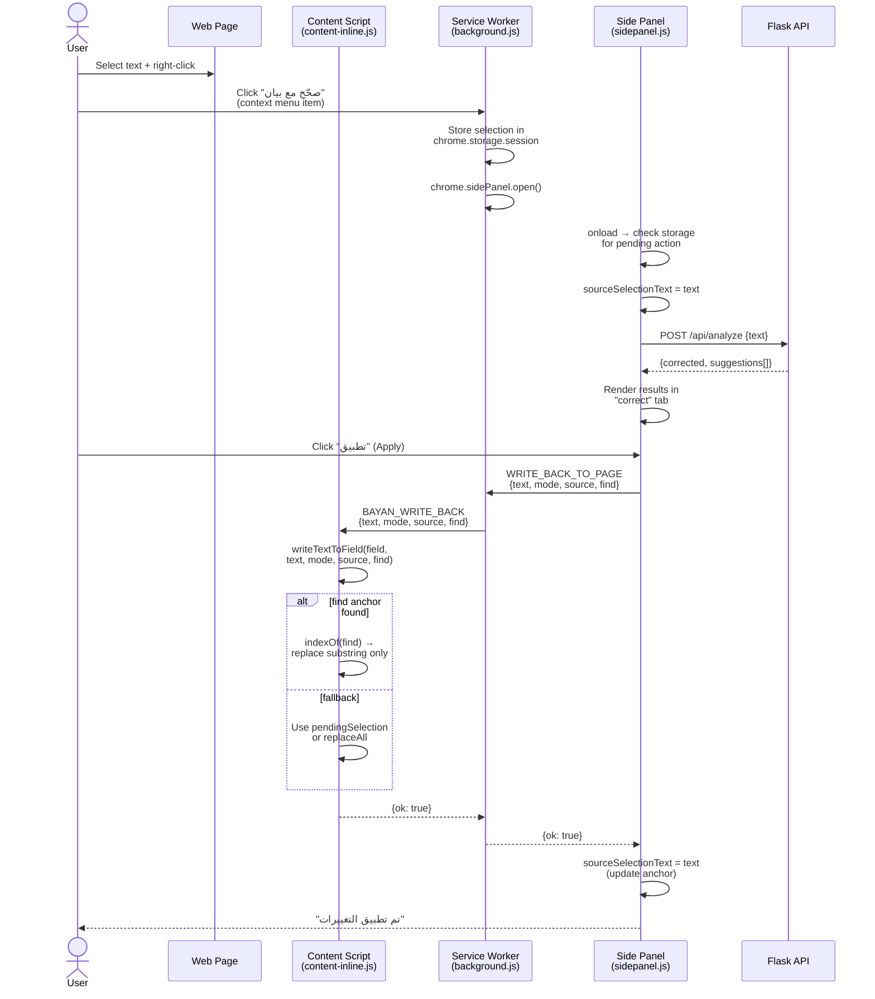
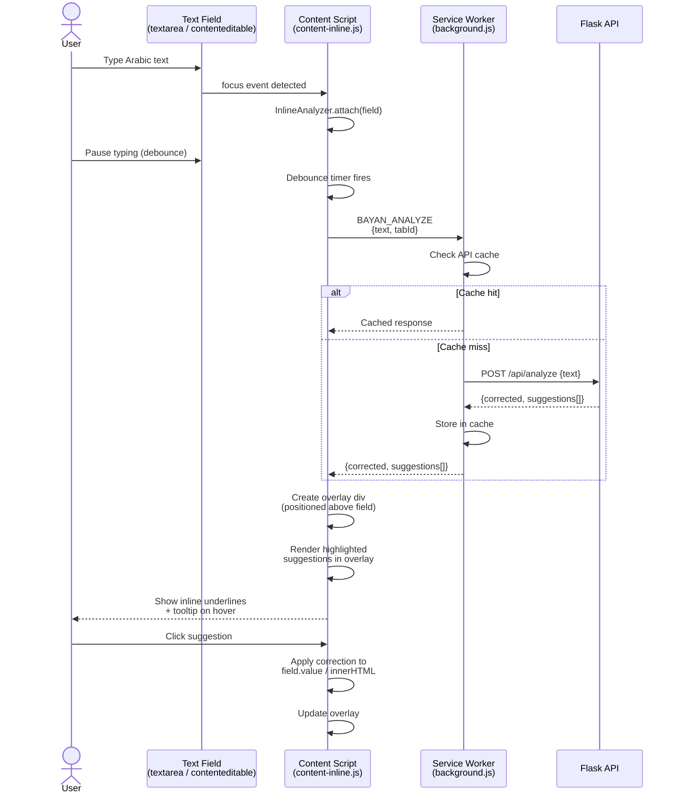
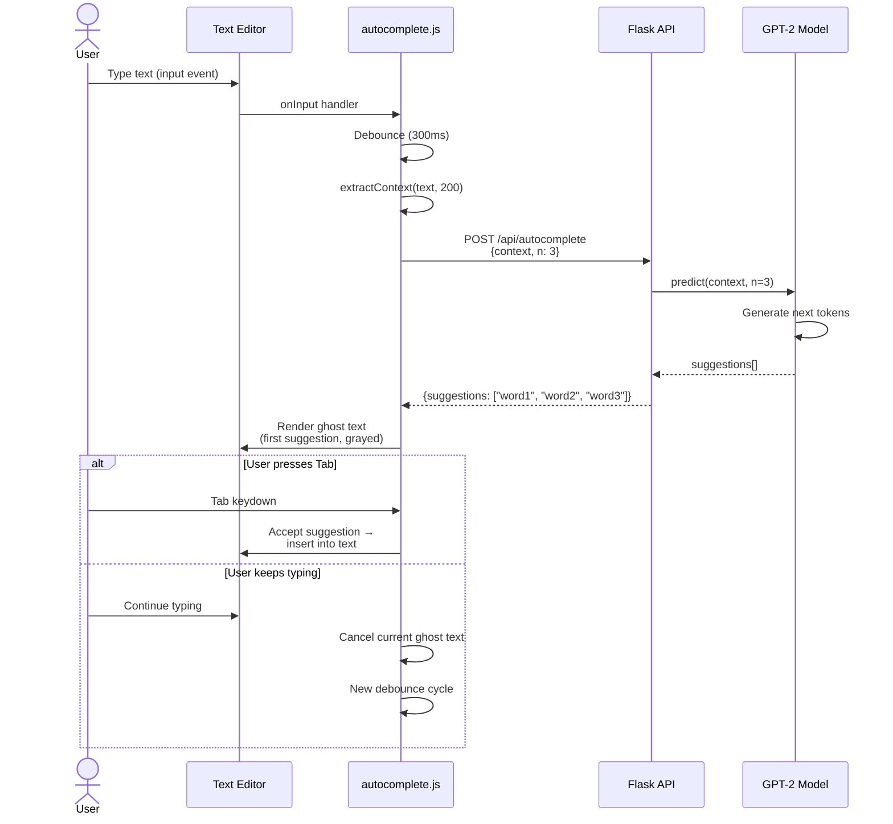
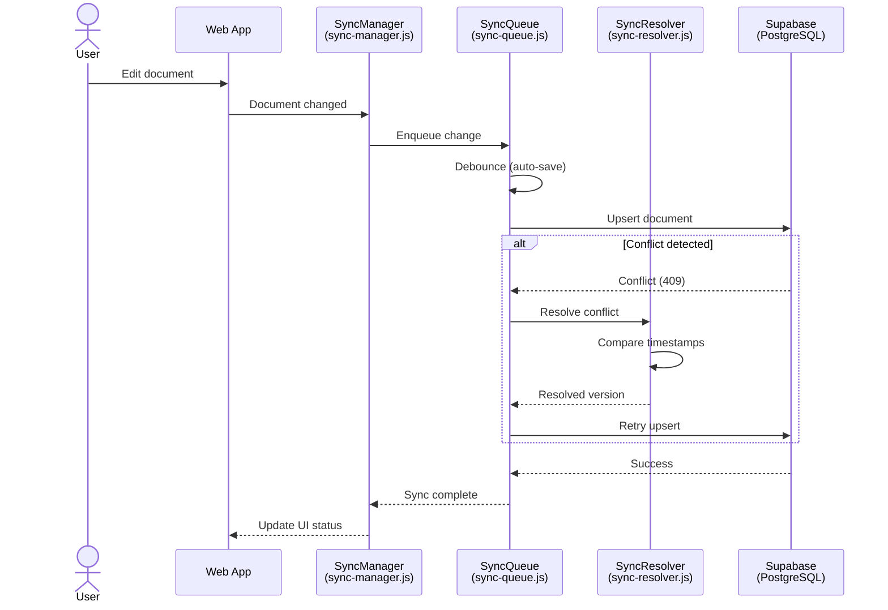

# Sequence Diagrams — Bayan

> Key interaction flows showing message passing between system components.

## 1. Text Analysis Pipeline (Web App)

The main correction flow when a user submits text for full analysis.

```mermaid
sequenceDiagram
    actor User
    participant Frontend as Web Frontend<br/>(bayan.bundle.js)
    participant Flask as Flask API<br/>(routes/nlp.py)
    participant Pipeline as PipelineContext<br/>(pipeline_context.py)
    participant Spelling as AraSpell<br/>(spelling_service.py)
    participant Grammar as Gemma 3<br/>(grammar_service.py)
    participant Punctuation as PuncAra-v1<br/>(punctuation_service.py)

    User->>Frontend: Enter text + click "تصحيح"
    Frontend->>Flask: POST /api/analyze {text}
    
    Flask->>Pipeline: PipelineContext(text)
    
    Note over Flask: Pre-checks: text length,<br/>Arabic ratio, religious text,<br/>URLs/emails/hashtags

    rect rgb(230, 245, 255)
        Note over Flask,Spelling: Stage 1: Spelling (≤1000 chars)
        Flask->>Spelling: _run_spelling_stage(ctx)
        Spelling->>Spelling: AraSpell seq2seq inference
        Spelling->>Spelling: Post-filters + OOV cleanup
        Spelling->>Spelling: Bidirectional validation
        Spelling-->>Flask: ctx.current_text updated
    end

    rect rgb(255, 245, 230)
        Note over Flask,Grammar: Stage 2: Grammar
        Flask->>Grammar: _run_grammar_stage(ctx)
        Grammar->>Grammar: Gemma 3 CausalLM inference<br/>(30s timeout)
        Grammar->>Grammar: Safety guards<br/>(Jaccard, tanween, entity, digit)
        Grammar-->>Flask: ctx.current_text updated
    end

    rect rgb(230, 255, 230)
        Note over Flask,Punctuation: Stage 3: Punctuation
        Flask->>Punctuation: _run_punctuation_stage(ctx)
        Punctuation->>Punctuation: PuncAra-v1 inference
        Punctuation->>Punctuation: Validation + 3-patch cap
        Punctuation-->>Flask: ctx.current_text updated
    end

    Flask->>Pipeline: ctx.patches.to_list()
    Pipeline-->>Flask: suggestions[] with<br/>original-text coordinates
    Flask->>Flask: _apply_patches_to_original()
    Flask-->>Frontend: {original, corrected,<br/>suggestions[], timing_ms}
    Frontend->>Frontend: Render inline suggestions<br/>(renderer.js)
    Frontend-->>User: Show highlighted corrections
```

## 2. Chrome Extension — Context Menu Flow

When a user right-clicks selected text on any webpage.

## 3. Chrome Extension — Inline Analysis Flow

Automatic text analysis when the user types in a text field.

## 4. Autocomplete — Ghost Text Flow

Real-time next-word prediction as the user types.

## 5. Document Sync Flow

Cloud synchronization of documents via Supabase.

