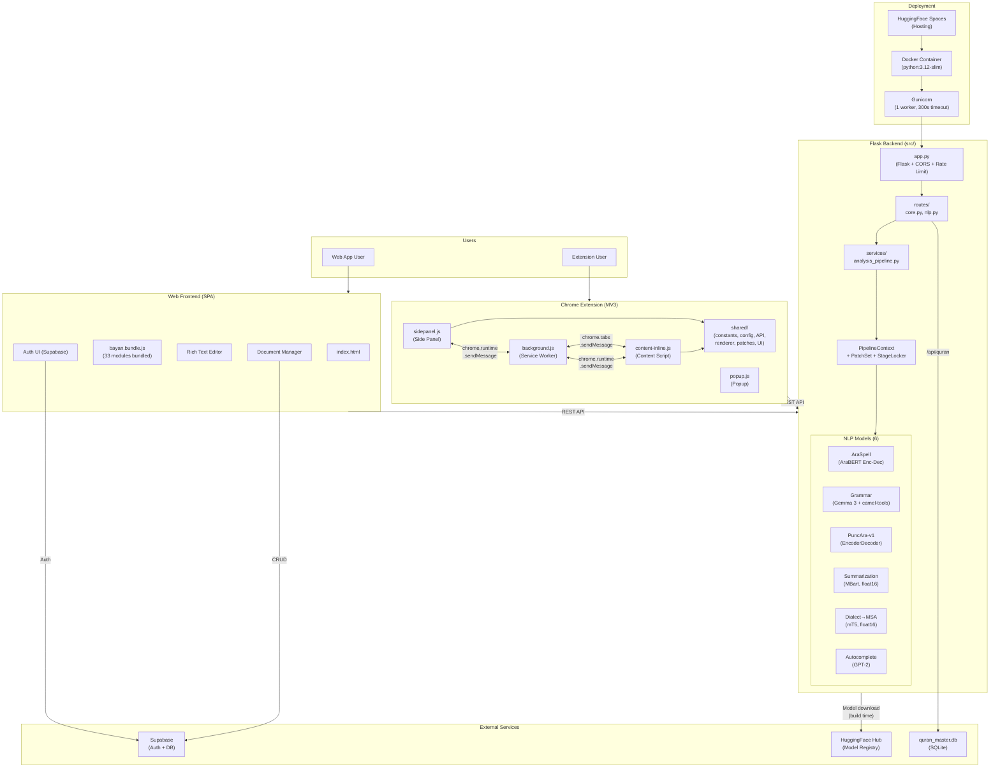

# System Architecture — Bayan

> High-level component diagram showing all major subsystems and their relationships.

## Overview

Bayan is an Arabic writing assistant composed of three main subsystems:
1. **Flask Backend** — NLP pipeline with 6 ML models, REST API
2. **Web Frontend** — Single-page application served by Flask
3. **Chrome Extension** — Manifest V3 extension with inline analysis and side panel

## API Endpoints

| Endpoint | Method | Rate Limit | Description |
|----------|--------|------------|-------------|
| `/api/analyze` | POST | 30/min | Unified pipeline: Spelling → Grammar → Punctuation |
| `/api/spelling` | POST | 30/min | Standalone spelling correction |
| `/api/grammar` | POST | 30/min | Standalone grammar correction |
| `/api/punctuation` | POST | 30/min | Standalone punctuation restoration |
| `/api/summarize` | POST | 10/min | Arabic text summarization |
| `/api/dialect` | POST | 10/min | Dialect → MSA conversion |
| `/api/quran` | POST | 20/min | Quran verse verification + translation |
| `/api/autocomplete` | POST | 60/min | Next-word prediction |
| `/api/health` | GET | — | Model status check |
| `/api/config` | GET | 30/min | Public Supabase config |

## Technology Stack

| Layer | Technology |
|-------|-----------|
| Backend Framework | Flask 3.x + Flask-CORS + Flask-Limiter |
| ML Framework | PyTorch (CPU-only) + HuggingFace Transformers |
| NLP Libraries | camel-tools (Arabic morphology), AraBERT tokenizer |
| Database | Supabase (PostgreSQL), SQLite (Quran) |
| Authentication | Supabase Auth (JWT) |
| Deployment | Docker, Gunicorn, HuggingFace Spaces |
| Extension | Chrome Manifest V3, Service Worker, Side Panel API |
| Frontend | Vanilla JS (ES6+), CSS3, no framework |
