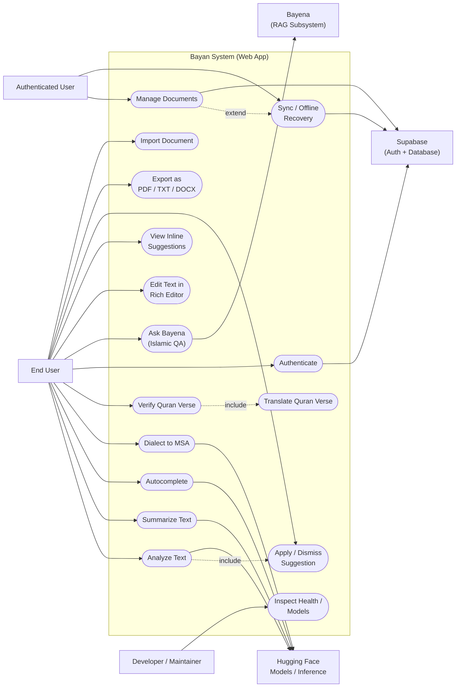
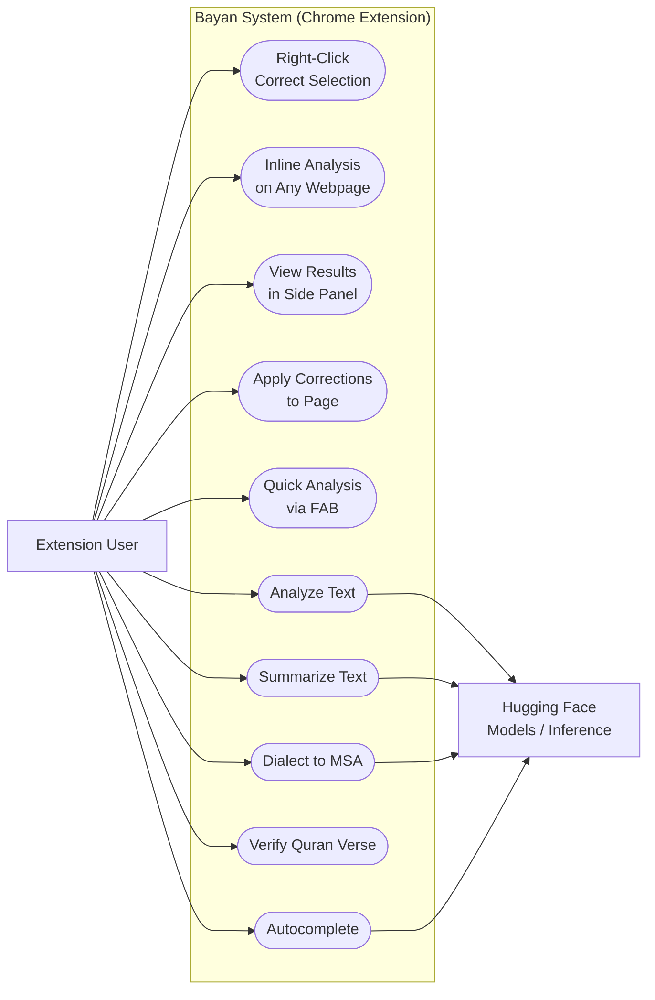

# Use Case Diagram — Bayan

> All user interactions with the system across web app and Chrome extension.

## 1. Web App Use Cases

## 2. Chrome Extension Use Cases

## Use Case Details

| # | Use Case | Actor | API Endpoint | Description |
|---|----------|-------|-------------|-------------|
| 1 | Correct Text | Both | `POST /api/analyze` | Runs unified 3-stage pipeline (Spelling, Grammar, Punctuation) |
| 2 | Correct Spelling | Both | `POST /api/spelling` | Standalone AraSpell correction |
| 3 | Correct Grammar | Both | `POST /api/grammar` | Standalone Gemma 3 + camel-tools correction |
| 4 | Add Punctuation | Both | `POST /api/punctuation` | Standalone PuncAra-v1 punctuation restoration |
| 5 | Summarize Text | Both | `POST /api/summarize` | MBart-based Arabic summarization (3 lengths) |
| 6 | Convert Dialect | Both | `POST /api/dialect` | mT5-based dialect-to-MSA conversion |
| 7 | Verify Quran | Both | `POST /api/quran` | Search in quran_master.db (SQLite) |
| 8 | Translate Quran | Both | `POST /api/quran` | Get verse translation (language param) |
| 9 | Autocomplete | Both | `POST /api/autocomplete` | GPT-2 next-word prediction |
| 10 | Edit Text | Web | — | Rich text editor in SPA |
| 11 | View Suggestions | Web | — | Inline highlighted suggestions |
| 12 | Apply/Reject | Web | — | Per-suggestion accept/reject |
| 13 | Export | Web | — | PDF, TXT, DOCX generation client-side |
| 14 | Import | Web | — | Load text/HTML/DOCX files |
| 15 | Manage Docs | Web | Supabase | Create, read, update, delete documents |
| 16 | Sync to Cloud | Web | Supabase | Real-time document sync |
| 17 | Auth | Web | Supabase | Email/password authentication |
| 20 | Context Menu | Ext | — | Right-click selected text, analyze |
| 21 | Inline Analysis | Ext | — | Auto-analyze on typing in text fields |
| 22 | Side Panel | Ext | — | Persistent workspace for all features |
| 23 | Write Back | Ext | — | Apply corrections directly to page content |
| 24 | FAB | Ext | — | Floating action button for quick access |
