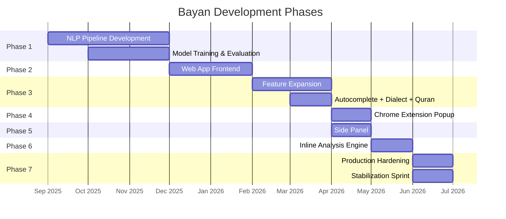

# Chapter 1: Introduction

## 1.1 Background and Context

The Arabic language is the fifth most spoken language globally, with over 420 million speakers across the Middle East and North Africa. As one of the six official languages of the United Nations, Arabic occupies a critical position in global communication, education, governance, and commerce. Despite this prominence, Arabic remains severely underserved by modern Natural Language Processing (NLP) tools when compared to English, Chinese, and European languages. The reasons for this disparity are deeply rooted in the morphological, syntactic, and orthographic complexity inherent to the Arabic writing system.

Arabic script is cursive, right-to-left, and context-dependent — the visual form of each character changes based on its position within a word (initial, medial, final, or isolated). Arabic morphology is predominantly non-concatenative: words are constructed by interleaving root consonants with vowel patterns and affixes, producing a combinatorial explosion of surface forms from a single three- or four-letter root. For instance, the root ك-ت-ب (k-t-b, meaning "write") gives rise to كتاب (kitāb, "book"), كاتب (kātib, "writer"), مكتبة (maktaba, "library"), كتابة (kitāba, "writing"), and dozens of additional derivations. This rich morphological system renders simple dictionary-lookup approaches inadequate for spelling correction, grammar checking, and text generation tasks.

Furthermore, Arabic text in everyday digital communication is frequently written without diacritical marks (tashkīl), which disambiguate vowel sounds and grammatical case endings. The absence of diacritics creates massive ambiguity: a single unvoweled string may correspond to multiple words with entirely different meanings. For example, the string علم without diacritics can mean "science" (ʿilm), "flag" (ʿalam), "taught" (ʿallama), or "knew" (ʿalima), among others. This pervasive ambiguity compounds the challenge of automated text processing.

The commercial landscape for Arabic writing assistance is strikingly barren. Grammarly, the dominant English-language writing assistant with over 30 million daily active users, offers no Arabic support whatsoever. QuillBot provides only basic paraphrasing for Arabic through machine translation proxies, with no grammar checking, spell checking, or punctuation restoration. Microsoft Word's Arabic spell checker relies on a static dictionary compiled decades ago and misses the vast majority of modern Arabic vocabulary, dialectal expressions, and morphological variations. Google Docs provides rudimentary suggestions but lacks the depth of analysis required for formal Arabic writing.

This technological gap has tangible consequences. Students submitting academic papers in Arabic must rely on manual proofreading. Journalists and content creators publishing Arabic-language articles have no automated quality assurance tools. Government agencies issuing official Arabic documents lack the writing assistance infrastructure that their English-language counterparts take for granted. The absence of comprehensive Arabic NLP tools is not merely an inconvenience — it is a barrier to the full participation of Arabic-speaking populations in the digital knowledge economy.

## 1.2 Problem Statement

The core problem addressed by this project can be stated as follows:

> **There exists no comprehensive, production-ready, AI-powered writing assistant for the Arabic language that provides integrated spelling correction, grammar checking, punctuation restoration, text summarization, dialect-to-MSA conversion, autocomplete, and Quranic text verification within a unified platform accessible from both a web interface and a browser extension.**

This problem decomposes into several interrelated sub-problems:

1. **Spelling Correction for Arabic**: Existing Arabic spell checkers are dictionary-based and cannot handle the combinatorial explosion of Arabic morphology. They fail on cliticized forms (e.g., وبالمدرسة — "and in the school"), produce false positives on valid but rare vocabulary, and cannot distinguish between orthographically similar words with different meanings (e.g., كان vs. كأن — "was" vs. "as if").

2. **Grammar Checking for Arabic**: Arabic grammar (نحو — naḥw) is governed by a complex system of case endings (إعراب — iʿrāb), number-gender agreement, verb conjugation paradigms (ماضي، مضارع، أمر), and syntactic structures (VSO vs. SVO word order) that existing tools cannot verify or correct.

3. **Punctuation Restoration**: Arabic text, particularly in informal digital communication, is frequently written with minimal or no punctuation. Restoring appropriate punctuation (periods, commas, semicolons, question marks in both Arabic and Latin forms) requires understanding sentence boundaries and rhetorical structure.

4. **Text Summarization**: Abstractive summarization of Arabic text requires models trained specifically on Arabic corpora, as cross-lingual transfer from English models produces hallucinated content and grammatically incorrect Arabic output.

5. **Dialect Handling**: The Arabic-speaking world encompasses a spectrum of dialects (Egyptian, Gulf, Levantine, Maghrebi) that differ substantially from Modern Standard Arabic (MSA — الفصحى). Users who write in dialect require tools to convert their text to formal MSA for academic, professional, and official contexts.

6. **Autocomplete**: Predictive text input for Arabic must account for the language's agglutinative tendencies, where prefixes (prepositions, conjunctions, articles) are attached directly to base words.

7. **Quranic Text Verification**: Given the centrality of the Quran in Arabic-language writing, the ability to verify and cross-reference Quranic quotations against the canonical text is a unique and valuable feature for Arabic writing tools.

## 1.3 Project Objectives

The Bayan (بيان) project was conceived to address the problems enumerated above through the design, implementation, and deployment of an integrated Arabic writing assistance platform. The specific objectives of the project are:

1. **Design and train a custom Arabic spelling correction model** (AraSpell) based on the AraBERT Encoder-Decoder architecture, incorporating a multi-stage correction pipeline with preprocessing, model inference, re-ranking, contextual refinement, and post-processing.

2. **Design and train a custom Arabic punctuation restoration model** (PuncAra-v1) based on a sequence-to-sequence Encoder-Decoder architecture fine-tuned on Arabic text with and without punctuation marks.

3. **Integrate a fine-tuned Arabic grammar correction model** using the Gemma 3 architecture, deployed as a Gradio-hosted inference endpoint with rule-based post-processing via CAMeL Tools morphological analysis.

4. **Train and deploy an Arabic text summarization model** based on the mBART (Multilingual BART) architecture, fine-tuned on Arabic summarization corpora.

5. **Develop a dialect-to-MSA conversion model** using the mT5 (Multilingual T5) architecture, capable of converting Egyptian, Gulf, Levantine, and Maghrebi dialects to formal Modern Standard Arabic.

6. **Implement a hybrid Arabic autocomplete system** combining statistical bigram models with neural GPT-2-based contextual prediction (AraGPT2-Base).

7. **Build a Quranic text verification engine** backed by a comprehensive SQLite database of the complete Quran with translations, enabling fuzzy search, verse identification, and cross-referencing.

8. **Develop a full-stack web application** with a Flask/Gunicorn backend, a rich single-page HTML/CSS/JavaScript frontend featuring a WYSIWYG editor, theme support, and real-time analysis.

9. **Develop a Chrome browser extension** (Manifest V3) providing Grammarly-style inline analysis on any web page, with a popup UI, side panel, context menu integration, floating action button, and suggestion tooltips.

10. **Deploy the system to production** on HuggingFace Spaces using Docker containerization, with pre-cached models, graceful degradation, and health monitoring.

## 1.4 Scope and Delimitations

### 1.4.1 In Scope

- Arabic text processing: spelling, grammar, punctuation, summarization, dialect conversion, autocomplete, and Quranic verification.
- Web application with a full-featured editor interface.
- Chrome browser extension with inline analysis capabilities.
- Cloud deployment on HuggingFace Spaces.
- User authentication via Supabase (PostgreSQL-based backend-as-a-service).
- Document management (create, save, load, cloud sync).
- Light and dark theme support.

### 1.4.2 Out of Scope

- Support for languages other than Arabic.
- Support for browsers other than Chromium-based browsers (Firefox, Safari).
- Mobile native applications (iOS, Android).
- Real-time collaborative editing (Google Docs-style multi-cursor).
- Diacritization (tashkīl) generation — the system processes unvoweled text.
- Handwriting recognition or OCR-based input.
- Commercial deployment or monetization infrastructure.

## 1.5 Methodology

The project followed an iterative, phased development methodology combining elements of Agile sprint planning with a waterfall-style sequential delivery of major system components. The development was organized into the following phases:

### Phase 1: Core NLP Pipeline
Development of the foundational NLP models and services: summarization, spelling correction (AraSpell), grammar correction, and punctuation restoration (PuncAra). Each model was trained independently, evaluated on held-out test sets, and integrated into a unified Flask API backend.

### Phase 2: Web Application (Frontend)
Design and implementation of the single-page web application (SPA) featuring a rich text editor, theme engine, formatting toolbar, real-time analysis display, and document management capabilities.

### Phase 3: Feature Expansion
Addition of autocomplete (hybrid bigram + GPT-2), dialect-to-MSA conversion (mT5), and Quranic text verification. Integration of Supabase for user authentication and cloud document storage.

### Phase 4: Chrome Extension — Popup and Context Menu
Development of the Chrome Manifest V3 extension with a popup UI that mirrors the web application's correction capabilities, plus context menu integration for right-click analysis of selected text on any web page.

### Phase 5: Chrome Extension — Side Panel
Implementation of a persistent side panel (using Chrome's Side Panel API, available since Chrome 114) providing a non-modal, always-available interface for text analysis alongside browsing.

### Phase 6: Chrome Extension — Inline Analysis Engine
Development of a Grammarly-style inline analysis system that highlights errors directly in editable text fields on any web page, with floating tooltips for individual suggestion acceptance.

### Phase 7: Production Hardening and Stabilization
Comprehensive architectural audit, elimination of duplicated infrastructure (cache, retry, hash, API URL, and versioning systems), memory leak fixes, race condition resolution, and production deployment optimization. This phase reduced the codebase by 458 lines while maintaining 100% test pass rate (49/49 unit tests + E2E tests).

## 1.6 Tools and Technologies

The following tools and technologies were employed in the development of the Bayan system:

### 1.6.1 Machine Learning and NLP

| Component | Technology | Purpose |
|---|---|---|
| Summarization | mBART (MBartForConditionalGeneration) | Arabic text summarization |
| Spelling | AraBERT Encoder-Decoder + AraSpell Pipeline | Arabic spelling correction |
| Grammar | Gemma 3 (AutoModelForCausalLM) + CAMeL Tools | Grammar error correction |
| Punctuation | PuncAra-v1 (EncoderDecoderModel) | Punctuation restoration |
| Autocomplete | AraGPT2-Base + Bigram Statistical Model | Next-word prediction |
| Dialect | mT5 (AutoModelForSeq2SeqLM) | Dialect-to-MSA conversion |
| Tokenization | AraBERT Tokenizer (aubmindlab/bert-base-arabertv02) | Subword tokenization |
| Morphology | CAMeL Tools MLE Disambiguator | Morphological analysis |
| Distance Metrics | Levenshtein, Damerau-Levenshtein, Jellyfish | Edit distance computation |

### 1.6.2 Backend

| Component | Technology | Version |
|---|---|---|
| Web Framework | Flask | Latest |
| CORS | Flask-CORS | Latest |
| WSGI Server | Gunicorn | Latest |
| ML Framework | PyTorch | Latest |
| Model Hub | HuggingFace Transformers + Hub | ≥0.20.0 |
| Inference Proxy | Gradio Client | Latest |
| Environment | python-dotenv | Latest |
| String Matching | RapidFuzz | Latest |

### 1.6.3 Frontend

| Component | Technology |
|---|---|
| Markup | HTML5 |
| Styling | CSS3 (Vanilla, CSS Variables) |
| Logic | Vanilla JavaScript (ES6+) |
| Authentication | Supabase JS Client |
| Editor | Custom contenteditable-based WYSIWYG editor |

### 1.6.4 Chrome Extension

| Component | Technology |
|---|---|
| Manifest | Chrome Manifest V3 |
| Background | Service Worker (background.js) |
| Content Script | content-inline.js + content-inline.css |
| Side Panel | Chrome Side Panel API (Chrome ≥114) |
| Popup | popup.html + popup.js + popup.css |
| Internationalization | Chrome i18n (_locales/) |

### 1.6.5 Infrastructure and Deployment

| Component | Technology |
|---|---|
| Containerization | Docker (python:3.12-slim) |
| Cloud Platform | HuggingFace Spaces |
| Database (Auth) | Supabase (PostgreSQL) |
| Database (Quran) | SQLite (quran_master.db, ~22MB) |
| Version Control | Git + GitHub |
| CI/CD | GitHub Actions |

## 1.7 Project Organization

### 1.7.1 Team Structure

The Bayan project was developed by a team of computer science students as a graduation capstone project, with each member contributing to specific subsystems while collaborating on integration and testing.

### 1.7.2 Repository Structure

The project repository is organized as follows:

```
BAYAN/
├── src/                          # Backend application
│   ├── app.py                    # Flask API server (1,717 lines)
│   ├── model_loader.py           # Model loading and inference (904 lines)
│   ├── hf_inference.py           # HuggingFace API fallback
│   ├── index.html                # Web application frontend
│   ├── js/                       # Frontend JavaScript modules
│   │   ├── editor.js             # WYSIWYG editor logic
│   │   ├── renderer.js           # Analysis result rendering
│   │   ├── autocomplete.js       # Autocomplete UI
│   │   ├── ui.js                 # General UI management
│   │   ├── api.js                # API client
│   │   ├── format.js             # Text formatting toolbar
│   │   ├── selection.js          # Text selection handling
│   │   ├── theme.js              # Theme management
│   │   ├── auth/                 # Authentication module
│   │   ├── documents/            # Document management
│   │   ├── documents-cloud/      # Cloud document sync
│   │   ├── summaries/            # Summary display
│   │   └── vendor/               # Third-party libraries
│   ├── css/                      # Stylesheets
│   └── nlp/                      # NLP Pipeline modules
│       ├── pipeline_context.py   # Pipeline state management
│       ├── correction_patch.py   # Patch/suggestion data model
│       ├── stage_locker.py       # Cross-stage conflict resolution
│       ├── spelling/
│       │   ├── araspell_rules.py # AraSpell pipeline (1,507 lines)
│       │   └── araspell_service.py
│       ├── grammar/
│       │   ├── grammar_rules.py  # CAMeL Tools rules (294 lines)
│       │   └── grammar_service.py
│       ├── punctuation/
│       │   ├── punctuation_rules.py
│       │   └── punctuation_service.py
│       ├── autocomplete/
│       │   ├── autocomplete_rules.py
│       │   └── autocomplete_service.py
│       └── dialect/
│           └── dialect_service.py
├── extension/                    # Chrome Extension
│   ├── manifest.json             # Manifest V3 configuration
│   ├── background.js             # Service worker
│   ├── content-inline.js         # Inline analysis engine
│   ├── content-inline.css        # Inline analysis styles
│   ├── popup.html / .js / .css   # Popup UI
│   ├── sidepanel/                # Side panel UI
│   ├── shared/                   # Shared extension modules
│   │   ├── analysis-controller.js
│   │   ├── bayan-api.js
│   │   ├── bayan-patches.js
│   │   ├── bayan-renderer.js
│   │   ├── bayan-state.js
│   │   ├── bayan-ui.js
│   │   ├── config.js
│   │   ├── constants.js
│   │   └── hash.js
│   └── tests/                    # Extension tests
├── quran.py                      # Quran search engine
├── quran_master.db               # Quran SQLite database (~22MB)
├── Dockerfile                    # Production container
├── requirements.txt              # Python dependencies
├── tests/                        # Unit and integration tests
└── docs/                         # Documentation
```

### 1.7.3 Development Timeline (Gantt Chart)



## 1.8 Report Organization

This report is organized into seven chapters:

- **Chapter 1 (Introduction)**: Provides background, problem statement, objectives, scope, methodology, tools, and project organization.
- **Chapter 2 (Literature Review)**: Surveys related work in Arabic NLP, spell checking, grammar correction, summarization, and writing assistance tools.
- **Chapter 3 (System Design and Architecture)**: Presents the overall system architecture, backend API design, NLP pipeline architecture, frontend design, and Chrome extension architecture.
- **Chapter 4 (Implementation)**: Details the implementation of each system component, including model training, API development, frontend features, and extension mechanics.
- **Chapter 5 (Testing and Evaluation)**: Describes the testing methodology, test results, model evaluation metrics, and production hardening audit findings.
- **Chapter 6 (Results and Discussion)**: Presents the system's capabilities, performance benchmarks, competitive analysis against Grammarly and QuillBot, and discusses limitations.
- **Chapter 7 (Conclusion and Future Work)**: Summarizes contributions, reflects on lessons learned, and outlines a roadmap for future development.
