# Chapter 3: System Design and Architecture

## 3.1 Overview

The Bayan system is a distributed, multi-tier architecture comprising four principal components: (1) a Python/Flask backend providing RESTful API endpoints for NLP model inference, (2) a single-page web application (SPA) frontend for direct text analysis, (3) a Chrome Manifest V3 browser extension for in-browser writing assistance, and (4) cloud infrastructure for deployment, authentication, and data persistence. This chapter presents the architectural design of each component, the data flow between components, and the key design decisions that shaped the system.

## 3.2 High-Level System Architecture

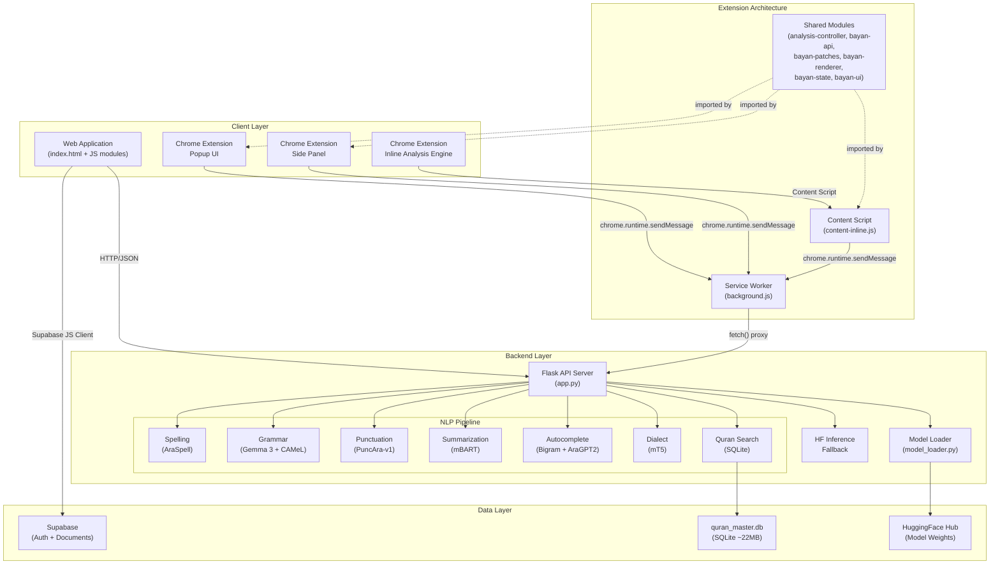

## 3.3 Backend Architecture

### 3.3.1 Flask API Server

The backend is a Flask application (`src/app.py`, 1,717 lines) that exposes RESTful API endpoints for all NLP operations. The server is designed to run under Gunicorn with a single worker process to minimize RAM consumption on the free-tier HuggingFace Spaces deployment (16GB RAM limit).

**API Endpoints:**

| Endpoint | Method | Purpose | Model |
|---|---|---|---|
| `/api/health` | GET | Health check and model status | — |
| `/api/debug-models` | GET | Debug model loading diagnostics | — |
| `/api/spelling` | POST | Standalone spelling correction | AraSpell |
| `/api/grammar` | POST | Standalone grammar correction | Gemma 3 |
| `/api/punctuation` | POST | Standalone punctuation restoration | PuncAra-v1 |
| `/api/summarize` | POST | Text summarization | mBART |
| `/api/autocomplete` | POST | Next-word prediction | Bigram + AraGPT2 |
| `/api/dialect` | POST | Dialect-to-MSA conversion | mT5 |
| `/api/quran` | POST | Quranic text verification | SQLite |
| `/api/analyze` | POST | Multi-stage sequential analysis | AraSpell → Gemma 3 → PuncAra |

### 3.3.2 Model Loading Strategy

The model loading strategy (`src/model_loader.py`, 904 lines) is designed to handle the constraints of the free-tier deployment:

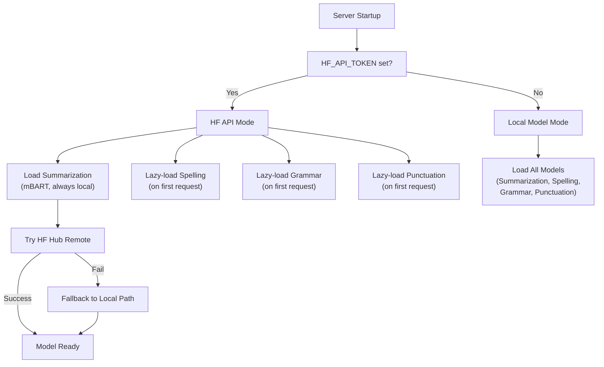

**Key Design Decisions:**

1. **Lazy Loading**: Spelling, grammar, punctuation, autocomplete, and dialect models are loaded on first request (singleton pattern), not at server startup. This avoids blocking the health check endpoint and reduces cold-start time.

2. **CPU-Only Inference**: All models run on CPU (`torch.device('cpu')`) in production. The grammar model explicitly forces CPU even when CUDA is available, to avoid GPU OOM on shared infrastructure.

3. **Float16 Precision**: Summarization and dialect models use `torch.float16` to halve memory consumption. Grammar uses `torch.float32` for stability on CPU.

4. **Pre-Downloaded Models**: The Dockerfile pre-downloads all model weights during the Docker build phase, caching them in the HuggingFace Hub local cache. At runtime, the container has no outbound DNS, so models must be available locally.

### 3.3.3 The `/api/analyze` Pipeline

The `/api/analyze` endpoint is the most architecturally complex component of the backend. It orchestrates a three-stage sequential pipeline: Spelling → Grammar → Punctuation. Each stage's output feeds into the next stage's input, and a sophisticated coordinate mapping system tracks character offsets through text mutations to produce suggestions aligned with the user's original input.

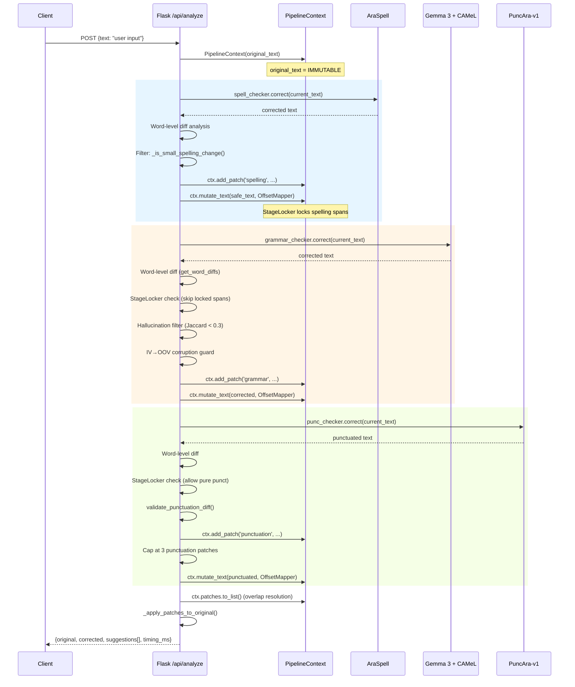

## 3.4 Pipeline Hardening Architecture

### 3.4.1 PipelineContext

The `PipelineContext` class (`src/nlp/pipeline_context.py`) carries all shared state through the three-stage pipeline. It enforces the following invariants:

1. **`original_text` is IMMUTABLE** — never reassigned after construction.
2. **`_offset_mappers` is APPEND-ONLY** — past mappers are never mutated or removed.
3. **`map_to_original()` is READ-ONLY** — deterministic coordinate transforms.
4. **All coordinate transforms go through `OffsetMapper` public API** — no direct access to internal opcodes.

### 3.4.2 CorrectionPatch and PatchSet

The `CorrectionPatch` dataclass (`src/nlp/correction_patch.py`) represents a single correction suggestion with dual coordinate spaces:

- **ORIGINAL coordinates** (`start_original`, `end_original`): Used for API response and overlap resolution. These coordinates refer to the user's original input text.
- **CURRENT coordinates** (`start_current`, `end_current`): Used by the `StageLocker` for pipeline-internal range checking. These coordinates refer to the pipeline's working copy, which is mutated by each stage.

The `PatchSet` class implements deterministic overlap resolution using a greedy first-fit strategy:

```
Sort order: priority DESC → confidence DESC → start ASC → id ASC
Strategy: First non-overlapping patch wins its range. One range = one owner.
```

**Priority hierarchy:**

| Stage | Priority |
|---|---|
| Grammar | 3 (highest) |
| Punctuation | 2 |
| Spelling | 1 |
| Autocomplete | 0 (lowest) |

### 3.4.3 OffsetMapper

The `OffsetMapper` class (`src/app.py`) provides bidirectional coordinate transformation between consecutive text versions using `difflib.SequenceMatcher`:

- **`reverse_map_offset(pos)`**: Maps a position from `text_after` → `text_before` (used to walk back to original coordinates).
- **`forward_map_range(start, end)`**: Maps a range from `text_before` → `text_after` (used by `StageLocker` to update locked spans after mutations).
- **Monotonicity guard**: If independent point mapping produces an inverted range (start > end), the end is clamped to `max(new_start, new_end)`.

### 3.4.4 StageLocker

The `StageLocker` (`src/nlp/stage_locker.py`) prevents later pipeline stages from modifying text ranges that were already corrected by earlier stages. When the spelling stage corrects a word, the `StageLocker` locks that character range. When the grammar stage subsequently proposes a correction overlapping with a locked range, the correction is rejected (unless it is a pure punctuation change).

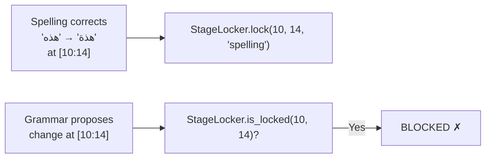

## 3.5 NLP Model Architecture

### 3.5.1 AraSpell Spelling Correction Pipeline

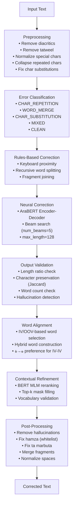

**Architecture details of AraSpell:**

| Component | Class | Lines |
|---|---|---|
| Post-Processor | `AraSpellPostProcessor` | ~360 |
| Error Classifier | `ErrorClassifier` | ~40 |
| Rules-Based Corrector | `RulesBasedCorrector` | ~100 |
| Output Validator | `OutputValidator` | ~60 |
| Vocabulary Manager | `VocabularyManager` | ~80 |
| Word Aligner | `WordAligner` | ~65 |
| Split/Merge Specialist | `SplitMergeSpecialist` | ~100 |
| Contextual Corrector | `ContextualCorrector` | ~100 |
| Edit Distance Corrector | `EditDistanceCorrector` | ~150 |
| Main Spell Checker | `ArabicSpellChecker` | ~200 |
| **Total** | | **~1,507** |

### 3.5.2 Grammar Correction Architecture

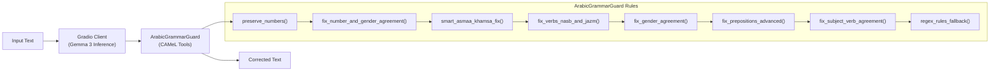

### 3.5.3 Punctuation Restoration Architecture

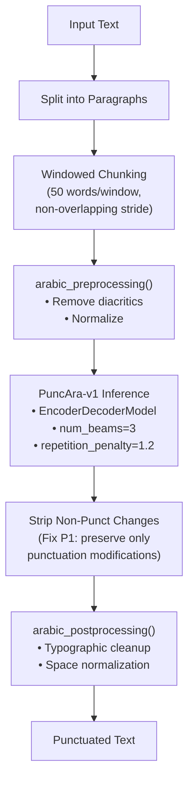

### 3.5.4 Autocomplete Architecture

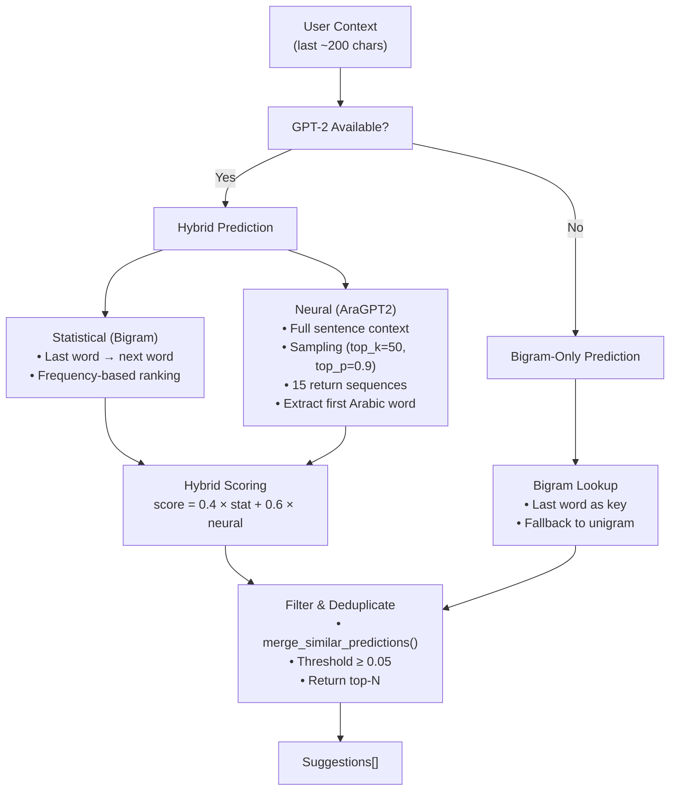

## 3.6 Frontend Architecture (Web Application)

### 3.6.1 Single-Page Application Structure

The web application is a single HTML file (`src/index.html`, 147,459 bytes) with modular JavaScript:

```mermaid
graph TD
    HTML["index.html<br/>(147KB)"]
    HTML --> EDITOR["editor.js<br/>(30KB, WYSIWYG editor)"]
    HTML --> RENDERER["renderer.js<br/>(12KB, results display)"]
    HTML --> UI["ui.js<br/>(13KB, UI management)"]
    HTML --> API["api.js<br/>(1.6KB, API client)"]
    HTML --> FORMAT["format.js<br/>(12.7KB, formatting toolbar)"]
    HTML --> SELECTION["selection.js<br/>(6.7KB, text selection)"]
    HTML --> THEME["theme.js<br/>(2.4KB, theme management)"]
    HTML --> AUTOCOMPLETE["autocomplete.js<br/>(15.5KB, autocomplete UI)"]
    HTML --> AUTH["auth/ module<br/>(authentication)"]
    HTML --> DOCS["documents/ module<br/>(local document management)"]
    HTML --> DOCS_CLOUD["documents-cloud/ module<br/>(cloud sync via Supabase)"]
    HTML --> SUMMARIES["summaries/ module<br/>(summary display)"]
```

### 3.6.2 Editor Architecture

The WYSIWYG editor is built on a `contenteditable` `<div>` element with custom JavaScript logic for:

- **Rich text formatting**: Bold, italic, underline, font family, font size, text alignment (right-to-left default for Arabic), text color, and highlight color.
- **Real-time analysis**: Debounced analysis requests sent to `/api/analyze` as the user types.
- **Autocomplete dropdown**: Context-aware suggestions triggered by text input, positioned near the cursor.
- **Inline highlighting**: Color-coded underlines for spelling (red), grammar (blue), and punctuation (green) suggestions.
- **Document management**: Create, save, load, rename, and delete documents with local storage persistence and optional Supabase cloud sync.

## 3.7 Chrome Extension Architecture

### 3.7.1 Manifest V3 Component Model

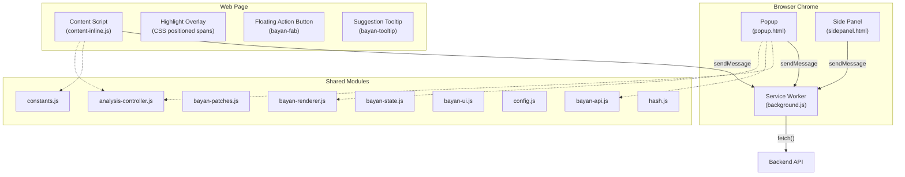

### 3.7.2 Background Service Worker

The background service worker (`extension/background.js`, 6,213 bytes) serves three purposes:

1. **Network Proxy**: Content scripts cannot make cross-origin requests to the Bayan API. The service worker receives `BAYAN_ANALYZE` messages and proxies them via `fetch()`.

2. **Context Menu Registration**: Creates the right-click context menu item "✍️ تحليل مع بيان" that allows users to analyze selected text.

3. **Side Panel Management**: Responds to `OPEN_SIDE_PANEL` messages by calling `chrome.sidePanel.open()`.

### 3.7.3 Content Script — Inline Analysis Engine

The content-inline.js script (20,208 bytes) implements the Grammarly-style inline analysis:

```mermaid
statechart-v2
    [*] --> Idle
    Idle --> Detecting : User focuses editable field
    Detecting --> Observing : Editable field detected
    Observing --> Analyzing : Text changed (debounced 800ms)
    Analyzing --> Rendering : API response received
    Rendering --> Observing : Highlights rendered
    Observing --> Idle : User blurs field

    state Analyzing {
        [*] --> SendMessage
        SendMessage --> WaitResponse : chrome.runtime.sendMessage
        WaitResponse --> ProcessPatches : Response.suggestions[]
        ProcessPatches --> [*]
    }

    state Rendering {
        [*] --> ClearOverlay
        ClearOverlay --> CreateHighlights
        CreateHighlights --> PositionOverlay
        PositionOverlay --> [*]
    }
```

**Key Design Features:**

- **MutationObserver**: Detects dynamically created editable fields on SPAs.
- **Debounced Analysis**: 800ms debounce prevents excessive API calls during rapid typing.
- **Content Hash Check**: Uses FNV-1a hashing (`shared/hash.js`) to skip re-analysis if text content hasn't changed.
- **Protected Site Detection**: Skips injection on `chrome://`, `chrome-extension://`, and Chrome Web Store domains.
- **Error Recovery Mode**: On API failure, enters a backoff state rather than repeatedly failing.

### 3.7.4 Shared Module Architecture

The shared modules implement a clean separation of concerns:

| Module | Responsibility |
|---|---|
| `constants.js` | API URL, version string |
| `config.js` | Configuration management |
| `hash.js` | FNV-1a content hashing |
| `bayan-api.js` | API client with error handling |
| `bayan-state.js` | Analysis state management |
| `bayan-patches.js` | Patch data model and operations |
| `bayan-renderer.js` | Result rendering (shared by popup/sidepanel) |
| `bayan-ui.js` | UI helper functions |
| `analysis-controller.js` | Orchestration: hash check → API call → state update → render |

## 3.8 Deployment Architecture

### 3.8.1 Docker Container

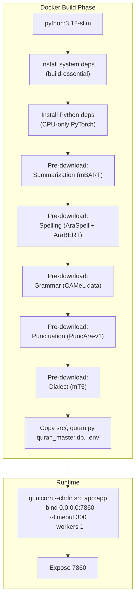

**Key Parameters:**
- **Workers**: 1 (to minimize RAM on free tier)
- **Timeout**: 300s (to accommodate full pipeline: spelling ~50s + grammar ~8s + punctuation ~30s + cold start)
- **Port**: 7860 (HuggingFace Spaces default)

### 3.8.2 Authentication and Data Flow

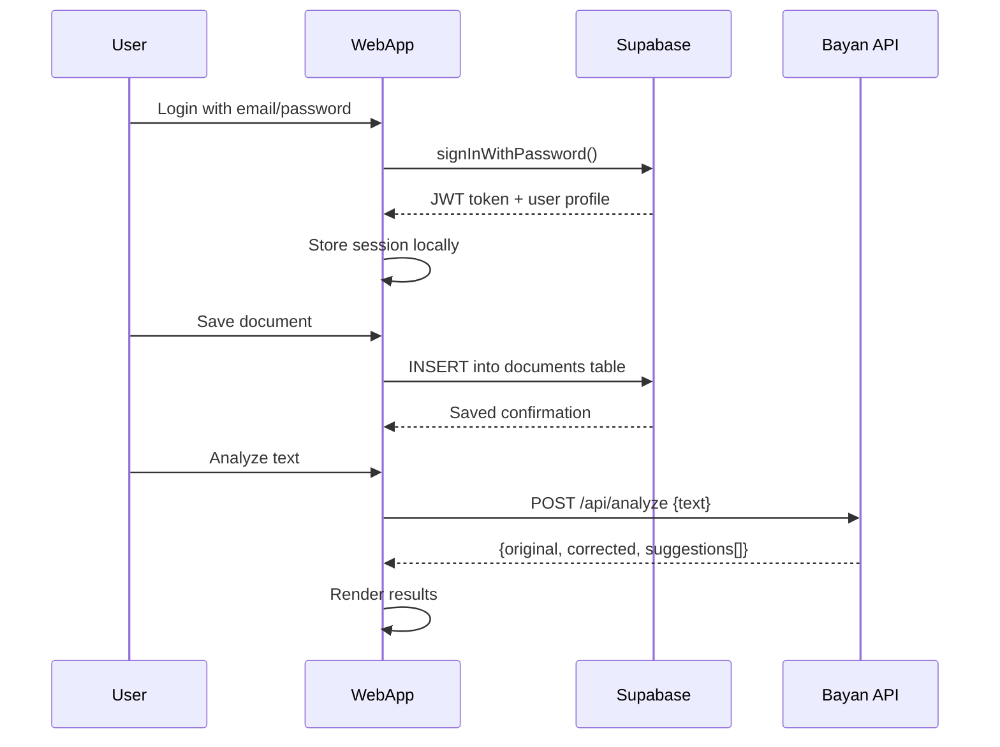

## 3.9 Data Models

### 3.9.1 Analysis API Response

```json
{
  "original": "النص الأصلي",
  "corrected": "النص المصحح",
  "suggestions": [
    {
      "id": "uuid",
      "start": 0,
      "end": 5,
      "original": "الأصلي",
      "correction": "الأصلية",
      "type": "spelling",
      "priority": 1,
      "confidence": 0.9,
      "locked": true,
      "alternatives": ["الأصلية", "الأصلي"]
    }
  ],
  "timing_ms": {
    "spelling_ms": 1200,
    "grammar_ms": 800,
    "punctuation_ms": 500,
    "total_ms": 2500
  },
  "status": "success"
}
```

### 3.9.2 CorrectionPatch Data Model

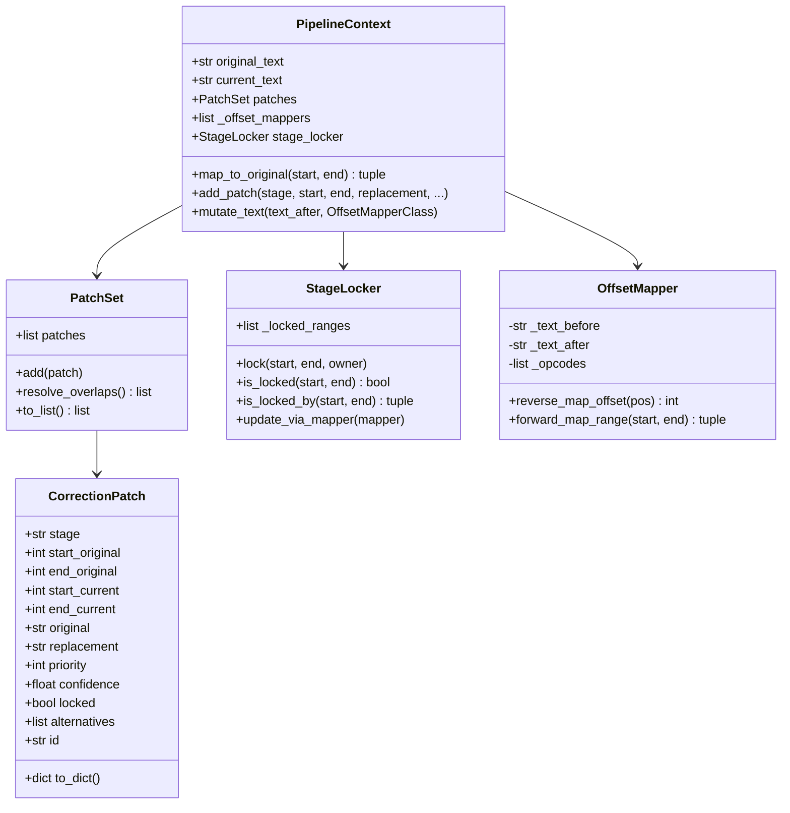

## 3.10 Security Considerations

### 3.10.1 Input Sanitization

The `/api/analyze` endpoint performs input sanitization:

1. **HTML Tag Stripping**: `re.sub(r'<[^>]*>', '', text)` removes HTML tags to prevent AraSpell from processing tag characters.
2. **Arabic Content Threshold**: Inputs with less than 30% Arabic characters (relative to total alphabetic characters) are returned without analysis, preventing code/markup from reaching the NLP models.
3. **Maximum Length**: All endpoints enforce a `MAX_TEXT_LENGTH = 5,000` character limit.

### 3.10.2 CORS Policy

```python
CORS(app, resources={r"/api/*": {"origins": "*"}})
```

CORS is restricted to `/api/*` routes only. Static file serving does not include CORS headers.

### 3.10.3 Chrome Extension Permissions

The manifest declares the minimum required permissions:

```json
"permissions": ["contextMenus", "activeTab", "storage", "sidePanel"],
"host_permissions": ["https://bayan10-bayan-api.hf.space/*"]
```

- No `<all_urls>` permission — only the Bayan API domain is allowed for network requests.
- `activeTab` provides temporary access to the current tab only when the user explicitly interacts with the extension.
- Content scripts are injected via the `content_scripts` manifest key (not programmatic injection), matching `https://*/*` and `http://*/*`.

## 3.11 Design Patterns Summary

| Pattern | Usage | Location |
|---|---|---|
| Singleton (Lazy-Loaded) | Model instances loaded on first request | All service modules |
| Pipeline | Sequential Spelling → Grammar → Punctuation processing | `/api/analyze` |
| Observer (MutationObserver) | Dynamic editable field detection | `content-inline.js` |
| Proxy | Service worker proxies API calls for content scripts | `background.js` |
| Strategy | Hybrid scoring selects between bigram and GPT-2 | `autocomplete_service.py` |
| Flyweight | Content hash avoids re-analysis of unchanged text | `analysis-controller.js` |
| Chain of Responsibility | OffsetMapper chain for coordinate transforms | `PipelineContext` |
| Greedy Algorithm | PatchSet overlap resolution | `correction_patch.py` |
