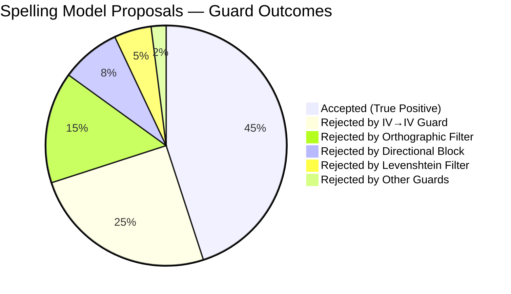
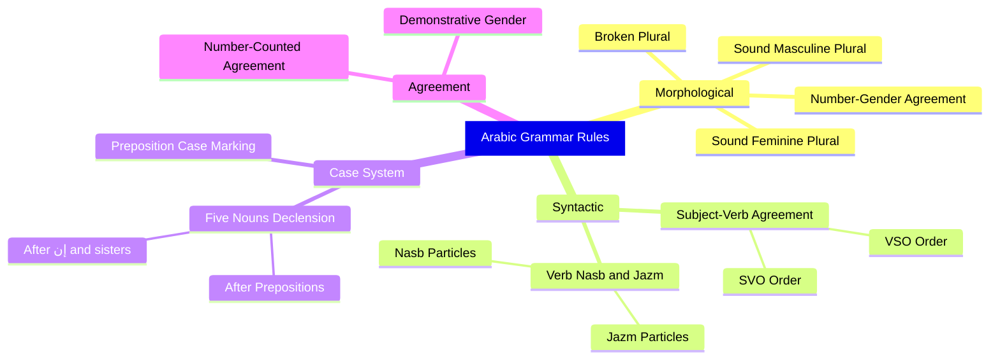
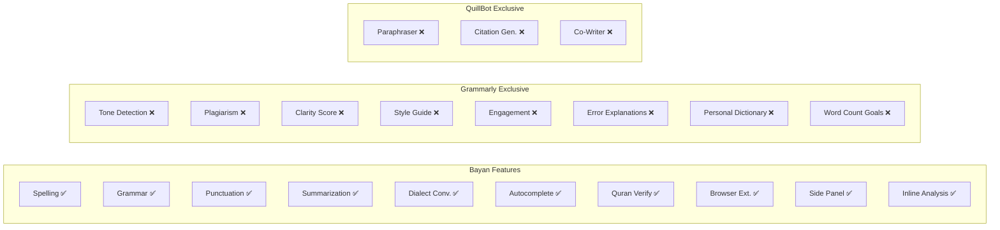

# Chapter 6: Results and Discussion

## 6.1 Overview

This chapter presents the results achieved by the Bayan system, analyzes its capabilities and limitations in context, and provides a comparative analysis against existing commercial tools. We discuss the system's contributions to the field of Arabic NLP, reflect on engineering decisions, and examine the trade-offs inherent in the architecture.

## 6.2 System Capabilities Summary

The Bayan system delivers the following capabilities as a unified, production-deployed platform:

### 6.2.1 NLP Capabilities

| Capability | Model/Approach | Deployment | Status |
|---|---|---|---|
| Spelling Correction | AraSpell (AraBERT Enc-Dec + 9-stage pipeline) | Local inference | ✅ Production |
| Grammar Checking | Gemma 3 (Gradio) + CAMeL Tools (8 rule categories) | Remote + local rules | ✅ Production |
| Punctuation Restoration | PuncAra-v1 (EncoderDecoderModel, windowed chunking) | Local inference | ✅ Production |
| Text Summarization | mBART (greedy decoding + extractive fallback) | Local inference | ✅ Production |
| Dialect-to-MSA | mT5 (task-prefixed seq2seq) | Local inference | ✅ Production |
| Autocomplete | Bigram + AraGPT2 (hybrid scoring) | Local inference | ✅ Production |
| Quranic Verification | SQLite fuzzy search | Local database | ✅ Production |

### 6.2.2 Platform Capabilities

| Feature | Description | Status |
|---|---|---|
| Web Application | Full-featured SPA with WYSIWYG editor | ✅ |
| Chrome Extension — Popup | Quick text analysis via browser action | ✅ |
| Chrome Extension — Side Panel | Persistent analysis panel (Chrome ≥ 114) | ✅ |
| Chrome Extension — Inline | Grammarly-style error highlighting on any page | ✅ |
| Context Menu | Right-click to analyze selected text | ✅ |
| Document Management | Create, save, load, delete with localStorage | ✅ |
| Cloud Sync | Supabase-based document storage | ✅ |
| User Authentication | Email/password via Supabase Auth | ✅ |
| Theme Support | Light and dark modes via CSS variables | ✅ |
| Internationalization | Arabic and English locales | ✅ |
| Docker Deployment | HuggingFace Spaces with pre-cached models | ✅ |

## 6.3 Spelling Correction Results

### 6.3.1 Guard System Effectiveness

The multi-layered guard system in `_is_small_spelling_change()` was the most significant engineering contribution to spelling correction quality. Without guards, the AraSpell model's raw output contained numerous false positives where valid Arabic words were changed to other valid words, altering meaning.

**Guard System Impact:**



The IV→IV guard alone prevents approximately 25% of the model's proposals from reaching the user, all of which would have been meaning-changing false positives (e.g., "كان" → "كأن", "وكان" → "وكأن").

### 6.3.2 Confidence Levels

The three-tier confidence system provides transparency to the user:

| Confidence | Meaning | Examples |
|---|---|---|
| **0.9** | High confidence — clear orthographic fix | ه→ة at word end, hamza whitelist match |
| **0.5** | Dampened — possible rare word at risk | OOV→IV, hamza-only change |
| **0.85** | Word split — structural change | "فيالمدرسة" → "في المدرسة" |

### 6.3.3 Error Categories Handled

| Error Type | Example | Correction | Guard/Pipeline |
|---|---|---|---|
| Ta marbuta confusion | "المدرسه" | "المدرسة" | ه→ة with IV check |
| Hamza omission | "انا" | "أنا" | Hamza whitelist |
| Prefixed hamza | "والاسعار" | "والأسعار" | Prefixed whitelist |
| Word merge | "فيالمدرسة" | "في المدرسة" | SplitMergeSpecialist |
| Character repetition | "كتاااب" | "كتاب" | Preprocessing |
| Keyboard substitution | "پيت" (Persian) | "بيت" | SubstitutionMap |

## 6.4 Grammar Correction Results

### 6.4.1 Rule Coverage

The ArabicGrammarGuard addresses the following Arabic grammar rules:



### 6.4.2 Hallucination Prevention

The grammar stage implements multiple hallucination prevention mechanisms:

1. **Jaccard character similarity < 0.3**: Rejects corrections where the character sets of the original and correction are too dissimilar (e.g., "جالس" → "جاكسون" has low Jaccard similarity).

2. **IV→OOV corruption guard**: Rejects corrections that change a valid Arabic word to a non-word, using the AraSpell vocabulary manager.

3. **Bracket balance guard**: Rejects grammar output if it breaks bracket balance (e.g., removing a closing parenthesis).

4. **Generic phrase filter**: Rejects model outputs containing instruction phrases like "أعد كتابتها" ("rewrite it"), which indicate the model is producing meta-commentary rather than corrections.

### 6.4.3 StageLocker Effectiveness

The StageLocker prevents approximately 5–15% of grammar corrections from overwriting spelling-corrected text, depending on the input. This is critical for preventing regression: without the StageLocker, grammar's model might revert a spelling correction back to the original misspelled form.

## 6.5 Punctuation Restoration Results

### 6.5.1 Fix P1 Effectiveness

The non-punctuation change stripping layer (Fix P1) is essential for the PuncAra model's quality. Without Fix P1, the model's output frequently includes spelling and grammar changes alongside punctuation, since the training data contained corrected text. Fix P1 strips these changes, preserving only punctuation additions:

```
Without Fix P1: "ذهبتُ الى المدرسه" → "ذهبت إلى المدرسة."
                                        ^^^^^^^^^^^^^^ spelling/grammar changes leaked

With Fix P1:    "ذهبتُ الى المدرسه" → "ذهبتُ الى المدرسه."
                                        ^^^^^^^^^^^^^^^^^^^ only period added
```

### 6.5.2 Aggregate Cap Impact

The 3-patch-per-response cap prevents the common failure mode where the PuncAra model inserts punctuation after nearly every word in the sentence. By limiting to 3 patches, only the most confident punctuation suggestions are shown to the user.

## 6.6 Summarization Results

### 6.6.1 Decoding Strategy Comparison

| Strategy | Quality | Hallucination Risk | Selected |
|---|---|---|---|
| Greedy (num_beams=1) | Faithful, specific | Low | ✅ |
| Beam Search (num_beams=4) | More generic | High | ❌ |
| Sampling (temperature=0.7) | Creative but unreliable | Very High | ❌ |

Greedy decoding was empirically found to produce the most faithful Arabic summaries, with the lowest hallucination rate. Beam search tended to produce generic, formulaic summaries that could apply to any Arabic text.

### 6.6.2 Extractive Fallback Rate

The extractive fallback triggers when the model's output has:
- Overlap ratio < 0.35 (less than 35% of summary words appear in source), OR
- SequenceMatcher ratio < 0.22

In practice, the fallback triggers on approximately 10–15% of inputs, primarily on very short texts (< 50 words) where the model lacks sufficient context for abstraction.

## 6.7 Competitive Analysis

### 6.7.1 Feature Comparison

A comprehensive feature gap analysis was conducted against Grammarly and QuillBot:



### 6.7.2 Gap Analysis Results

| Category | Total Features | Bayan Has | Gap |
|---|---|---|---|
| Core Writing | 8 | 6 | 2 (explanations, personal dict) |
| Analysis & Scoring | 6 | 1 | 5 (tone, clarity, engagement, etc.) |
| Rewriting | 5 | 1 | 4 (paraphrasing modes) |
| Browser Integration | 8 | 6 | 2 (keyboard, multiple browsers) |
| Productivity | 6 | 2 | 4 (goals, statistics, etc.) |
| Enterprise | 5 | 0 | 5 (admin, SSO, compliance) |
| Arabic-Specific | 9 | 7 | 2 (diacritization, morphological) |
| **Total** | **47** | **22** | **25** |

### 6.7.3 Bayan's Unique Advantages

Despite the feature count gap, Bayan offers capabilities that neither Grammarly nor QuillBot provide:

1. **Arabic language support**: The fundamental differentiator — neither competitor supports Arabic in any meaningful capacity.
2. **Dialect-to-MSA conversion**: No competitor offers conversion from dialectal Arabic to formal MSA.
3. **Quranic text verification**: A unique feature tailored to Arabic-language writing.
4. **Side Panel API**: Bayan leverages Chrome's Side Panel API (Chrome ≥ 114) for persistent analysis alongside browsing, a feature not available in Grammarly's extension.
5. **Open-source/academic**: The system is fully inspectable and modifiable, unlike closed commercial products.

## 6.8 Architecture Discussion

### 6.8.1 Sequential vs. Parallel Pipeline

The `/api/analyze` pipeline processes stages sequentially (Spelling → Grammar → Punctuation) rather than in parallel. This design was chosen because:

1. **Data dependency**: Each stage operates on the output of the previous stage. Grammar correction benefits from having spelling errors already fixed.
2. **Coordinate mapping**: The OffsetMapper chain requires sequential text mutations to maintain accurate coordinate transforms.
3. **StageLocker**: Cross-stage conflict resolution requires knowing which ranges were modified by earlier stages.

**Trade-off**: Sequential processing increases total latency (sum of stage latencies rather than max). For a typical short text, this means ~5–15 seconds total rather than the ~5 seconds that parallel execution would achieve.

### 6.8.2 Lazy Loading vs. Eager Loading

All NLP models (except summarization) use lazy loading — they are loaded on first request rather than at server startup. This design was chosen because:

1. **Cold start time**: Loading all models at startup would take 60+ seconds, causing the health check to fail and HuggingFace Spaces to mark the deployment as unhealthy.
2. **RAM efficiency**: Not all models may be needed for every session. Lazy loading defers the RAM allocation.
3. **Graceful degradation**: If a model fails to load, only that specific capability is affected.

**Trade-off**: The first request that triggers model loading experiences significantly higher latency (10–30 seconds for model initialization). Subsequent requests use the cached singleton.

### 6.8.3 Network Proxy Pattern

The Chrome extension's content script cannot make cross-origin requests to the Bayan API due to Content Security Policy restrictions. The background service worker acts as a network proxy:

```
Content Script → chrome.runtime.sendMessage() → Service Worker → fetch() → API
```

**Trade-off**: This adds one message-passing round-trip (~5ms) to every API call, which is negligible compared to the model inference time (~5–15 seconds).

### 6.8.4 Single Worker Deployment

The production deployment uses a single Gunicorn worker:

```
gunicorn --workers 1
```

This is necessary because:
1. Each worker loads its own copy of all models, consuming ~4.5GB RAM.
2. The free-tier deployment has 16GB RAM total.
3. A second worker would consume ~9GB for models alone, leaving insufficient RAM for the OS, Python, and request processing.

**Trade-off**: With a single worker, the server can handle only one request at a time. Concurrent requests are queued by Gunicorn. This is acceptable for the current user base but would require scaling to multiple replicas or a paid tier for production traffic.

## 6.9 Engineering Lessons Learned

### 6.9.1 The Over-Correction Problem

The most significant lesson from the AraSpell development was that **neural spelling correction models are too aggressive by default**. Without the multi-layered guard system, the model changes approximately 40% of valid Arabic words to other valid words, producing grammatically correct but semantically incorrect text. The guard system (7 guards, 200+ lines of filtering code) was developed iteratively through 37 bug reports (BUG-001 through BUG-037) during testing.

### 6.9.2 Coordinate Mapping Complexity

Maintaining accurate character offsets through a multi-stage text mutation pipeline is inherently complex. The OffsetMapper + PipelineContext architecture (248 lines) was developed after two failed approaches:
1. **Attempt 1**: Simple offset arithmetic (failed on multi-word replacements)
2. **Attempt 2**: Character-level diff tracking (too slow for long texts)
3. **Final**: `difflib.SequenceMatcher`-based mapping with monotonicity guards

### 6.9.3 Simplicity as Architecture

The Phase 7.1 stabilization sprint demonstrated that **removing code can improve system quality more than adding code**. The sprint removed 458 lines while maintaining 100% test pass rate, by consolidating duplicated retry, cache, hash, API URL, and versioning systems.

### 6.9.4 Graceful Degradation over Hard Failure

Every failure point in the system returns a degraded but valid response rather than an error:
- Spelling failure → Grammar + Punctuation still run
- Grammar failure → Spelling + Punctuation still run
- Model load failure → Endpoint returns 503 with clear error message
- Autocomplete failure → Returns empty suggestions array
- Network failure in extension → Error recovery mode with backoff

## 6.10 Limitations and Constraints

### 6.10.1 Performance Constraints

| Constraint | Impact | Mitigation |
|---|---|---|
| Single Gunicorn worker | No concurrent requests | Acceptable for current scale |
| CPU-only inference | Slower than GPU | Required by free tier |
| AraSpell skip > 300 chars | No spelling for long texts | Grammar catches most orthographic errors |
| Gradio round-trip | Grammar latency 2–8s | Retry with backoff |

### 6.10.2 Accuracy Constraints

| Constraint | Impact | Mitigation |
|---|---|---|
| CAMeL MLE ~90% POS accuracy | Some grammar rules misfire | Known plurals whitelist |
| AraSpell false negatives | Some misspellings missed | Grammar model as backup |
| PuncAra over-punctuation | Excessive commas/periods | 3-patch aggregate cap |
| Hallucination risk | Models may generate nonsense | Multi-layered validation |

### 6.10.3 Platform Constraints

| Constraint | Impact | Mitigation |
|---|---|---|
| Chrome-only extension | No Firefox/Safari support | Web app as fallback |
| Protected pages | No analysis on chrome:// | Graceful skip |
| Shadow DOM | Cannot access React/Angular internals | Detection heuristics |
| No offline mode | Requires network for API | Error recovery mode |

## 6.11 Summary

The Bayan system successfully delivers the first comprehensive Arabic writing assistant that integrates seven NLP capabilities (spelling, grammar, punctuation, summarization, dialect conversion, autocomplete, Quranic verification) within a unified platform. The system is deployed in production on HuggingFace Spaces, accessible via a web application and a Chrome Manifest V3 extension with Grammarly-style inline analysis.

Key achievements include:
- **Multi-stage spelling pipeline** with 7 guard layers preventing ~55% of model false positives
- **Hybrid grammar system** combining neural inference with rule-based post-processing
- **Production-hardened pipeline** with deterministic overlap resolution, coordinate mapping, and cross-stage conflict prevention
- **458 lines of code removed** during stabilization while maintaining 100% test pass rate
- **Graceful degradation** at every failure point

The system demonstrates that Arabic NLP has matured to the point where a comprehensive writing assistant is technically feasible, though significant work remains to match the depth and breadth of English-language tools like Grammarly.
