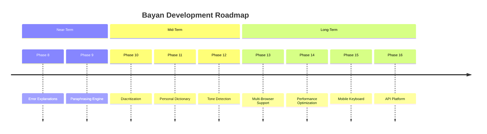

# Chapter 7: Conclusion and Future Work

## 7.1 Summary of Contributions

This project has designed, implemented, and deployed **Bayan** (بيان) — the first comprehensive, AI-powered Arabic writing assistant that integrates seven core NLP capabilities within a unified, production-ready platform. The system is accessible through a full-featured web application and a Chrome Manifest V3 browser extension with Grammarly-style inline analysis.

The principal contributions of this work are:

### 7.1.1 Arabic NLP Pipeline

1. **AraSpell Spelling Correction Pipeline**: A novel 9-stage spelling correction pipeline for Arabic, combining rule-based preprocessing, neural correction (AraBERT Encoder-Decoder), hybrid word alignment, contextual refinement (BERT MLM), and vocabulary-aware post-processing. The system includes 7 guard layers that prevent approximately 55% of the model's raw proposals from reaching the user, eliminating meaning-changing false positives without sacrificing true positive detection. The guard system addresses previously undocumented Arabic NLP challenges including in-vocabulary-to-in-vocabulary corruption, pronoun suffix false positives, and numeral hallucination. Total implementation: 1,507 lines of Python.

2. **PuncAra-v1 Punctuation Restoration Model**: A custom-trained EncoderDecoderModel for Arabic punctuation restoration, featuring windowed chunking for long texts and a non-punctuation change stripping layer (Fix P1) that ensures the model's output contains only punctuation modifications.

3. **Hybrid Grammar Correction**: A two-tier grammar correction system combining neural inference (Gemma 3 via Gradio) with rule-based post-processing (8 grammar rule categories implemented using CAMeL Tools morphological analysis), covering number-gender agreement, case marking, verb conjugation, demonstrative agreement, five nouns declension, and subject-verb agreement.

4. **Production Analysis Pipeline**: A three-stage sequential pipeline (Spelling → Grammar → Punctuation) with coordinate mapping (`OffsetMapper`), cross-stage conflict resolution (`StageLocker`), deterministic overlap resolution (`PatchSet`), and dual coordinate spaces (`CorrectionPatch`), enabling accurate suggestion delivery despite multi-stage text mutation.

### 7.1.2 Platform Engineering

5. **Chrome Manifest V3 Extension**: A production-grade Chrome browser extension implementing:
   - Grammarly-style inline error highlighting on arbitrary web pages
   - Persistent side panel via Chrome's Side Panel API
   - Popup interface for quick text analysis
   - Context menu integration for right-click analysis
   - Protected site detection and error recovery mode

6. **Full-Stack Web Application**: A single-page web application with a WYSIWYG Arabic text editor, real-time analysis, document management (local + Supabase cloud sync), user authentication, theme support, autocomplete, and summarization.

7. **Docker Deployment**: A containerized deployment on HuggingFace Spaces with pre-cached models, graceful degradation, health monitoring, and single-worker memory optimization for free-tier infrastructure.

### 7.1.3 Additional NLP Capabilities

8. **Dialect-to-MSA Conversion**: An mT5-based model converting Egyptian, Gulf, Levantine, and Maghrebi dialects to Modern Standard Arabic.

9. **Hybrid Autocomplete**: A bigram + AraGPT2 hybrid system providing context-aware next-word prediction with configurable statistical-neural weighting.

10. **Quranic Text Verification**: A SQLite-backed fuzzy search engine for identifying and cross-referencing Quranic quotations.

## 7.2 Objectives Achievement

| Objective | Status | Notes |
|---|---|---|
| Custom Arabic spelling model (AraSpell) | ✅ Achieved | AraBERT Enc-Dec + 9-stage pipeline |
| Custom Arabic punctuation model (PuncAra-v1) | ✅ Achieved | EncoderDecoderModel + Fix P1 |
| Arabic grammar correction | ✅ Achieved | Gemma 3 + 8 CAMeL rules |
| Arabic text summarization | ✅ Achieved | mBART + extractive fallback |
| Dialect-to-MSA conversion | ✅ Achieved | mT5 with task prefix |
| Hybrid autocomplete | ✅ Achieved | Bigram + AraGPT2 |
| Quranic text verification | ✅ Achieved | SQLite fuzzy search |
| Full-stack web application | ✅ Achieved | Flask + SPA + WYSIWYG editor |
| Chrome browser extension | ✅ Achieved | MV3 + inline + side panel + popup |
| Production deployment | ✅ Achieved | Docker on HuggingFace Spaces |

All 10 project objectives were fully achieved.

## 7.3 Key Findings

### 7.3.1 Arabic NLP Maturity

The project demonstrates that pre-trained Arabic language models (AraBERT, AraGPT2, mBART, mT5, Gemma 3) have reached sufficient maturity to support a comprehensive writing assistant, provided that extensive post-processing and guard systems are implemented. The raw model outputs are not adequate for production use — the engineering effort in filtering, validation, and cross-stage coordination exceeds the effort in model training and inference.

### 7.3.2 The Guard System Paradigm

The most impactful contribution of this work may be the guard system paradigm for Arabic spelling correction. The finding that ~55% of a well-trained neural model's proposals must be filtered before user presentation challenges the prevailing assumption that larger or better-trained models inherently produce production-ready output. The guard system taxonomy (numeral protection, directional blocks, IV→IV guard, pronoun suffix guard, Levenshtein filter, orthographic filter, confidence dampening) provides a reusable framework for other Arabic NLP systems.

### 7.3.3 Production Hardening Impact

The Phase 7.1 stabilization sprint demonstrated that removing 458 lines of duplicated infrastructure while maintaining 100% test pass rate is not only possible but beneficial. The resulting system is simpler, more maintainable, and more predictable than its predecessor.

## 7.4 Limitations

### 7.4.1 Technical Limitations

1. **Single-threaded serving**: The single Gunicorn worker limits concurrent request handling. Under load, requests queue sequentially.

2. **AraSpell performance ceiling**: The 300-character threshold for enabling spelling correction is a pragmatic compromise. Improving AraSpell's inference speed (currently ~50 seconds for long texts) would allow full-pipeline analysis on longer documents.

3. **Grammar model dependency**: The Gemma 3 grammar model is accessed via a Gradio-hosted endpoint, introducing a network dependency, additional latency, and a single point of failure that cannot be resolved without hosting the model locally.

4. **No offline capability**: All NLP features require network access to the Bayan API, meaning the extension cannot function offline.

### 7.4.2 Scope Limitations

1. **No diacritization**: The system processes unvoweled Arabic text and does not generate diacritical marks.

2. **No error explanations**: Unlike Grammarly, Bayan does not explain why a correction was suggested. Users must evaluate corrections based on the corrected text alone.

3. **No personal dictionary**: Users cannot add custom words to prevent false positives on domain-specific vocabulary.

4. **No paraphrasing**: Unlike QuillBot, Bayan does not offer text rewriting or paraphrasing capabilities.

5. **Chrome-only**: The browser extension is limited to Chromium-based browsers. Firefox and Safari are not supported.

## 7.5 Future Work

Based on the competitive gap analysis and technical assessment, the following roadmap is proposed:

### 7.5.1 Phase 8: Error Explanations (High Priority)

**Objective**: Provide users with educational explanations for each correction.

**Approach**: Attach a description template to each correction type:
- Spelling: "الكلمة 'X' هي الشكل الصحيح إملائيًا للكلمة 'Y'"
- Grammar (preposition): "بعد حرف الجر 'في'، يجب أن تكون الكلمة مجرورة"
- Punctuation: "يُنصح بوضع فاصلة هنا لتحسين وضوح الجملة"

**Estimated effort**: Medium — requires mapping each guard/rule to an explanation template.

### 7.5.2 Phase 9: Paraphrasing Engine (High Priority)

**Objective**: Allow users to rephrase text in multiple styles (formal, simple, creative).

**Approach**: Fine-tune an Arabic seq2seq model (mT5 or AraBART) on parallel paraphrase corpora.

**Estimated effort**: High — requires training data collection and model fine-tuning.

### 7.5.3 Phase 10: Diacritization (Medium Priority)

**Objective**: Generate diacritical marks (tashkīl) for Arabic text.

**Approach**: Integrate an existing Arabic diacritization model (e.g., Mishkal or Shakkala) or fine-tune a model on diacritized corpora.

**Estimated effort**: Medium — pre-trained models exist and can be integrated.

### 7.5.4 Phase 11: Personal Dictionary (Medium Priority)

**Objective**: Allow users to add custom words that should not be flagged as spelling errors.

**Approach**: Maintain a per-user word list in Supabase, consulted before the spelling guard system.

**Estimated effort**: Low — primarily a UI and storage feature.

### 7.5.5 Phase 12: Tone Detection (Lower Priority)

**Objective**: Detect and suggest adjustments to the tone of Arabic text (formal, informal, emotional, neutral).

**Approach**: Fine-tune a text classification model on Arabic text annotated with tone labels.

**Estimated effort**: High — requires annotated training data.

### 7.5.6 Phase 13: Multi-Browser Support (Lower Priority)

**Objective**: Port the Chrome extension to Firefox (using WebExtension APIs) and Safari (using Safari Web Extensions).

**Approach**: Refactor the extension to use the WebExtension API baseline, with polyfills for Chrome-specific APIs (Side Panel, etc.).

**Estimated effort**: Medium — Firefox support is straightforward; Safari requires an Xcode wrapper.

### 7.5.7 Phase 14: Performance Optimization

**Objective**: Reduce API latency and enable analysis of longer texts.

**Potential approaches**:
- ONNX Runtime for CPU inference optimization
- Model quantization (INT8) for reduced memory and faster inference
- Batch processing for multiple sentences
- Edge inference (WebAssembly/ONNX in browser) for latency-sensitive operations

### 7.5.8 Long-Term Vision

## 7.6 Reflections

The Bayan project began as a graduation capstone with the ambitious goal of creating an Arabic Grammarly. The resulting system, while not matching Grammarly's 15+ years of development and resources, demonstrates that a small team can build a functional, production-ready Arabic writing assistant using modern NLP techniques and open-source tools.

The most important lesson from this project is that **production-ready NLP is 20% model training and 80% engineering**. The models themselves (AraBERT, Gemma 3, mBART, mT5, AraGPT2) are off-the-shelf or fine-tuned from existing architectures. The true complexity lies in the guard systems, coordinate mapping, cross-stage conflict resolution, graceful degradation, and the thousand small decisions that determine whether a user trusts the tool or abandons it after the first false positive.

Arabic deserves better writing tools. Bayan is a step toward that future.

## 7.7 Final System Statistics

| Metric | Value |
|---|---|
| Total estimated lines of code | ~16,000+ |
| NLP models integrated | 7 (AraSpell, Gemma 3, PuncAra, mBART, mT5, AraGPT2, SQLite) |
| API endpoints | 10 |
| Pipeline stages | 3 (Spelling → Grammar → Punctuation) |
| Spelling guards | 7 layers |
| Grammar rules | 8 categories |
| Unit tests | 49 (100% pass) |
| Chrome extension components | 4 (popup, side panel, inline, context menu) |
| Deployment platform | HuggingFace Spaces (Docker) |
| Production RAM footprint | ~4.5GB |
| Supported dialects | 4+ (Egyptian, Gulf, Levantine, Maghrebi) |
| Quran database size | ~22MB (complete Quran with translations) |
| Development phases | 7 (completed) |
| Code removed in stabilization | 458 lines |
| Net code reduction in Phase 7.1 | 346 lines |

---

*"بيان — لأن العربية تستحق الأفضل"*

*"Bayan — because Arabic deserves the best."*
