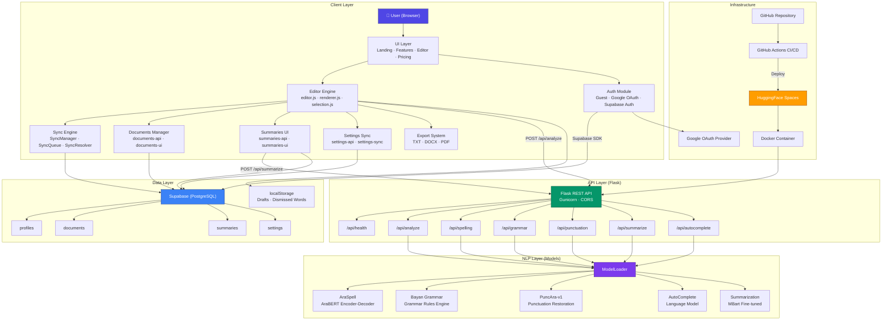

# 01 — High-Level System Architecture

## Overview

BAYAN is a full-stack Arabic NLP web application that provides intelligent writing assistance: spelling correction (AraSpell), grammar checking, punctuation restoration (PuncAra-v1), autocomplete suggestions, and text summarization. The system is deployed as a containerized Flask application on HuggingFace Spaces, with Supabase as the backend database and Google OAuth for authentication.

## Architecture Diagram

## Layer Descriptions

| Layer | Components | Responsibility |
|-------|-----------|----------------|
| **Client** | HTML/CSS/JS SPA | User interface, editor, auth gate, document management |
| **API** | Flask + Gunicorn | REST endpoints, request validation, model orchestration |
| **NLP** | 5 ML models | Spelling, grammar, punctuation, autocomplete, summarization |
| **Data** | Supabase + localStorage | Persistent storage, auth, offline drafts |
| **Infrastructure** | Docker + HF Spaces + CI | Containerization, deployment, monitoring |

## Design Rationale

1. **Single-Page Application (SPA)**: No framework overhead — pure HTML/CSS/JS for minimal bundle size and fast load.
2. **Flask API**: Lightweight Python backend, ideal for ML model serving.
3. **Supabase**: Managed PostgreSQL with built-in auth, RLS, and realtime — eliminates custom backend for CRUD.
4. **Docker**: Ensures model dependencies are pre-cached at build time (no runtime downloads).
5. **HuggingFace Spaces**: Free GPU/CPU hosting optimized for ML model serving.

## Extension Points

- Additional NLP models can be added via `ModelLoader` without changing the API structure.
- New Supabase tables follow the same RLS pattern.
- Frontend pages follow a `showPage()` pattern for easy addition.
