# 02 — UML Class Diagram

## Overview

This diagram models the complete class structure of the BAYAN system across Frontend and Backend layers, showing composition, aggregation, inheritance, and dependency relationships.

## Class Diagram

```mermaid
classDiagram
    direction TB

    %% ─── Frontend: Editor Core ───
    class Editor {
        -analyzeTimeout: Timer
        -analyzeAbortController: AbortController
        -undoStack: Array
        -redoStack: Array
        -dismissedWords: Set
        +initEditor()
        +getEditorText(): string
        +setEditorHTML(html)
        +updateEditorStats()
        +analyzeTextDelayed()
        +applyCorrection()
        +dismissSuggestion(suggestion)
        +applyAllSuggestions()
        +pushUndoState()
        +editorUndo(): boolean
        +editorRedo(): boolean
        +clearEditor()
        +copyText()
    }

    class Renderer {
        +renderCorrections(text, suggestions)
        +highlightErrors(editor, suggestions)
        +createErrorSpan(text, type, id)
        +escapeHtml(text): string
        +renderSuggestionsList(suggestions)
        +renderSuggestionCard(suggestion, idx)
    }

    class SelectionManager {
        +saveSelection(): Range
        +restoreSelection(range)
        +getCaretOffset(): number
        +setCaretOffset(offset)
        +getSelectedText(): string
    }

    class FormatManager {
        +execFormat(command, value)
        +toggleBold()
        +toggleItalic()
        +toggleUnderline()
        +setFontFamily(font)
        +setFontSize(size)
        +setTextColor(color)
        +setHighlightColor(color)
        +setAlignment(align)
        +insertList(type)
        +clearFormatting()
        +initDocSearch()
    }

    %% ─── Frontend: Auth ───
    class AuthManager {
        +signInAsGuest(): Promise
        +signInWithGoogle(): Promise
        +linkGoogle(): Promise
        +signOut(): Promise
        +getDisplayName(user): string
        +getAuthProvider(user): string
        +getAvatarUrl(user): string
        +isGuestUser(user): boolean
    }

    class AuthUI {
        +bindAuthUIEvents()
        +showAuthGate()
        +hideAuthGate()
        +updateAuthUI(user)
        +closeAuthMenu()
        +showAuthOfflineBanner(show)
    }

    class SessionManager {
        +initSession()
        +onAuthStateChange(callback)
        +getSession(): Session
        +refreshSession()
    }

    class SupabaseClient {
        +getSupabaseClient(): Client
        -url: string
        -anonKey: string
    }

    %% ─── Frontend: Documents ───
    class DocumentManager {
        +createDocument(title, content): Promise
        +loadDocuments(): Promise
        +loadDocument(id): Promise
        +saveDocument(id, content): Promise
        +renameDocument(id, title): Promise
        +deleteDocument(id): Promise
    }

    class DocumentUI {
        -docState: DocState
        +setDocState(state)
        +getDocState(): DocState
        +renderDocList(docs)
        +openDocument(id)
        +updateTitleBar()
        +loadAndRenderList()
    }

    class DocState {
        +currentDocumentId: string
        +currentDocumentTitle: string
        +hasUnsavedChanges: boolean
    }

    %% ─── Frontend: Summaries ───
    class SummaryManager {
        +createSummary(docId, originalText, summaryText): Promise
        +loadSummaries(docId): Promise
        +deleteSummary(id): Promise
    }

    class SummaryUI {
        +renderSummaryList(summaries)
        +showSummaryPanel(summary)
        +exportSummaryAsTxt()
    }

    %% ─── Frontend: Settings ───
    class SettingsAPI {
        +loadSettings(): Promise
        +saveSettings(settings): Promise
    }

    class SettingsSync {
        +initSettingsSync()
        +applySettings(settings)
        +getLocalSettings(): object
    }

    %% ─── Frontend: Sync ───
    class SyncManager {
        -syncInterval: Timer
        -isOnline: boolean
        +initSync()
        +scheduleSave()
        +syncNow(): Promise
        +handleOnline()
        +handleOffline()
    }

    class SyncQueue {
        -queue: Array
        +enqueue(operation)
        +dequeue(): Operation
        +peek(): Operation
        +isEmpty(): boolean
        +flush(): Promise
    }

    class SyncResolver {
        +resolve(local, remote): Resolved
        +mergeConflict(a, b): string
        +lastWriteWins(a, b): object
    }

    %% ─── Frontend: UI ───
    class UIManager {
        +showPage(pageId)
        +switchTab(tabId)
        +showToast(message, type)
        +setAnalyzingState(isAnalyzing)
        +updateSuggestionCounts(s, g, p)
        +updateWritingScore(s, g, p)
        +renderSuggestionsList(suggestions)
    }

    class ThemeManager {
        +initTheme()
        +toggleTheme()
        +getPreferredTheme(): string
        +applyTheme(theme)
    }

    class APIClient {
        +apiPost(endpoint, body): Promise
        +apiGet(endpoint): Promise
        -baseUrl: string
    }

    %% ─── Backend: Flask ───
    class FlaskApp {
        +index(): Response
        +health_check(): JSON
        +debug_models(): JSON
        +analyze_text(): JSON
        +spelling_correction(): JSON
        +grammar_correction(): JSON
        +add_punctuation(): JSON
        +summarize(): JSON
        +autocomplete(): JSON
    }

    class ModelLoader {
        +load_models()
        +ensure_models_loaded()
        -summarization_model: SummarizationModel
        -spelling_model: SpellingModel
        -grammar_model: GrammarModel
        -punctuation_model: PunctuationModel
        -autocomplete_model: AutocompleteModel
    }

    %% ─── Backend: NLP Services ───
    class AraSpellService {
        +correct(text): CorrectionResult
        +get_alternatives(word): List
        -model: EncoderDecoderModel
        -tokenizer: AutoTokenizer
    }

    class GrammarService {
        +check(text): List~GrammarError~
        +suggest_fix(error): string
        -rules: GrammarRules
    }

    class PunctuationService {
        +restore(text): string
        -model: PunctuationModel
    }

    class AutoCompleteService {
        +complete(prefix): List~Suggestion~
        -model: LanguageModel
    }

    class SummarizationService {
        +summarize(text, max_length): string
        -model: MBartForConditionalGeneration
        -tokenizer: AutoTokenizer
    }

    class HFInference {
        +hf_summarize(text): string
        +hf_correct_spelling(text): string
        +hf_add_punctuation(text): string
        +hf_autocomplete(text): string
        +check_hf_api_available(): boolean
    }

    %% ─── Relationships ───
    Editor *-- SelectionManager : uses
    Editor *-- Renderer : renders via
    Editor o-- FormatManager : formatting
    Editor --> APIClient : sends text
    Editor --> SyncManager : triggers save

    AuthManager --> SupabaseClient : authenticates via
    AuthManager --> SessionManager : manages session
    AuthUI --> AuthManager : calls

    DocumentManager --> SupabaseClient : CRUD
    DocumentUI --> DocumentManager : delegates to
    DocumentUI *-- DocState : owns

    SummaryManager --> SupabaseClient : CRUD
    SummaryUI --> SummaryManager : delegates to

    SettingsSync --> SettingsAPI : persists via
    SettingsAPI --> SupabaseClient : CRUD

    SyncManager *-- SyncQueue : owns
    SyncManager *-- SyncResolver : resolves with
    SyncManager --> DocumentManager : saves via

    UIManager --> Editor : controls
    UIManager --> Renderer : renders

    FlaskApp *-- ModelLoader : loads models
    FlaskApp --> AraSpellService : spelling
    FlaskApp --> GrammarService : grammar
    FlaskApp --> PunctuationService : punctuation
    FlaskApp --> AutoCompleteService : autocomplete
    FlaskApp --> SummarizationService : summarization
    FlaskApp --> HFInference : remote fallback

    ModelLoader --> AraSpellService : initializes
    ModelLoader --> GrammarService : initializes
    ModelLoader --> PunctuationService : initializes
    ModelLoader --> AutoCompleteService : initializes
    ModelLoader --> SummarizationService : initializes
```

## Design Rationale

- **Composition (`*--`)**: Editor owns SelectionManager and Renderer — they cannot exist without the Editor.
- **Aggregation (`o--`)**: FormatManager is reusable and independent.
- **Dependency (`-->`)**: API calls and data flows between modules.
- **Frontend modules** are globally-scoped functions (vanilla JS) but modeled as classes for UML clarity.
- **Backend** uses Flask route functions modeled as FlaskApp methods, with NLP services as separate classes.
