# 03 — Component Diagram

## Overview

This diagram shows how BAYAN's software components are organized and interact across Frontend, API, NLP, and Data layers.

## Component Diagram

```mermaid
graph TB
    subgraph "Frontend SPA"
        direction TB
        subgraph "Pages"
            HOME["🏠 Landing Page"]
            FEATURES["⚡ Features Page"]
            EDITOR_PAGE["📝 Editor Page"]
            PRICING["💰 Pricing Page"]
            P404["🚫 404 Page"]
        end

        subgraph "Editor Core"
            EDITOR["editor.js<br/>State · Undo/Redo · Analysis"]
            RENDERER["renderer.js<br/>Error Highlighting · Spans"]
            SELECTION["selection.js<br/>Caret · Range · Offset"]
            FORMAT["format.js<br/>Bold · Italic · Lists · Colors"]
        end

        subgraph "Auth System"
            AUTH_GATE["Auth Gate<br/>Login Modal"]
            AUTH_JS["auth.js<br/>Guest · Google · Link"]
            AUTH_UI["auth-ui.js<br/>Menu · Avatar · Banner"]
            SESSION["session.js<br/>Token Refresh"]
            SB_CLIENT["client.js<br/>Supabase Init"]
        end

        subgraph "Data Modules"
            DOC_API["documents-api.js<br/>CRUD Operations"]
            DOC_UI["documents-ui.js<br/>Sidebar · List · Search"]
            DOC_STATE["documents-state.js<br/>Current Doc Tracking"]
            SUMM_API["summaries-api.js<br/>Save · Load · Delete"]
            SUMM_UI_MOD["summaries-ui.js<br/>Display · Export TXT"]
            SET_API["settings-api.js<br/>Load · Save"]
            SET_SYNC["settings-sync.js<br/>Apply · Sync"]
        end

        subgraph "Sync Engine"
            SYNC_MGR["sync-manager.js<br/>Online/Offline"]
            SYNC_Q["sync-queue.js<br/>Operation Queue"]
            SYNC_RES["sync-resolver.js<br/>Conflict Resolution"]
        end

        subgraph "Utilities"
            API_JS["api.js<br/>HTTP Client"]
            THEME["theme.js<br/>Dark/Light Toggle"]
            UI_JS["ui.js<br/>Toast · Score · Suggestions"]
        end
    end

    subgraph "API Layer (Flask)"
        FLASK["Flask App<br/>app.py"]
        
        subgraph "Endpoints"
            E_HEALTH["/api/health"]
            E_ANALYZE["/api/analyze"]
            E_SPELL["/api/spelling"]
            E_GRAMMAR["/api/grammar"]
            E_PUNCT["/api/punctuation"]
            E_SUMMARY["/api/summarize"]
            E_AUTO["/api/autocomplete"]
            E_DEBUG["/api/debug/models"]
        end
    end

    subgraph "NLP Services"
        LOADER["model_loader.py<br/>Lazy Loading · Caching"]
        
        subgraph "Models"
            M_SPELL["AraSpell<br/>araspell_service.py<br/>araspell_rules.py"]
            M_GRAM["Grammar Service<br/>grammar_service.py"]
            M_PUNCT["PuncAra-v1<br/>Punctuation Model"]
            M_AUTO["AutoComplete<br/>Language Model"]
            M_SUMM["Summarization<br/>MBart (float16)"]
        end

        HF_API["hf_inference.py<br/>Remote HF API Fallback"]
    end

    subgraph "Data Layer"
        SUPABASE["Supabase<br/>PostgreSQL + Auth + RLS"]
        LOCALSTORAGE["localStorage<br/>Drafts · Goals · Dismissed"]
    end

    %% Connections
    EDITOR --> API_JS
    API_JS --> FLASK
    FLASK --> E_HEALTH & E_ANALYZE & E_SPELL & E_GRAMMAR & E_PUNCT & E_SUMMARY & E_AUTO

    E_ANALYZE --> LOADER
    E_SPELL --> LOADER
    E_GRAMMAR --> LOADER
    E_PUNCT --> LOADER
    E_SUMMARY --> LOADER
    E_AUTO --> LOADER

    LOADER --> M_SPELL & M_GRAM & M_PUNCT & M_AUTO & M_SUMM
    LOADER --> HF_API

    DOC_API --> SUPABASE
    SUMM_API --> SUPABASE
    SET_API --> SUPABASE
    AUTH_JS --> SUPABASE
    SYNC_MGR --> DOC_API

    EDITOR --> LOCALSTORAGE

    style FLASK fill:#059669,color:#fff
    style SUPABASE fill:#3B82F6,color:#fff
    style LOADER fill:#7C3AED,color:#fff
```

## Component Responsibilities

| Component | Files | Responsibility |
|-----------|-------|----------------|
| Editor Core | `editor.js`, `renderer.js`, `selection.js`, `format.js` | Text editing, error highlighting, formatting |
| Auth System | `auth.js`, `auth-ui.js`, `session.js`, `client.js`, `config.js` | Authentication flow, session management |
| Documents | `documents-api.js`, `documents-ui.js`, `documents-state.js` | Document CRUD, sidebar, search |
| Summaries | `summaries-api.js`, `summaries-ui.js` | Summary storage and display |
| Settings | `settings-api.js`, `settings-sync.js` | User preferences persistence |
| Sync Engine | `sync-manager.js`, `sync-queue.js`, `sync-resolver.js` | Offline support, conflict resolution |
| API Client | `api.js` | HTTP request abstraction |
| Flask API | `app.py` | 8 REST endpoints |
| NLP Services | `model_loader.py`, `araspell_service.py`, `hf_inference.py` | Model loading, inference |

## Extension Points

- New pages: Add HTML section + `showPage()` entry.
- New NLP model: Add to `model_loader.py` + new `/api/` route.
- New Supabase table: Add migration SQL + API module + UI module.
