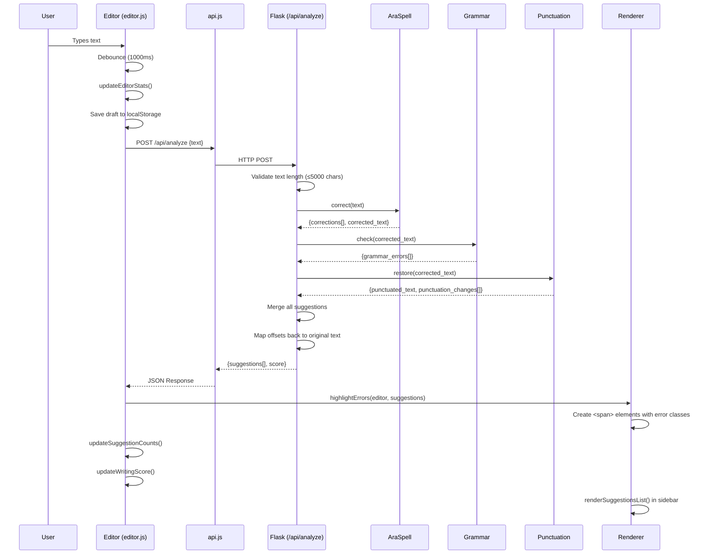
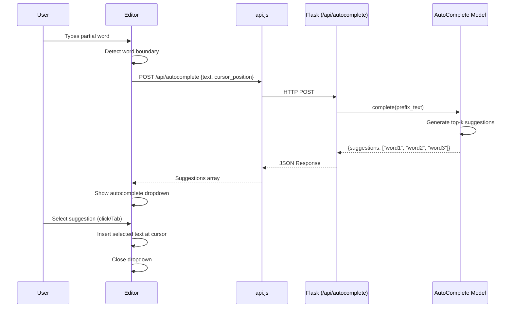
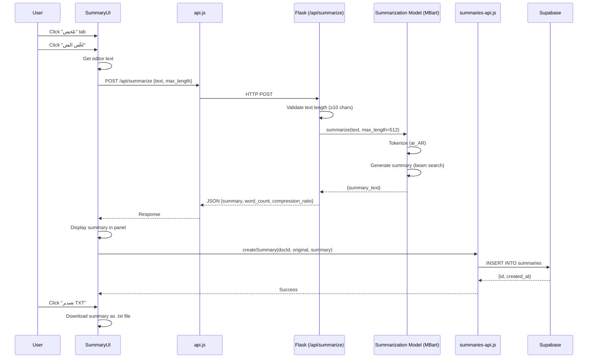
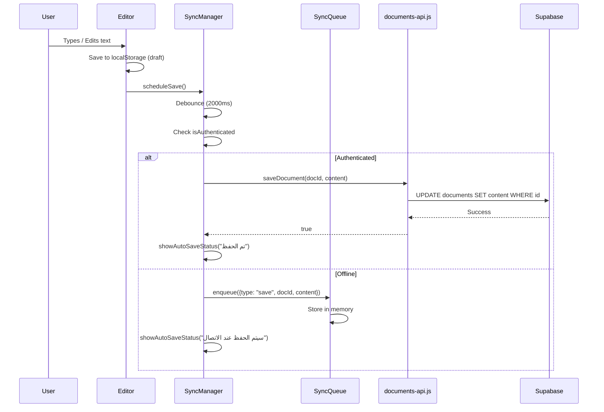
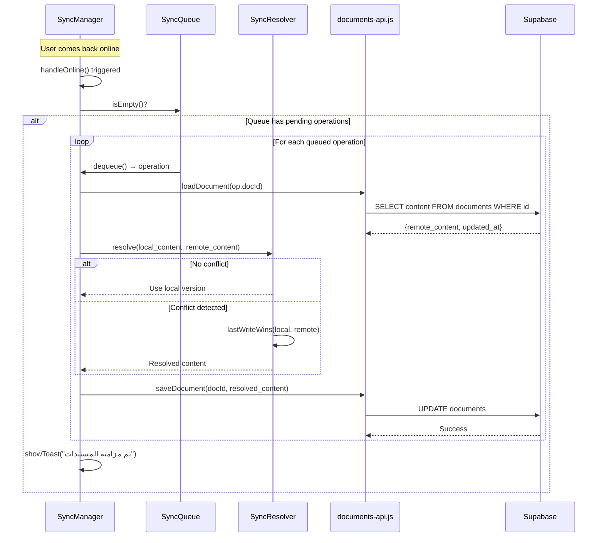

# 04 — Sequence Diagrams

## A. Typing + NLP Analysis Flow

---

## B. AutoComplete Flow

---

## C. Summarization Flow

---

## D. Document Save Flow

---

## E. Offline Recovery Flow

## Design Rationale

1. **Debounced Analysis**: 1-second debounce prevents API flooding during fast typing.
2. **Sequential NLP Pipeline**: Spelling → Grammar → Punctuation ensures each stage works on corrected text.
3. **Offline-First**: All changes saved to localStorage immediately; Supabase sync is eventual.
4. **Conflict Resolution**: Last-write-wins strategy with timestamp comparison.
