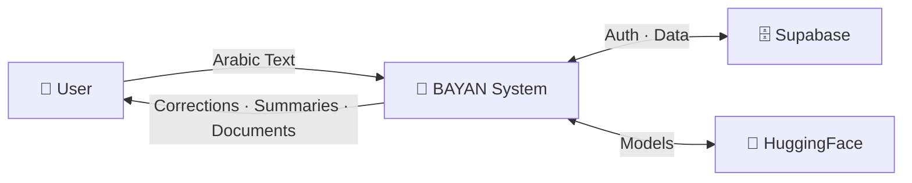
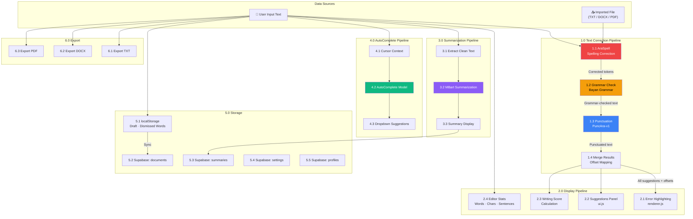

# 05 — Data Flow Diagram (DFD)

## Overview

This diagram traces how data flows through the BAYAN system — from user input to final storage, through all NLP processing stages.

## Level 0 — Context Diagram



## Level 1 — System DFD



## Data Stores Summary

| Store | Type | Data | Access Pattern |
|-------|------|------|----------------|
| `localStorage` | Client-side | Draft HTML, dismissed words, word goal, theme | Read/write on every input |
| `documents` | Supabase | id, user_id, title, content, timestamps | CRUD per user (RLS) |
| `summaries` | Supabase | id, document_id, user_id, original, summary | Append-mostly |
| `settings` | Supabase | id, user_id, preferences JSON | Read on login, write on change |
| `profiles` | Supabase | id, display_name, avatar_url, auth_provider | Auto-created on signup |

## Data Transformation Chain

```
Raw Arabic Text
  │
  ├──→ AraSpell ──→ Corrected words (with alternatives)
  │         │
  │         ▼
  │    Grammar Engine ──→ Grammar errors (with suggestions)
  │         │
  │         ▼
  │    Punctuation ──→ Punctuation insertions
  │         │
  │         ▼
  │    Offset Mapper ──→ Maps corrected offsets → original offsets
  │         │
  │         ▼
  │    Unified Suggestions Array
  │         │
  │         ├──→ Error Spans (renderer.js)
  │         ├──→ Sidebar Cards (ui.js)
  │         └──→ Score Calculation
  │
  ├──→ AutoComplete Model ──→ Top-K word suggestions
  │
  └──→ MBart Summarizer ──→ Compressed summary text
```
