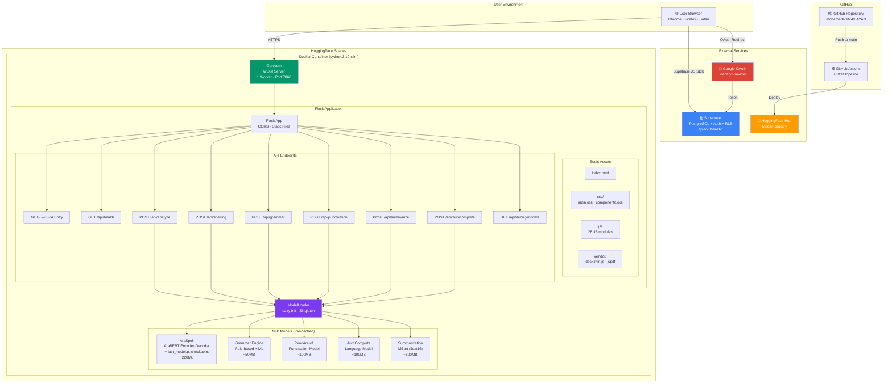

# 06 — Deployment Diagram

## Overview

BAYAN's final production deployment runs as a Dockerized Flask application on HuggingFace Spaces, with Supabase for database/auth and Google OAuth as an identity provider.

## Deployment Diagram

## Container Specifications

| Parameter | Value |
|-----------|-------|
| **Base Image** | `python:3.12-slim` |
| **Port** | `7860` |
| **WSGI Server** | Gunicorn (1 worker, 120s timeout) |
| **PyTorch** | CPU-only (saves ~1.5GB vs CUDA) |
| **Total Model Size** | ~1.07 GB |
| **Estimated RAM** | ~2.5 GB (peak during inference) |

## Environment Variables

| Variable | Purpose | Source |
|----------|---------|--------|
| `SUPABASE_URL` | Database endpoint | HF Spaces Secrets |
| `SUPABASE_ANON_KEY` | Public API key | HF Spaces Secrets |
| `HF_API_TOKEN` | Remote inference fallback | HF Spaces Secrets |
| `SUMMARIZATION_REPO_ID` | Model repo path | Default: `bayan10/summarization-model` |
| `PORT` | Server port | Default: `7860` |
| `DEBUG` | Debug mode | Default: `False` |

## CI/CD Pipeline

## Scaling Considerations

- **Single Worker**: Minimizes RAM; ML models are not thread-safe.
- **Model Pre-caching**: Docker builds download models once; no runtime network needed.
- **HF Inference Fallback**: When `HF_API_TOKEN` is set, uses remote HF Inference API to avoid local RAM limits.
- **Float16 Models**: Summarization model loaded in half-precision to halve memory.
