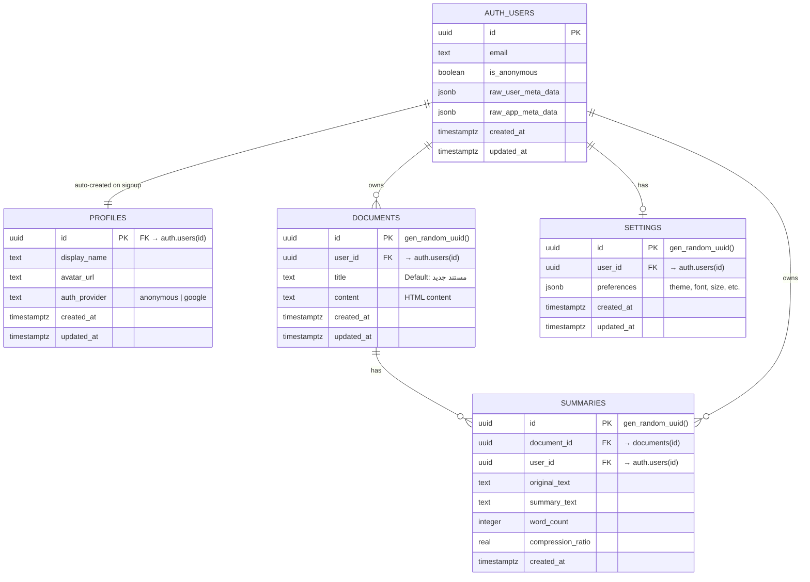

# 07 — Database Schema Diagram

## Overview

BAYAN uses Supabase (PostgreSQL) with Row-Level Security (RLS). All tables enforce per-user data isolation via `auth.uid()`.

## Entity Relationship Diagram



## Table Details

### profiles

| Column | Type | Constraints | Description |
|--------|------|-------------|-------------|
| `id` | `uuid` | PK, FK → auth.users | User ID from Supabase Auth |
| `display_name` | `text` | nullable | Display name (from Google or "ضيف") |
| `avatar_url` | `text` | nullable | Google profile picture URL |
| `auth_provider` | `text` | NOT NULL, default 'anonymous' | `anonymous` or `google` |
| `created_at` | `timestamptz` | NOT NULL, default now() | Account creation time |
| `updated_at` | `timestamptz` | NOT NULL, default now() | Last profile update |

### documents

| Column | Type | Constraints | Description |
|--------|------|-------------|-------------|
| `id` | `uuid` | PK, default gen_random_uuid() | Document unique ID |
| `user_id` | `uuid` | FK → auth.users, NOT NULL | Owner |
| `title` | `text` | default 'مستند جديد' | Document title |
| `content` | `text` | nullable | HTML content from editor |
| `created_at` | `timestamptz` | NOT NULL, default now() | Creation time |
| `updated_at` | `timestamptz` | NOT NULL, default now() | Last save time |

### summaries

| Column | Type | Constraints | Description |
|--------|------|-------------|-------------|
| `id` | `uuid` | PK, default gen_random_uuid() | Summary unique ID |
| `document_id` | `uuid` | FK → documents(id) | Parent document |
| `user_id` | `uuid` | FK → auth.users, NOT NULL | Owner |
| `original_text` | `text` | NOT NULL | Source text that was summarized |
| `summary_text` | `text` | NOT NULL | Generated summary |
| `word_count` | `integer` | nullable | Summary word count |
| `compression_ratio` | `real` | nullable | Compression percentage |
| `created_at` | `timestamptz` | NOT NULL, default now() | Generation time |

### settings

| Column | Type | Constraints | Description |
|--------|------|-------------|-------------|
| `id` | `uuid` | PK, default gen_random_uuid() | Setting record ID |
| `user_id` | `uuid` | FK → auth.users, UNIQUE | Owner (one per user) |
| `preferences` | `jsonb` | NOT NULL, default '{}' | All user preferences |
| `created_at` | `timestamptz` | NOT NULL, default now() | Creation time |
| `updated_at` | `timestamptz` | NOT NULL, default now() | Last update time |

## Row Level Security (RLS) Policies

All tables have RLS enabled. Policies follow the pattern:

```sql
-- SELECT: Users can only read their own data
CREATE POLICY "select_own" ON table
  FOR SELECT USING (auth.uid() = user_id);

-- INSERT: Users can only insert their own data  
CREATE POLICY "insert_own" ON table
  FOR INSERT WITH CHECK (auth.uid() = user_id);

-- UPDATE: Users can only update their own data
CREATE POLICY "update_own" ON table
  FOR UPDATE USING (auth.uid() = user_id);

-- DELETE: Users can only delete their own data
CREATE POLICY "delete_own" ON table
  FOR DELETE USING (auth.uid() = user_id);
```

## Database Triggers

| Trigger | Event | Function | Purpose |
|---------|-------|----------|---------|
| `on_auth_user_created` | `AFTER INSERT ON auth.users` | `handle_new_user()` | Auto-create profile on signup |
| `on_auth_user_updated` | `AFTER UPDATE ON auth.users` | `handle_user_updated()` | Update profile when linking Google |

## Client-Side Storage (localStorage)

| Key | Type | Purpose |
|-----|------|---------|
| `bayan_editor_draft` | `string (HTML)` | Unsaved editor content |
| `bayan_dismissed_words` | `JSON array` | Words marked "keep as-is" |
| `bayan_word_goal` | `number` | Word count target |
| `bayan_theme` | `string` | "dark" or "light" |
