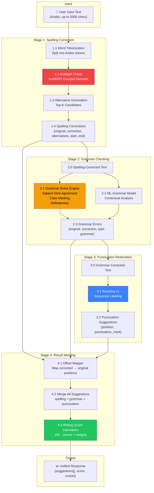
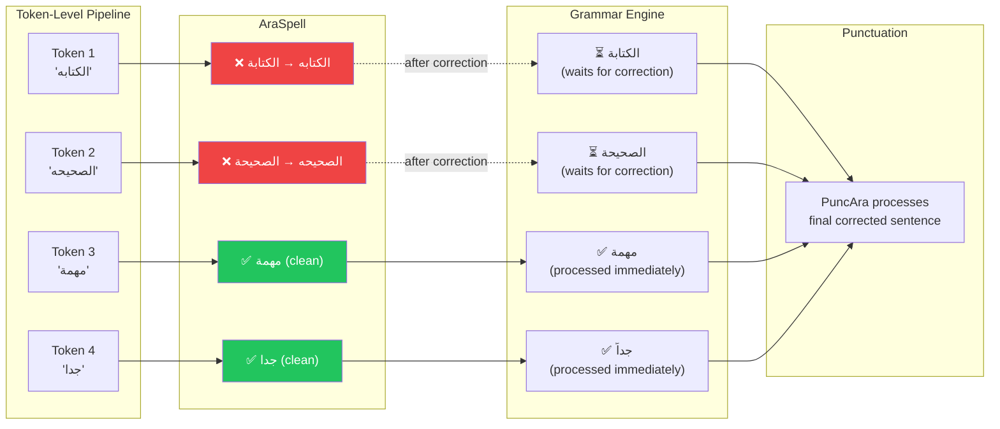
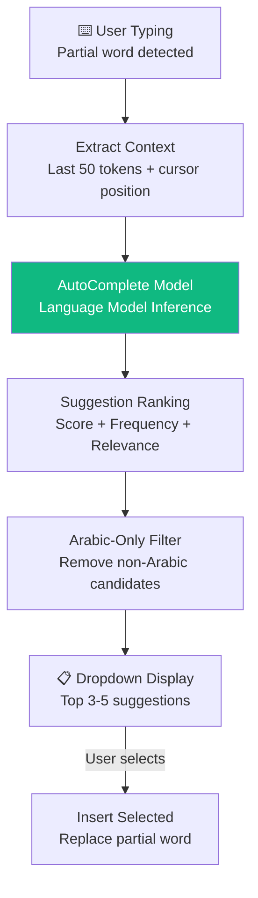
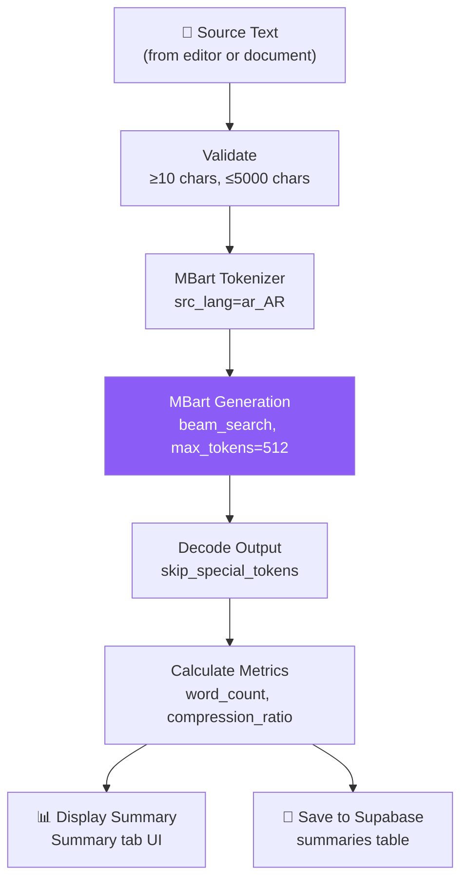

# 08 — NLP Pipeline Diagram (Final Production State)

## Overview

The BAYAN NLP layer consists of three independent pipelines: **Text Correction** (sequential), **AutoComplete** (parallel), and **Summarization** (independent). All five models are fully deployed and operational.

---

## Main Correction Pipeline

---

## Smart Dependency Logic

### Dependency Rules

1. **Clean tokens** bypass the spelling wait and are sent to grammar immediately.
2. **Misspelled tokens** are corrected first; grammar waits only for those specific tokens.
3. **Punctuation** executes last on the fully corrected sentence.
4. **Offset mapping** traces every change back to the original text positions.

---

## AutoComplete Pipeline

---

## Summarization Pipeline

---

## Models Reference Table

| Model | Architecture | Size | Input | Output |
|-------|-------------|------|-------|--------|
| **AraSpell** | AraBERT Encoder-Decoder + Checkpoint | ~220MB | Misspelled word | Corrected word + alternatives |
| **Grammar** | Rule Engine + ML Classifier | ~50MB | Corrected text | Grammar errors + suggestions |
| **PuncAra-v1** | Sequence Labeling Model | ~100MB | Unpunctuated text | Punctuated text |
| **AutoComplete** | Language Model | ~100MB | Text prefix | Next word candidates |
| **Summarization** | MBart (float16) | ~600MB | Arabic text | Compressed summary |

## Design Rationale

1. **Sequential Pipeline**: Spelling must run first because grammar and punctuation analysis on misspelled words produces false positives.
2. **Offset Mapping**: Critical for mapping corrected positions back to original text (where the user sees highlights).
3. **HF Inference Fallback**: When RAM is limited, the system can route to HuggingFace Inference API remotely.
4. **Float16**: Summarization model uses half-precision to halve memory footprint without quality loss.
