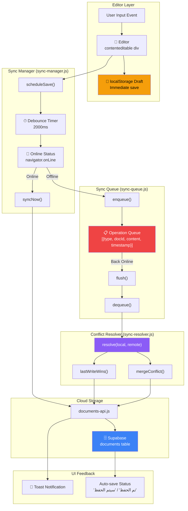
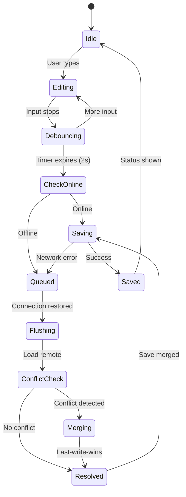
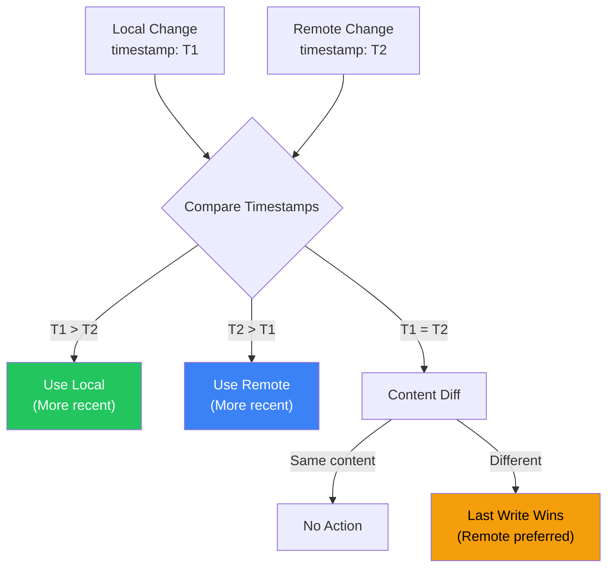

# 09 — Sync Engine Diagram

## Overview

The Sync Engine ensures documents are saved reliably, supporting offline editing with automatic recovery and conflict resolution when connectivity is restored.

## Sync Architecture



## State Machine



## Module API Reference

### SyncManager (`sync-manager.js`)

```javascript
// Initialize sync engine
initSync()

// Schedule a debounced save
scheduleSave()

// Immediately sync current document
async syncNow() → Promise<boolean>

// Handle browser online event
handleOnline()

// Handle browser offline event
handleOffline()
```

### SyncQueue (`sync-queue.js`)

```javascript
// Add operation to queue
enqueue({ type: 'save', docId: string, content: string })

// Remove and return next operation
dequeue() → Operation | null

// Check if queue is empty
isEmpty() → boolean

// Process all queued operations
async flush() → Promise<void>
```

### SyncResolver (`sync-resolver.js`)

```javascript
// Resolve local vs remote versions
resolve(local: Document, remote: Document) → ResolvedDocument

// Timestamp-based resolution
lastWriteWins(a: Document, b: Document) → Document

// Content merge (future: OT-based)
mergeConflict(localContent: string, remoteContent: string) → string
```

## Conflict Resolution Strategy



## Design Rationale

1. **localStorage First**: Every keystroke saves to localStorage — zero data loss on crash/close.
2. **2-Second Debounce**: Prevents excessive Supabase writes during fast typing.
3. **Queue-Based Offline**: Operations queue in memory; flushed when connectivity returns.
4. **Last-Write-Wins**: Simple, predictable resolution — the most recent change wins.
5. **Browser Events**: `online`/`offline` events trigger queue flush and status updates.
