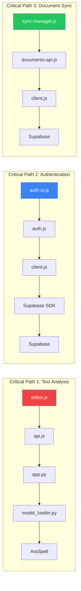

# 10 — Project Dependency Map

## Overview

This diagram shows the dependency relationships between all BAYAN modules, highlighting critical paths, internal dependencies, and external services.

## Full Dependency Graph

```mermaid
graph TB
    subgraph "Frontend Dependencies"
        direction TB
        INDEX["index.html<br/>(SPA Entry)"]

        subgraph "Core"
            EDITOR["editor.js"]
            RENDERER["renderer.js"]
            SELECTION["selection.js"]
            FORMAT["format.js"]
        end

        subgraph "Auth"
            AUTH["auth.js"]
            AUTH_UI["auth-ui.js"]
            SESSION["session.js"]
            CLIENT["client.js"]
            CONFIG["config.js"]
        end

        subgraph "Data"
            DOC_API["documents-api.js"]
            DOC_UI["documents-ui.js"]
            DOC_STATE["documents-state.js"]
            SUMM_API["summaries-api.js"]
            SUMM_UI["summaries-ui.js"]
            SET_API["settings-api.js"]
            SET_SYNC["settings-sync.js"]
        end

        subgraph "Sync"
            SYNC_MGR["sync-manager.js"]
            SYNC_Q["sync-queue.js"]
            SYNC_RES["sync-resolver.js"]
        end

        subgraph "UI"
            UI["ui.js"]
            THEME["theme.js"]
            API["api.js"]
        end

        subgraph "Vendor"
            DOCX["docx.min.js"]
            JSPDF["jspdf.umd.min.js"]
            SUPABASE_SDK["supabase-js (CDN)"]
        end
    end

    subgraph "Backend Dependencies"
        APP["app.py (Flask)"]
        MODEL_LOADER["model_loader.py"]
        HF_INF["hf_inference.py"]

        subgraph "NLP"
            ARASPELL_SVC["araspell_service.py"]
            ARASPELL_RULES["araspell_rules.py"]
            GRAMMAR_SVC["grammar_service.py"]
        end
    end

    subgraph "External Services"
        SUPABASE["Supabase<br/>Auth + PostgreSQL"]
        GOOGLE["Google OAuth"]
        HF_HUB["HuggingFace Hub"]
        HF_API_EXT["HF Inference API"]
    end

    subgraph "Infrastructure"
        DOCKER["Docker"]
        GUNICORN["Gunicorn"]
        GH_ACTIONS["GitHub Actions"]
    end

    subgraph "Python Packages"
        FLASK["Flask + CORS"]
        TORCH["PyTorch (CPU)"]
        TRANSFORMERS["Transformers"]
        HF_HUB_PKG["huggingface_hub"]
    end

    %% Frontend Internal Dependencies
    INDEX --> EDITOR & RENDERER & SELECTION & FORMAT
    INDEX --> AUTH & AUTH_UI & SESSION & CLIENT
    INDEX --> DOC_API & DOC_UI & SUMM_API & SUMM_UI
    INDEX --> SYNC_MGR & UI & THEME & API

    EDITOR --> RENDERER
    EDITOR --> SELECTION
    EDITOR --> API
    EDITOR --> UI

    DOC_UI --> DOC_API
    DOC_UI --> DOC_STATE
    SUMM_UI --> SUMM_API
    SET_SYNC --> SET_API

    SYNC_MGR --> SYNC_Q
    SYNC_MGR --> SYNC_RES
    SYNC_MGR --> DOC_API

    AUTH --> CLIENT
    AUTH --> SESSION
    AUTH_UI --> AUTH
    CLIENT --> CONFIG
    CLIENT --> SUPABASE_SDK

    DOC_API --> CLIENT
    SUMM_API --> CLIENT
    SET_API --> CLIENT

    DOC_UI --> DOCX
    DOC_UI --> JSPDF

    %% Backend Internal Dependencies
    APP --> MODEL_LOADER
    APP --> HF_INF
    APP --> ARASPELL_SVC

    ARASPELL_SVC --> ARASPELL_RULES
    MODEL_LOADER --> TRANSFORMERS
    MODEL_LOADER --> TORCH
    MODEL_LOADER --> HF_HUB_PKG

    HF_INF --> HF_API_EXT

    %% External Dependencies
    CLIENT --> SUPABASE
    AUTH --> GOOGLE
    MODEL_LOADER --> HF_HUB
    DOCKER --> GUNICORN
    GUNICORN --> APP
    GH_ACTIONS --> DOCKER

    %% Styling
    style APP fill:#059669,color:#fff
    style SUPABASE fill:#3B82F6,color:#fff
    style EDITOR fill:#7C3AED,color:#fff
    style MODEL_LOADER fill:#DC2626,color:#fff

    linkStyle default stroke:#94A3B8
```

## Critical Dependency Paths



## Dependency Matrix

| Module | Depends On | Depended By |
|--------|-----------|-------------|
| `editor.js` | renderer, selection, api, ui | index.html |
| `renderer.js` | — | editor.js |
| `auth.js` | client, session | auth-ui.js |
| `documents-api.js` | client | documents-ui, sync-manager |
| `sync-manager.js` | sync-queue, sync-resolver, documents-api | editor.js |
| `app.py` | model_loader, hf_inference, araspell_service | Gunicorn |
| `model_loader.py` | transformers, torch, huggingface_hub | app.py |
| `client.js` | config, supabase-js CDN | auth, documents-api, summaries-api, settings-api |

## Future Extension Points

| Extension | Where to Add | Dependencies Needed |
|-----------|-------------|-------------------|
| New NLP model | `model_loader.py` + `/api/` route in `app.py` | transformers |
| Multi-language | `araspell_rules.py` + new language rules | Language-specific models |
| Mobile app | New client consuming same `/api/` endpoints | React Native / Flutter |
| Analytics | New Supabase table + tracking module | — |
| Real-time collab | Supabase Realtime channel | supabase-js realtime |
