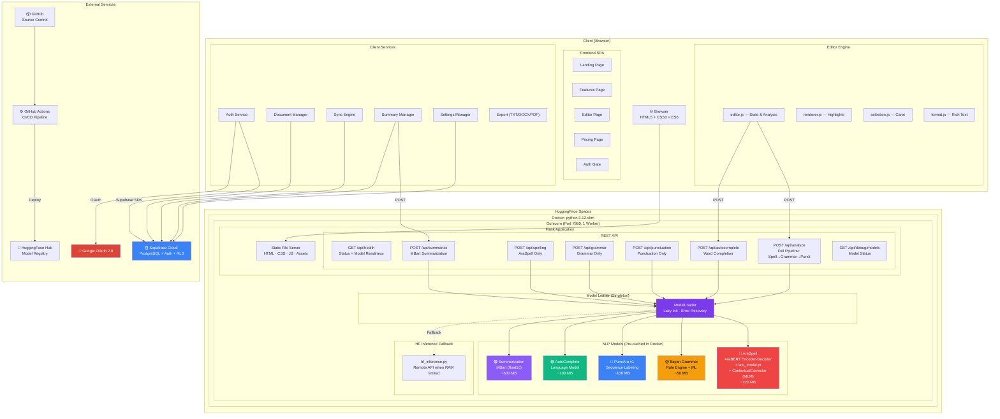

# 11 — Final Production Architecture

## Overview

This document represents the **FINAL production architecture** of BAYAN, with all five NLP modules fully deployed, integrated, and operational inside a single Docker container on HuggingFace Spaces.

## Production Architecture

## Resource Budget

| Resource | Allocation | Notes |
|----------|-----------|-------|
| **RAM** | ~2.5 GB peak | 5 models loaded simultaneously |
| **Disk** | ~1.07 GB models + ~500 MB system | Pre-cached during Docker build |
| **CPU** | 2 vCPU (HF Spaces) | Single Gunicorn worker |
| **Network** | None at runtime | Models pre-downloaded |
| **Cold Start** | ~30-60 seconds | Model lazy loading |

## API Endpoint Summary

| Endpoint | Method | Purpose | Model(s) Used |
|----------|--------|---------|--------------|
| `/` | GET | Serve SPA + inject Supabase creds | — |
| `/api/health` | GET | Health check + model status | All (status check) |
| `/api/analyze` | POST | Full NLP pipeline | AraSpell → Grammar → Punctuation |
| `/api/spelling` | POST | Spelling correction only | AraSpell |
| `/api/grammar` | POST | Grammar check only | Grammar |
| `/api/punctuation` | POST | Punctuation restoration only | PuncAra-v1 |
| `/api/summarize` | POST | Text summarization | MBart |
| `/api/autocomplete` | POST | Word completion | AutoComplete |
| `/api/debug/models` | GET | Model debug info | All |

## Production Hardening

| Feature | Implementation |
|---------|---------------|
| **Error Recovery** | ModelLoader catches load failures; API returns 503 with details |
| **Timeout** | Gunicorn 120s timeout for long summarizations |
| **CORS** | Restricted to `/api/*` routes only |
| **Input Validation** | Max 5000 chars, min 10 chars for summarization |
| **Startup Errors** | Captured in `_startup_errors` array, exposed via `/api/health` |
| **HF Fallback** | Auto-routes to HF Inference API when `HF_API_TOKEN` is set |
| **Model Caching** | All models downloaded during `docker build`, not at runtime |
