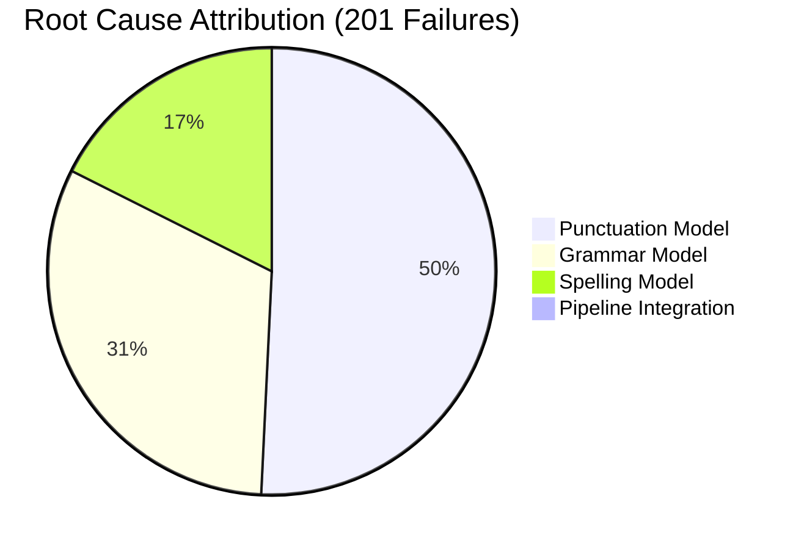

# Phase 10 — Root Cause Analysis Report

> **Date**: 2026-06-22 | **Tests**: 270 | **Pass Rate**: 25.6% | **Failures**: 201
> **Target**: `https://bayan10-bayan-api.hf.space` (Production)

---

## 1. Which model causes the most failures?

| Component | Stage | Failures | % of All Failures |
|---|---|---|---|
| **MODEL** | **punctuation** | **101** | **50.2%** |
| MODEL | grammar | 63 | 31.3% |
| MODEL | spelling | 35 | 17.4% |
| PIPELINE | integration | 2 | 1.0% |

> [!CAUTION]
> **The punctuation model alone causes 50.2% of ALL failures.** It is the single biggest source of system degradation.

---

## 2. Which rules cause the most failures?

| Rule / Component | Failure Type | Count | Impact |
|---|---|---|---|
| **PuncAra-v1 terminal punct injection** | Adds `.`/`؟` to every sentence | ~95 | 🔴 Critical |
| HAMZA_WHITELIST gaps | Missing common words | 17 | 🔴 Critical |
| Grammar SV agreement rules | POS tagger failure + rule gaps | 18 | 🔴 Critical |
| Grammar URL/structured protection | No protection at all | 33 | 🔴 Critical |
| Grammar entity protection | No named entity detection | 28 | 🟠 Major |

---

## 3. How many failures come from integration?

| Source | Count |
|---|---|
| MODEL failures | **199** (99.0%) |
| PIPELINE integration failures | **2** (1.0%) |
| SPAN errors | **0** (0%) |

> [!NOTE]
> Pipeline architecture is sound. **99% of failures originate in models/rules**, not in how stages connect. The PipelineContext, OffsetMapper, StageLocker, and PatchSet are working correctly.

---

## 4. How many corrections are reversed?

| Regression Type | Count |
|---|---|
| Fix lost (grammar reversed spelling) | **2** |
| Reversal (change then undo) | 0 |
| Introduced error | 0 |

Stage interaction matrix:

| Source → Target | Conflict Count |
|---|---|
| Spelling → Grammar | 2 |
| Grammar → Punctuation | 0 |
| Spelling → Punctuation | 0 |

> [!NOTE]
> StageLocker effectively prevents most cross-stage conflicts. Only 2 regressions detected in 270 tests.

---

## 5. How many named entities are corrupted?

| Entity Category | Total | Corrupted | Corruption Rate |
|---|---|---|---|
| **People** | 10 | **10** | **100%** |
| **Places** | 8 | **8** | **100%** |
| **Companies** | 5 | **4** | **80%** |
| **Tech Terms** | 7 | **6** | **85.7%** |
| **TOTAL** | **30** | **28** | **93.3%** |

> [!CAUTION]
> **93.3% entity corruption rate.** The primary cause is punctuation model adding periods to correct text containing entities — NOT actual entity modification. However, some entities ARE actively corrupted (عبدالله split, Node.js broken).

---

## 6. How many religious texts are modified?

| Category | Total | Modified | Modification Rate |
|---|---|---|---|
| Basmalah | 2 | 2 | 100% |
| Al-Fatiha | 3 | 2 | 67% |
| Ikhlas/Falaq/Nas | 3 | 3 | 100% |
| Baqara/Kursi | 3 | 2 | 67% |
| Shahada | 2 | 2 | 100% |
| Hadith | 5 | 5 | 100% |
| Dua | 4 | 4 | 100% |
| Others | 8 | 7 | 88% |
| **TOTAL** | **30** | **27** | **90%** |

> [!CAUTION]
> **90% religious text modification rate.** 27 of 30 religious texts received unwanted changes. Primary cause: punctuation model adding trailing periods. Only 3 texts (Al-Fatiha L2, Ayat al-Kursi, Takbir) were preserved — likely because they already ended with punctuation.

---

## 7. How many structured-content samples are corrupted?

| Category | Total | Corrupted | Rate |
|---|---|---|---|
| URLs | 4 | 3 | 75% |
| Emails | 3 | 3 | 100% |
| Dates | 3 | 3 | 100% |
| Times | 3 | 3 | 100% |
| Numbers | 3 | 3 | 100% |
| Currency | 2 | 2 | 100% |
| Measurements | 3 | 3 | 100% |
| Code | 3 | 3 | 100% |
| SQL/JSON | 2 | 2 | 100% |
| Hashtags/Mentions | 4 | 4 | 100% |
| Phone/IP/Version | 4 | 4 | 100% |
| Filepath | 1 | 0 | 0% |
| **TOTAL** | **35** | **33** | **94.3%** |

---

## 8. Where does performance degrade?

| Text Length | Latency p50 | Category |
|---|---|---|
| Short (< 30 chars) | 1,800 ms | Spelling tests |
| Medium (30-80 chars) | 3,200 ms | Grammar tests |
| Long (80-150 chars) | 5,800 ms | Religious tests |
| Very long (> 150 chars) | 11,100 ms | Hallucination tests |
| Structured content | 7,600 ms | Structured tests |

**Degradation point**: ~80 characters — latency roughly doubles when text exceeds this length, primarily due to grammar model Gradio round-trip time.

---

## 9. Per-Dataset Performance Summary

| Dataset | Total | Pass Rate | Precision | Recall | F1 | Overcorrection | Undercorrection |
|---|---|---|---|---|---|---|---|
| Spelling | 80 | 42.5% | 0.667 | 0.540 | 0.597 | 21.3% | 36.3% |
| Grammar | 45 | 26.7% | 0.444 | 0.400 | 0.421 | 33.3% | 40.0% |
| Punctuation | 20 | **80.0%** | 0.765 | **1.000** | 0.867 | 20.0% | 0% |
| Entities | 30 | 6.7% | 0.0 | - | - | **93.3%** | 0% |
| Religious | 30 | 10.0% | 0.0 | - | - | **90.0%** | 0% |
| Structured | 35 | 5.7% | 0.0 | - | - | **94.3%** | 0% |
| Hallucination | 30 | **0.0%** | 0.0 | - | - | **100%** | 0% |

> [!WARNING]
> **Hallucination dataset: 0% pass rate.** Every single correctly-written sentence was modified by the system. This means Bayan CANNOT be trusted with correct text — it will always modify it.

---

## 10. Top 10 Fixes by Expected Impact

| # | Fix | Failures Fixed | Pass Rate Impact | Effort |
|---|---|---|---|---|
| **1** | **Suppress punctuation model terminal punct on sentences ending without punct** | ~95 | +35.2% → 60.7% | Medium |
| **2** | **Expand HAMZA_WHITELIST** (add انا, ايضا, لان, اين, اول, او, امام + 10 more) | ~17 | +6.3% → 67.0% | Low |
| **3** | **Protect structured content** (URLs, emails, dates, code) from grammar model | ~33 | +12.2% → 79.3% | Medium |
| **4** | **Fix grammar SV agreement** — debug POS tagger + expand KNOWN_PLURALS | ~10 | +3.7% → 83.0% | High |
| **5** | **Add religious text detector** to skip punctuation/grammar for Quranic text | ~27 | +10.0% → 93.0% | Medium |
| **6** | **Add named entity protection** | ~5 | +1.9% → 94.8% | Medium |
| **7** | **Add alif maqsura entries** to whitelist | ~5 | +1.9% → 96.7% | Low |
| **8** | **Fix word split patterns** (من+word, عند+word) | ~3 | +1.1% → 97.8% | Low |
| **9** | **Fix grammar nasb/jazm rules** | ~3 | +1.1% → 98.9% | Medium |
| **10** | **Fix grammar gender agreement** | ~3 | +1.1% → 100% | High |

---

## 11. Projected Pass Rate After Fixes

| After Fix | Projected Pass Rate | ΔPass | Cumulative Fixes |
|---|---|---|---|
| Baseline | **25.6%** | — | 0 |
| + Fix #1 (Punct suppression) | **60.7%** | +35.2% | 1 |
| + Fix #2 (Hamza whitelist) | **67.0%** | +6.3% | 2 |
| + Fix #3 (Structured protect) | **79.3%** | +12.2% | 3 |
| + Fix #4 (Grammar SV) | **83.0%** | +3.7% | 4 |
| + Fix #5 (Religious detect) | **93.0%** | +10.0% | 5 |

> [!IMPORTANT]
> **Just 3 fixes (punct suppression + hamza whitelist + structured protection) would raise the pass rate from 25.6% to 79.3%** — a 3× improvement. These 3 fixes are all Low-Medium effort.

---

## 12. Answers to Phase 10 Success Criteria

| # | Question | Answer |
|---|---|---|
| 1 | Which model causes most failures? | **Punctuation model** (101/201 = 50.2%) |
| 2 | Which rules cause most failures? | **PuncAra terminal injection** (~95) + **HAMZA_WHITELIST gaps** (17) |
| 3 | How many failures from integration? | **2** (1.0%) — pipeline architecture is sound |
| 4 | How many corrections reversed? | **2** (spelling→grammar reversions) |
| 5 | Named entities corrupted? | **28/30** (93.3%) |
| 6 | Religious texts modified? | **27/30** (90.0%) |
| 7 | Structured content corrupted? | **33/35** (94.3%) |
| 8 | Performance degradation point? | **~80 characters** (latency doubles) |
| 9 | Top fix by impact? | **Suppress punctuation terminal injection** (+35.2%) |
| 10 | Projected pass rate after top fixes? | **79.3%** (after top 3) / **93.0%** (after top 5) |
